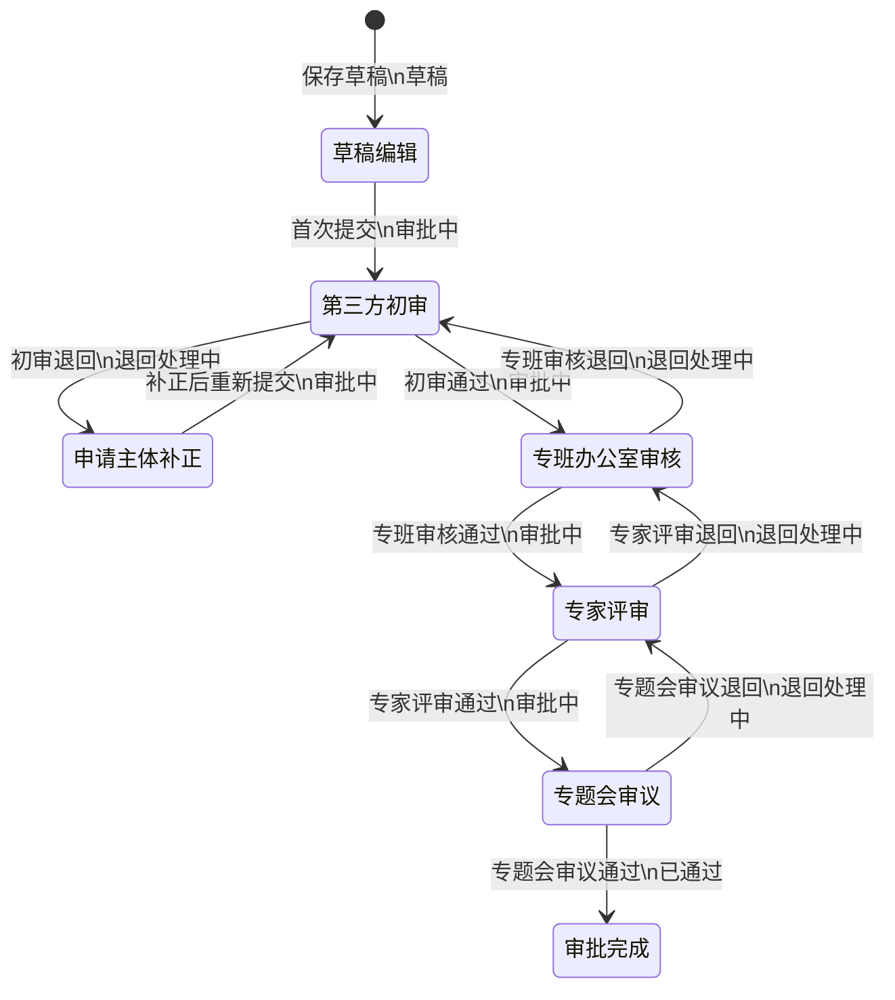
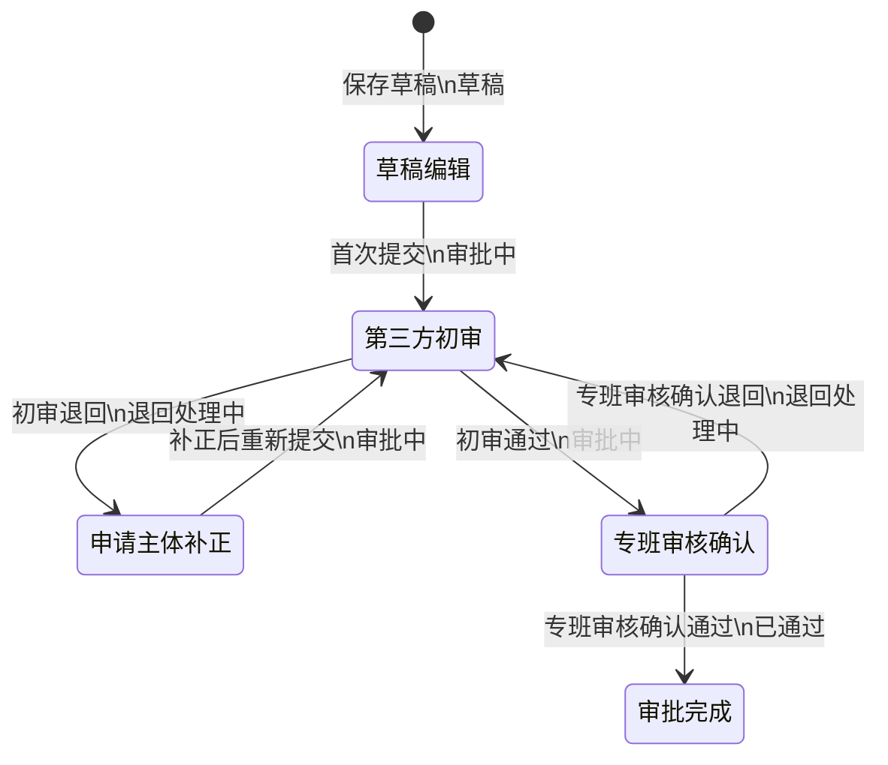
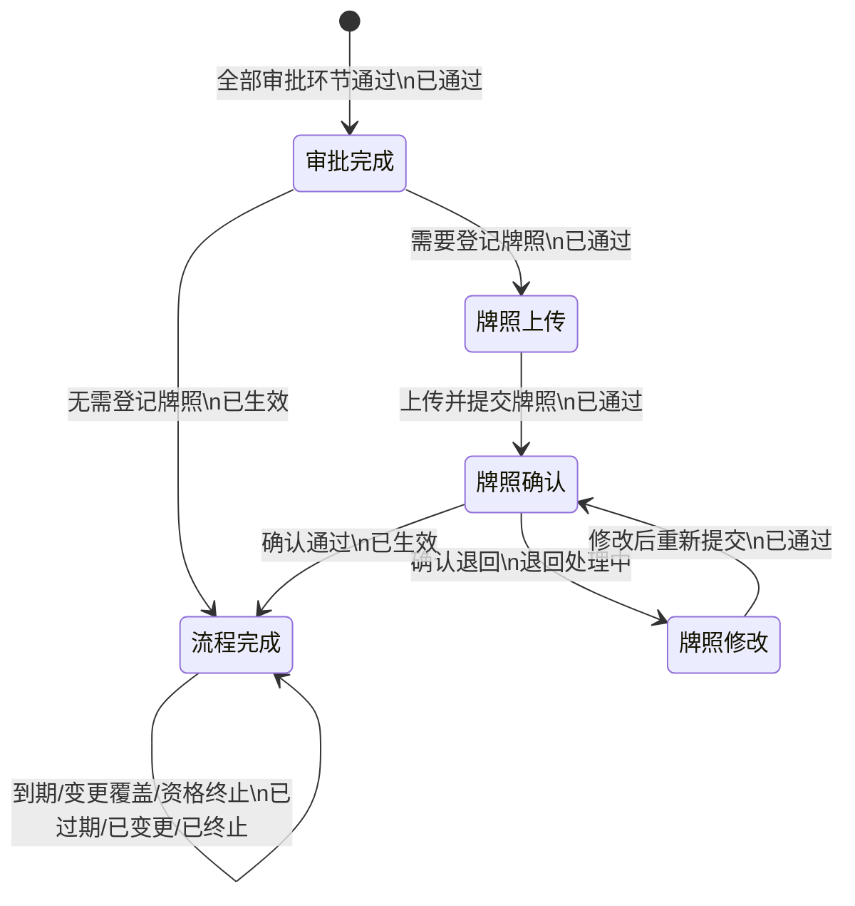
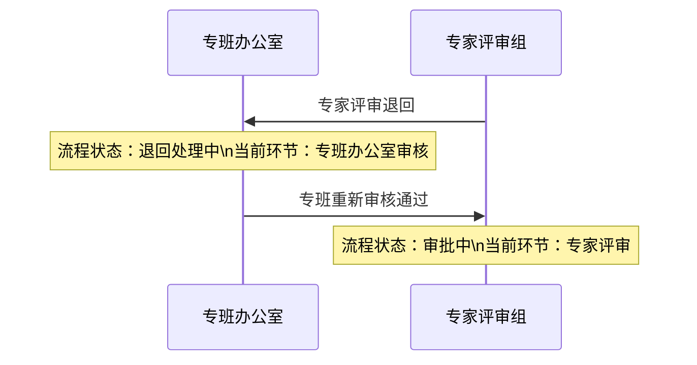

# 准入申请审批流程说明

## 1. 目的与适用范围

本文明确道路测试准入、示范应用准入、商业化试点准入的审批流转、状态口径、页面展示和操作规则，适用于初次申请、延期申请、变更申请及新增相同配置车辆申请。

本规则只支持**退回紧邻的前置审批节点**，不支持审批人自由选择退回目标节点。退回不是流程终止或不予受理；退回后，流程必须回到前置审批节点继续处理。第三方初审无前置审批节点，退回时进入申请主体补正环节。

## 2. 最终结论与核心规则

1. 页面和接口统一使用“流程状态 + 当前环节”两个当前态字段，不再并行维护“申请状态”“审批状态”“流程当前节点”三套口径。
2. 流程状态回答“申请整体处于什么处境”；当前环节回答“当前由谁处理、应执行什么操作”。两个字段必须在同一业务事务中同步变化。
3. 审批通过时进入下一环节；审批退回时只回到紧邻的前置环节，不支持自由指定退回目标。
4. 第三方初审是首个审批环节，没有前置审批环节；其退回后进入“申请主体补正”。
5. 退回后流程没有结束，流程状态为“退回处理中”，当前环节为实际接收退回任务的上一级环节。
6. 上一级环节重新处理并提交到原退回来源环节后，流程状态恢复“审批中”。
7. 不设置整体“已退回”状态；“退回”只作为某次环节处理结果写入流程日志。
8. 全部审批环节通过后，流程状态为“已通过”；上传牌照和牌照确认属于审批后办理环节。
9. 牌照确认退回后，流程状态为“退回处理中”，当前环节为“牌照修改”；修改后重新提交牌照确认时，流程状态恢复“已通过”。
10. 已生效、已过期、已变更和已终止属于申请生命周期结果，不属于审批环节。

## 3. 双字段定义

### 3.1 流程状态

| 流程状态  | 说明                                      | 是否终态 |
| ----- | --------------------------------------- | ---- |
| 草稿    | 申请已保存但尚未首次提交。由第三方初审阶段，在未处理前撤回           | 否    |
| 审批中   | 申请正在按正常方向进行审批。                          | 否    |
| 退回处理中 | 某环节执行退回，当前由前置环节或申请主体补正处理，尚未重新提交到退回来源环节。 | 否    |
| 已通过   | 全部审批环节已通过，正在办理牌照或等待进入生效状态。              | 否    |
| 已生效   | 审批及必要的牌照办理完成，申请进入有效期。                   | 否    |
| 已过期   | 当前时间超过申请有效期。                            | 是    |
| 已变更   | 原申请被已生效的变更申请覆盖，不再有效。                    | 是    |
| 已终止   | 触发资格终止，申请不再有效。                          | 是    |

### 3.2 当前环节

| 当前环节   | 适用范围                  | 当前责任方   | 可执行操作                     |
| ------ | --------------------- | ------- | ------------------------- |
| 草稿     | 全部申请类型                | 申请主体    | 编辑、首次提交、删除草稿              |
| 申请主体补正 | 第三方初审退回后              | 申请主体    | 按退回意见补正、重新提交              |
| 第三方初审  | 全部申请类型                | 第三方服务机构 | 初审通过、退回申请主体补正；接收专班退回后重新初审 |
| 专班审核   | 初次申请、新增相同配置车辆申请 | 专班办公室   | 审核通过、退回第三方初审；接收专家退回后重新审核  |
| 专家评审   | 初次申请、新增相同配置车辆申请 | 专家评审组   | 评审通过、退回专班办公室；接收专题会退回后重新评审 |
| 专题会审议  | 初次申请、新增相同配置车辆申请 | 市工作专班   | 审议通过、退回专家评审               |
| 牌照上传   | 审批通过且需要登记牌照           | 申请主体    | 上传并提交临时牌照                 |
| 牌照确认   | 牌照已提交                 | 第三方服务机构 | 确认通过、退回修改                 |
| 牌照修改   | 牌照确认退回后               | 申请主体    | 修改牌照、重新提交确认               |
| 流程完成   | 已生效或终态                | 无       | 查看                        |

> 当前环节统一使用业务环节名称，不再使用“待初审、待专家评审”等申请状态名称。页面可通过“审批中 + 专家评审”表达原“待专家评审”语义。

### 3.3 有效组合与页面语义

| 业务场景 | 流程状态 | 当前环节 | 页面辅助信息 |
| --- | --- | --- | --- |
| 保存但未提交 | 草稿 | 草稿编辑 | 无 |
| 首次提交后等待初审 | 审批中 | 第三方初审 | 无 |
| 第三方初审退回 | 退回处理中 | 申请主体补正 | 由第三方初审退回 |
| 申请主体补正后重新提交 | 审批中 | 第三方初审 | 可展示“曾退回” |
| 初审通过进入初次申请专班审核 | 审批中 | 专班办公室审核 | 无 |
| 初审通过进入延期或变更专班确认 | 审批中 | 专班审核确认 | 无 |
| 初审通过进入新增车辆专班审核 | 审批中 | 专班办公室审核 | 无 |
| 专班办公室退回 | 退回处理中 | 第三方初审 | 由专班办公室审核退回 |
| 专家评审退回 | 退回处理中 | 专班办公室审核 | 由专家评审退回 |
| 专班办公室重新提交专家 | 审批中 | 专家评审 | 可展示“曾退回” |
| 专题会审议退回 | 退回处理中 | 专家评审 | 由专题会审议退回 |
| 全部审批通过且需要牌照 | 已通过 | 牌照上传 | 无 |
| 牌照已提交 | 已通过 | 牌照确认 | 无 |
| 牌照确认退回 | 退回处理中 | 牌照修改 | 由牌照确认退回 |
| 牌照修改后重新提交 | 已通过 | 牌照确认 | 可展示“曾退回” |
| 审批完成且无需牌照或牌照确认通过 | 已生效 | 流程完成 | 无 |
| 撤回、过期、变更或终止 | 对应生命周期状态 | 流程完成 | 无 |

“由XX环节退回”和“曾退回”是从流程日志计算的辅助信息，不是第三个当前态字段。

## 4. 状态机

状态机中的方框只表示“当前环节”，箭头表示业务事件；箭头上的第二行表示事件完成后的“流程状态”。这样避免为每个环节复制一套“退回处理中”状态框。

### 4.1 初次申请及新增相同配置车辆申请审批流程



### 4.2 延期及变更申请审批流程



延期和变更申请不经过专家评审和专题会审议。新增相同配置车辆申请与初次申请一致，执行“第三方初审 → 专班办公室审核 → 专家评审 → 专题会审议”四级审批。

### 4.3 审批后办理与生命周期



### 4.4 退回后重新审批示例



## 5. 操作与权限规则

| 流程状态 | 当前环节 | 操作角色 | 可执行操作 | 操作后的组合 |
| --- | --- | --- | --- | --- |
| 草稿 | 草稿编辑 | 申请主体 | 编辑、首次提交、删除 | 提交后：审批中 + 第三方初审 |
| 审批中 | 第三方初审 | 第三方服务机构 | 通过、退回 | 通过后进入专班环节；退回后：退回处理中 + 申请主体补正 |
| 退回处理中 | 申请主体补正 | 申请主体 | 补正、重新提交 | 审批中 + 第三方初审 |
| 审批中 | 专班办公室审核 | 专班办公室 | 通过、退回 | 初次申请及新增相同配置车辆申请通过后：审批中 + 专家评审；退回后：退回处理中 + 第三方初审 |
| 退回处理中 | 第三方初审 | 第三方服务机构 | 重新初审：通过、退回 | 通过后回到原下级环节；再次退回后：退回处理中 + 申请主体补正 |
| 审批中 | 专家评审 | 专家评审组 | 通过、退回 | 通过后：审批中 + 专题会审议；退回后：退回处理中 + 专班办公室审核 |
| 退回处理中 | 专班办公室审核 | 专班办公室 | 重新审核：通过、退回 | 通过后：审批中 + 专家评审；再次退回后：退回处理中 + 第三方初审 |
| 审批中 | 专题会审议 | 市工作专班 | 通过、退回 | 通过后：已通过 + 审批完成；退回后：退回处理中 + 专家评审 |
| 退回处理中 | 专家评审 | 专家评审组 | 重新评审：通过、退回 | 通过后：审批中 + 专题会审议；再次退回后：退回处理中 + 专班办公室审核 |
| 审批中 | 专班审核确认 | 市工作专班 | 通过、退回 | 延期或变更申请通过后：已通过 + 审批完成；退回后：退回处理中 + 第三方初审 |
| 已通过 | 牌照上传 | 申请主体 | 上传并提交牌照 | 已通过 + 牌照确认 |
| 已通过 | 牌照确认 | 第三方服务机构 | 确认通过、退回修改 | 通过后：已生效 + 流程完成；退回后：退回处理中 + 牌照修改 |
| 退回处理中 | 牌照修改 | 申请主体 | 修改、重新提交 | 已通过 + 牌照确认 |

操作权限必须由“流程状态 + 当前环节 + 当前用户角色”共同判断。非当前责任方只能查看，不显示审批、补正或重新提交入口。

## 6. 数据与流程日志口径

页面和接口只保存两个当前态字段；流程日志是审计数据，不构成第三个状态字段。

| 字段 | 说明 | 枚举示例 |
| --- | --- | --- |
| `processStatus` | 流程整体状态 | `draft`、`processing`、`returning`、`approved`、`active`、`withdrawn`、`expired`、`changed`、`terminated` |
| `currentStage` | 当前实际责任环节 | `draft_edit`、`applicant_correction`、`third_party_review`、`committee_review`、`expert_review`、`meeting_review`、`committee_confirm`、`plate_upload`、`plate_confirmation`、`plate_correction`、`completed` |
| `flowLogs` | 不可篡改的事件记录，记录环节实例、轮次、处理结果、退回来源、退回目标、处理人、时间、意见、附件和退回闭环 | 见下例 |

```js
{
  processStatus: 'returning',
  currentStage: 'committee_review',
  flowLogs: [
    {
      eventId: 'flow_event_1001',
      eventType: 'stage_returned',
      returnCycleId: 'return_cycle_1',
      stageInstanceId: 'expert_review_round_1',
      stage: 'expert_review',
      round: 1,
      result: 'returned',
      handler: '专家评审组',
      handledAt: '2026-09-10 14:20:00',
      opinion: '请补充专班审核意见和论证依据。',
      returnToStage: 'committee_review'
    }
  ]
}
```

页面从尚未闭环的最新退回日志生成“由专家评审退回”等辅助信息。上一级重新处理通过并回到原退回来源环节时，追加同一 `returnCycleId` 的闭环事件，不修改历史退回记录。

## 7. 页面与文档修改清单

### 7.1 产品文档

| 文件 | 需修改位置 | 修改内容 |
| --- | --- | --- |
| `02-产品文档/测试示范监管模块PRD.md` | F04/F05/F06 准入申请列表、筛选、详情及操作规则 | 将单一“申请状态”改为“流程状态 + 当前环节”；删除整体“已退回”状态及统一“重新提交”规则；补充退回来源辅助信息和按角色处理规则。 |
| `02-产品文档/测试示范监管模块PRD.md` | F08 审批管理列表、Tab、筛选、详情及审批交互 | 将“审批状态 + 当前节点”统一为“流程状态 + 当前环节”；“已退回”Tab 改为“退回处理中”；退回后当前环节切换至前置环节。 |
| `02-产品文档/测试示范监管模块PRD.md` | 4.3、5.2 状态流转图、状态集合、事件集合和转换矩阵 | 按本文三段状态机更新；区分初次申请、派生申请及审批后办理；明确只退回前置环节。 |
| `02-产品文档/测试示范监管模块PRD.md` | 流程日志与验收标准 | 增加退回轮次、来源环节、目标环节、闭环事件及双字段一致性验收。 |

### 7.2 高保真页面及共享逻辑

| 文件 | 需要修改的页面内容 |
| --- | --- |
| `03-高保真页面/monitor/access-apply/road-test.html` | 列表将“申请状态”调整为“流程状态”和“当前环节”两列；筛选条件同步拆分；详情顶部展示两个字段；流程进度只展示环节，按真实日志标记通过、退回和当前处理；删除 `rejected` 统一状态、最后一步统一标红和所有退回记录统一“重新提交”的逻辑；申请主体只有在“退回处理中 + 申请主体补正”时显示补正入口。 |
| `03-高保真页面/monitor/access-apply/demo-apply.html` | 与道路测试页使用相同双字段、筛选、退回来源、流程进度、日志和操作权限；同步处理版本演进中的状态文案。 |
| `03-高保真页面/monitor/access-apply/demo-operate.html` | 与道路测试页使用相同双字段、筛选、退回来源、流程进度、日志和操作权限；同步处理版本演进中的状态文案。 |
| `03-高保真页面/monitor/access-approve/approve.html` | 列表列名统一为“流程状态”“当前环节”；Tab 调整为“我的待办、全部、审批中、退回处理中、已通过”；当前环节显示实际拥有待办的前置环节，并在退回处理中展示“由XX环节退回”；退回操作直接切换到前置环节并生成新一轮待办，不再写入 `done + rejected`；操作入口按当前环节和角色判断。 |
| `03-高保真页面/monitor/access-apply/apply-records.html` | 列表和筛选采用“流程状态 + 当前环节”；“已退回”改为“退回处理中”；如保留历史退回查询，使用“曾退回”筛选并从流程日志判断。 |
| `03-高保真页面/components/plate-registration.js` | 统一实现“已通过 + 牌照上传 → 已通过 + 牌照确认 → 已生效 + 流程完成”；牌照确认退回后切换为“退回处理中 + 牌照修改”。 |
| `03-高保真页面/common.js` | 增加统一的流程状态、当前环节、退回来源文案映射，供上述页面复用；不得再通过单一 `rejected` 值推断退回节点。 |

### 7.3 页面展示要求

| 场景 | 流程状态列 | 当前环节列 |
| --- | --- | --- |
| 正常专家评审 | 审批中 | 专家评审 |
| 专家评审退回 | 退回处理中 | 专班办公室审核；辅助显示“由专家评审退回” |
| 专班重新提交专家 | 审批中 | 专家评审；可辅助显示“曾退回” |
| 全部审批通过待上传牌照 | 已通过 | 牌照上传 |
| 牌照确认退回 | 退回处理中 | 牌照修改；辅助显示“由牌照确认退回” |
| 牌照确认完成 | 已生效 | 流程完成 |

## 8. 验收要点

- 所有相关列表统一展示“流程状态 + 当前环节”，不存在“申请状态”“审批状态”“当前节点”混用。
- 筛选值、列表标签、详情摘要、流程进度、流程日志和操作入口使用同一状态数据源。
- 专家评审退回后显示“退回处理中 + 专班办公室审核”，并直观显示“由专家评审退回”。
- 专班办公室重新审核通过后显示“审批中 + 专家评审”，历史退回日志仍可查看。
- 第三方初审退回后显示“退回处理中 + 申请主体补正”，只有申请主体可补正并重新提交。
- 任何审批退回都不进入整体“已退回”终态，也不统一回到第三方初审。
- 初次申请、派生申请和审批后牌照办理使用各自流程图，不将三类过程混成一张复杂状态机。
- 流程日志完整记录环节实例、轮次、退回来源、退回目标、处理人、处理时间、处理意见、附件和闭环状态。
- 页面操作由“流程状态 + 当前环节 + 用户角色”共同决定，非当前责任方仅可查看。

## 9. 新对话 Handoff

### 9.1 任务目标

以本文为本次改造的流程口径，将准入申请和审批管理从单一 `status/rejected` 模型调整为“流程状态 `processStatus` + 当前环节 `currentStage`”双字段模型，并同步更新产品文档和高保真页面。

### 9.2 执行范围

1. 修改 `02-产品文档/测试示范监管模块PRD.md` 中 F04、F05、F06、F08、状态机、转换矩阵、流程日志和验收标准。
2. 修改 `road-test.html`、`demo-apply.html`、`demo-operate.html`、`approve.html`、`apply-records.html`。
3. 修改共享状态映射和牌照流转逻辑：`common.js`、`components/plate-registration.js`。
4. 统一列表、筛选、详情、流程图、流程日志、Tab、操作权限和版本演进状态文案。

### 9.3 强制业务规则

- 工作流只允许退回紧邻的前置环节；第三方初审退回申请主体补正。
- 退回后流程状态为“退回处理中”，当前环节为实际接收任务的环节。
- 前置环节处理通过并回到退回来源环节后，流程状态恢复“审批中”。
- “退回”是日志事件，不是整体流程终态。
- 延期和变更申请使用“第三方初审 → 专班审核确认”；新增相同配置车辆申请使用与初次申请一致的四级审批。
- 牌照办理独立于审批环节，但继续使用同一“流程状态 + 当前环节”页面口径。

### 9.4 实施和验证要求

- 修改文件超过4个，实施前按项目规则备份 `03-高保真页面`、`02-产品文档`、`01-需求文档`（如修改）和根目录 `index.html`，并仅保留最近5次备份。
- 修改现有 PRD 时只做增量修订，同一天的更新合并为一条版本记录，禁止全文重写。
- 页面样式遵循 `.Codex` 中的 UI Design，复用现有组件和视觉规范。
- 完成后使用浏览器验证列表筛选、退回上一级、重新审批、详情流程进度、流程日志、牌照确认退回以及角色操作权限。
- 截图保存至 `07-bugs`，并对三个准入申请页执行同类问题检查。
