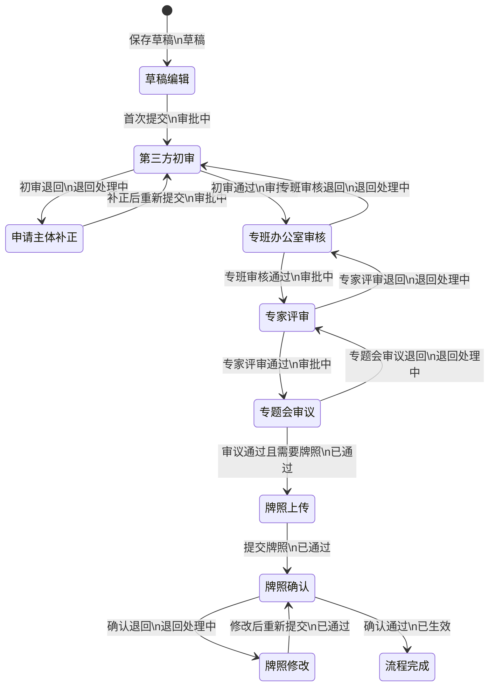
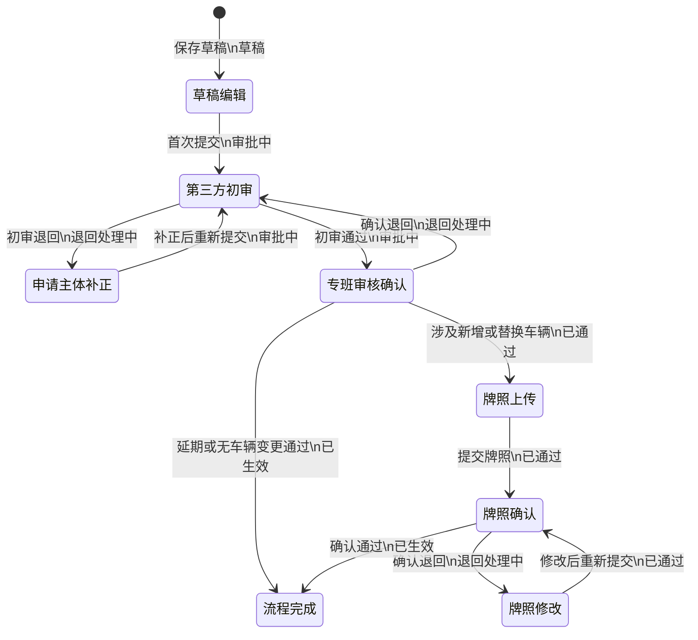
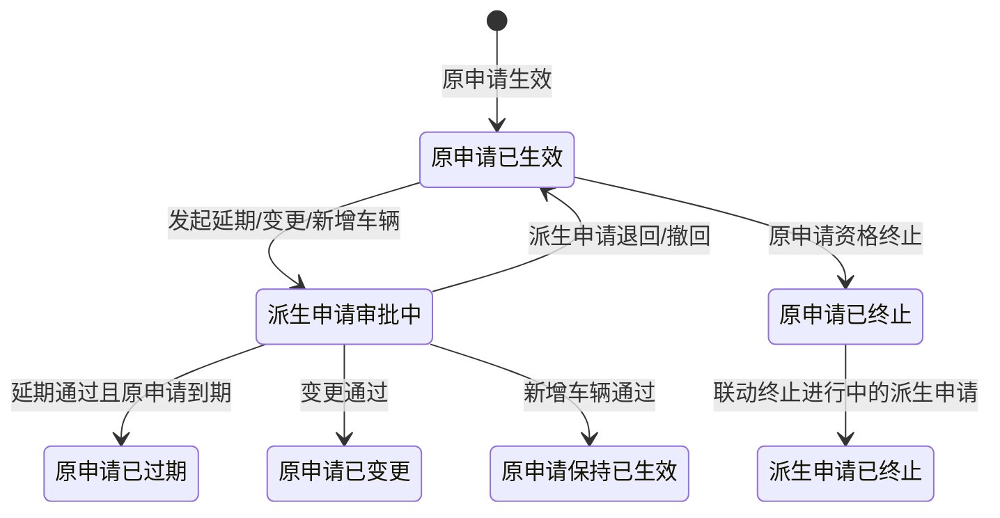
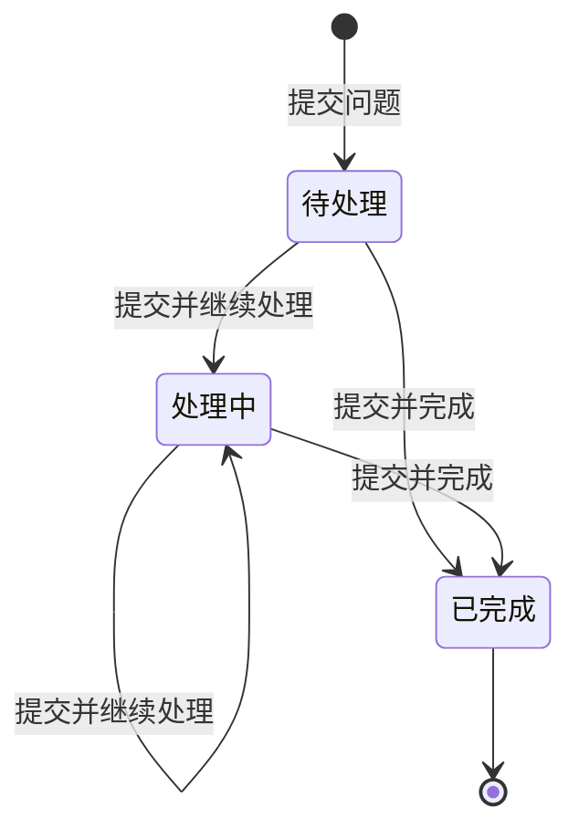
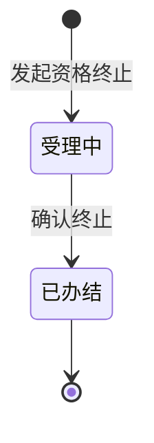
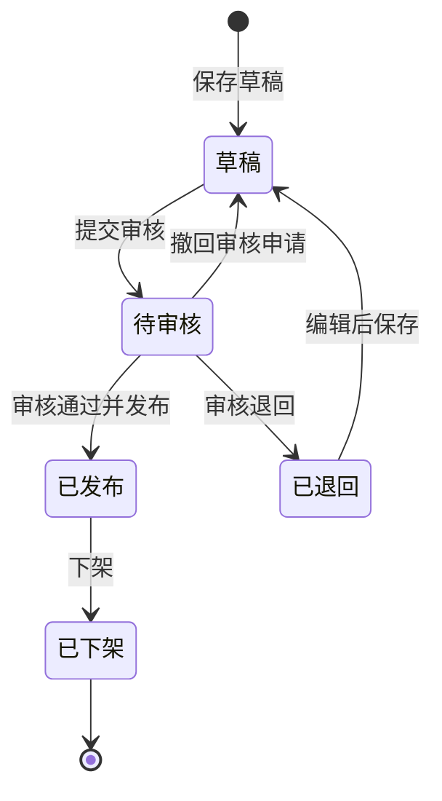
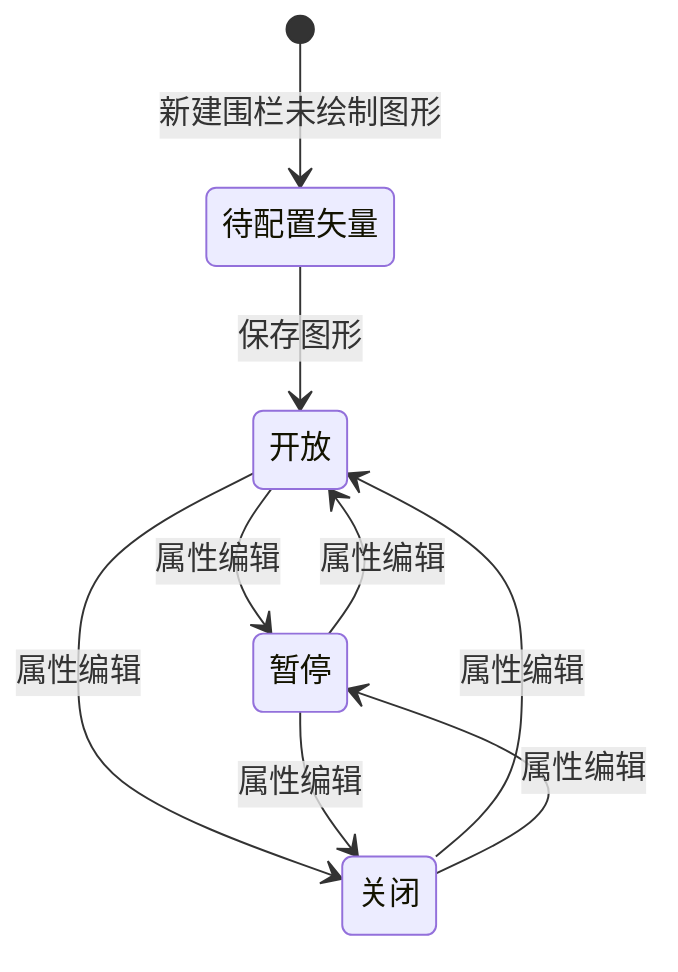

| 属性   | 内容           |
| ---- | ------------ |
| 产品名称 | 智能网联汽车安全监测平台 |
| 模块名称 | 测试示范监管模块     |
| 文档版本 | V4.8         |
| 创建日期 | 2026-06-08   |
| 最后更新 | 2026-09-10   |
| 文档状态 | 待确认          |

---

# 版本记录

| 版本   | 修改日期       | 修改人  | 修改内容                                                                                                                                                                                                                                                                                                                                                                                                                                                                                                                                                                                                                                                                                                                     | 备注  |
| ---- | ---------- | ---- | ------------------------------------------------------------------------------------------------------------------------------------------------------------------------------------------------------------------------------------------------------------------------------------------------------------------------------------------------------------------------------------------------------------------------------------------------------------------------------------------------------------------------------------------------------------------------------------------------------------------------------------------------------------------------------------------------------------------------ | --- |
| V1.0 | 2026-06-08 | 产品经理 | 基于需求规格说明书 V1.7 和高保真页面完成初稿撰写                                                                                                                                                                                                                                                                                                                                                                                                                                                                                                                                                                                                                                                                                              | —   |
| V4.4 | 2026-08-24 | 产品经理 | F04/F05/F06 初次申请新增“应用场景”字段，枚举值为无人物流、无人环卫、无人公交、无人出行；道路选择和提交环节校验所选道路的“适用应用场景”；延期、变更、新增相同配置车辆申请继承原应用场景；审批详情和业务总览同步展示；F10 资格终止支持申请主体和测试车辆两类终止对象，车辆对象可选择车辆并查看关联申请流程，终止记录列表改为展示终止对象并使用秒级终止日期，终止后关联申请流程统一变更为“已终止”；列表进一步拆分为终止对象类型、申请主体、测试车辆三列，按对象类型分别展示主体名称或车辆名称；查询条件中的终止对象改为终止对象类型下拉筛选，枚举全部、申请主体、测试车辆；终止详情不展示应用场景字段；F08 审批操作在第三方初审和专家评审节点将“审批意见”字段统一调整为“备注”，其他节点保持原字段名称；F22 交通违法信息新增批量导入功能（见 3.22.3），支持下载导入模板与 Excel/CSV 文件上传（单次最大1000条），导入后自动校验并标记不合规数据，按钮对全部角色可见；F15 异常事件处置取消草稿保存，处置提交后直接进入待审核；异常事件审批的退回操作统一命名为“退回”；临时牌照登记（4.14.5）新增牌照照片必传（JPG/PNG），有效期由单一截止日期改为起止时间范围并校验先后顺序，道路测试批量牌照上传、示范应用单车牌照更新的登记入口同步改造 | 与开放道路管理模块联动 |
| V4.5 | 2026-08-25 | 产品经理 | F04/F05/F06 新增相同配置车辆申请在新增车辆外支持新增安全员；安全员从既有备案人员档案选择，可移除后重新选择，提交时须同时具备新增车辆和新增安全员；F04/F05/F06 准入申请及 F08 审批详情中的道路/区域详情统一将字段“所属行政区域”命名为“所属区域”。 | — |
| V4.6 | 2026-08-27 | 产品经理 | F04/F05/F06 准入申请列表新增申请时间范围筛选，按申请创建日期进行包含式筛选；当查询条件无法在同一行完整展示时，使用统一的展开/收起机制展示附加查询条件。 | — |
| V4.7 | 2026-08-31 | 产品经理 | F04/F05/F06 临时牌照登记由“登记后直接生效”调整为“登记后进入第三方机构牌照审核”；牌照弹窗按 VIN 码、型号、临时牌照号、有效期、牌照照片、操作展示当前申请车辆，支持按车辆编辑和保存牌照信息；临牌号增加跨申请唯一性校验；第三方机构可对已登记牌照作出通过或不通过结论，不通过必须填写修改意见并回流申请主体，申请主体修改后重新提交牌照审核，审核通过后申请才生效。 | — |
| V4.8 | 2026-09-10 | 产品经理 | F04/F05/F06/F08 统一采用“流程状态 + 当前环节”双字段；退回仅作为流程日志事件并回到紧邻前置环节，第三方初审退回申请主体补正；延期和变更执行第三方初审、专班审核确认两级审批，新增相同配置车辆与初次申请一致执行第三方初审、专班办公室审核、专家评审、专题会审议四级审批；牌照上传、确认和退回修改纳入同一双字段口径；流程日志增加退回轮次、来源、目标和闭环记录；审批操作由流程状态、当前环节和用户角色共同控制；申请主体补正时打开原申请编辑页并回填已有内容，取消不改变申请，提交成功后返回原退回环节继续审批；补正入口名称调整为“补正”，编辑页不展示额外退回提示，并在页面最下方以既有审批日志时间线展示已发生记录供申请主体参考；退回处理中不在当前环节补充退回来源，退回来源仅保留在流程日志中；F22 交通违法记录详情新增“违法所在道路”字段，展示顺序位于“违法发生地址”之前；F18 信息发布管理的列表操作列统一命名为“操作”，编辑仅适用于草稿和已退回信息，待审核信息支持撤回并回到草稿；F19 电子围栏将限速与车辆越界报警合并为围栏配置，移除已停用车辆自动移除、支持申请主体申请该区域及包含车辆号牌；F16/F17 事故流程调整为已上报、待提交分析报告、待审核、已完成、已撤回、已退回六种状态，交通事故报告保留为可选材料且不进入审核，第三方专业服务机构和系统管理员均可审核，已退回记录修改后重新进入待审核；F17 事故审核列表移除事故保险和审核角色，新增事故发生时间；事故数据上报与事故审核详情统一展示上报事故信息字段；F17 审核处理仅录入审核意见，审核结果由通过或退回操作确认，退回时审核意见必填，取消不改变事故处理状态；F17 查看详情仅展示事故信息和流程记录，不提供审批操作。 | — |

> V4.8 交互补充（2026-09-10）：F04/F05/F06/F08 详情弹窗标题栏仅展示标题和申请编号；标题下以唯一流程上下文栏集中展示流程状态、当前环节和当前处理方，退回处理中可辅助展示“由 XX 环节退回”。基本信息不重复展示流程状态或当前环节；退回来源仍以流程日志为审计依据，不构成第三个当前态字段。F08 列表操作列固定按“查看、处理”顺序展示。

> V4.4 补充（2026-08-24）：F04/F05/F06 初次申请、延期、变更和新增相同配置车辆申请，以及 F08 审批详情中的道路信息弹窗，与道路详情字段分组保持一致：删除“测试场景信息”，在“开放管控信息”展示适用自动驾驶等级、适用应用场景和适用业务类型。
> V4.4 补充（2026-08-24）：F08 第三方初审新增材料级文本批注。仅第三方初审可对单个材料新增、编辑、删除批注；退回时至少需要一条材料批注，系统按材料编号、材料名称和问题说明生成问题清单并随整体退回结果提供给申请主体；未批注材料默认无问题，不增加材料核验状态。退回重提后，第三方初审复核可查看上次历史批注且只读；市工作专班、专家评审、专题会审议等后续节点不展示批注入口，按流程日志追溯问题清单。

> V3.9（2026-08-13）：F04/F05/F06 准入申请与审批模块延期申请全面统一：(1) 延期申请表单统一（三页同构：顶部提示条"延期申请·基于原申请编号"、原申请信息只读（申请主体/原时间段/业务类型/项目）、延期内容（原测试周期只读、延期时间段开始日期自动接续原截止日期+1 天只读、结束日期可编辑、延期原因必填）、延期申请材料（最新安全性自我声明/延期申请书/前期总结评估报告/延期必要性说明 + 原申请附件只读折叠），区块标题不标注"不可编辑/可编辑"）；(2) F05/F06 新建申请表单新增项目字段（示范应用项目/商业化试点项目，附件前必填）；(3) 审批延期详情与申请表单对齐：移除"基本信息"区块（申请编号/申请主体/申请状态/申请时间并入顶部提示条）、原申请信息区块（从原申请记录取值，da/do 补齐项目字段）、延期内容区块（含时间接力说明）、附件区 h4 统一"延期申请材料"且组标题统一"本次申请文件"、原申请附件折叠统一"原申请附件（只读关联）"、人员表标题使用业务名称、业务类型完整文案（载人示范应用/载人商业化试点等）、rt 附件组标题移除"共 N 项"后缀；(4) 道路/车辆详情"查看"打开与准入信息管理一致的完整档案弹窗（roadFullData/vehicleFullData），审批详情同步接入；(5) 三类变更申请收敛为同一框架：仅申请主体只读，统一变更原因文本框、原声明只读关联、最新声明/变更理由及必要性说明/相应证明材料上传，分别按道路测试、示范应用、商业化试点配置七项可变更字段；车辆、驾驶员（安全员）、路段或区域在勾选变更后以原申请清单预填表格展示，只能通过既有选择弹窗新增。删除操作改为标记拟删除，可恢复；同一表格展示保留、新增、拟删除对象。提交固化全量对象及行级状态，审批详情以新建申请同规格表格只读展示并附状态，后续基础档案变化不得影响审批证据；清空已勾选清单时禁止提交；变更详情展示原值/新值对比，右侧“版本演进”按钮打开独立弹窗；(6) 变更申请及详情的本次材料和原申请附件沿用延期申请材料分组与文件行规则，原申请附件按实际初次申请材料清单完整只读关联。 | —   |

> V4.0（2026-08-14）：F04/F05/F06 新增相同配置车辆申请及详情统一接入共享框架：(1) 申请表单统一展示原申请编号、申请主体、业务类型、原有效期及项目，并使用本地车辆选择器；仅允许选择与原申请车辆型号、自动驾驶级别相同且未在原清单中的车辆，提交时校验已选车辆、申请理由和两项本次材料；(2) 三类业务本次材料固定为两项：道路测试为“最新道路测试安全性自我声明”“新增相同配置车辆必要性说明”，示范应用为“最新示范应用安全性自我声明”“新增相同配置车辆必要性说明”，商业化试点为“最新商业化试点安全性自我声明”“新增相同配置车辆必要性说明”；(3) 原申请附件单独按对应初次申请的实际材料分组完整只读关联，材料行不附加“只读关联”说明；(4) 延期、变更、新增相同配置车辆详情共用派生申请详情骨架：标题展示申请编号和状态，顶部摘要展示申请类型、关联申请、申请主体和申请时间；“申请信息”和“申请材料”按业务类型展示，本次申请的原申请内容（基本信息、业务信息和材料）默认收起，统一展示审批流程进度、流程日志和版本演进；新增车辆详情仅展示车辆清单和申请理由，不展示配置核验结果；(5) 初次申请仅统一详情标题展示申请编号和状态，不调整初次申请表单；(6) 所有查看态材料及原申请关联材料统一按初次申请详情的材料目录呈现编号、材料名称、文件或关联档案、预览和下载操作；(7) F08 审批详情复用同一申请详情内容，查看态仅展示详情、流程进度和流程日志，审批态在此基础上增加节点信息、审批意见、审批附件及整体通过/退回操作；详情内的申请状态按申请当前节点展示，初次申请不重复展示申请状态。 | —   |
> V4.0 补充（2026-08-14）：F04/F05/F06 的延期申请及详情统一接入派生申请共享框架。三个业务统一展示完整原申请只读上下文、原有效期及自动接续的延期起始日，仅允许填写新的结束日期、延期原因及四项本次材料；延期入口在原有效期结束前 3 个月开放，单次延期不得超过 6 个月。延期时间段、规则说明和延期原因的填写方式与对应初次申请保持一致。各业务通过配置维护业务字段、附件名称、原申请材料分组和提交后的新申请记录。


> V4.0 交互补充：申请详情标题中的状态以状态标签呈现，初次申请基本信息不重复展示申请状态。派生申请详情不展示重复基本信息；延期申请的审批详情与申请详情均只展示本次申请信息（原申请时间段、延期时间段、延期原因）和“申请材料”，不单列原申请信息；原申请内容及其附件仅作为默认收起的只读关联区展示，展开后依次展示关联初次申请的基本信息、业务信息、道路/车辆/人员明细及材料目录，无需二次展开。道路测试、示范应用和商业化试点的原申请内容采用统一的阅读区呈现。新建延期、变更和新增相同配置车辆申请复用“顶部摘要—申请信息—申请材料—原申请内容”骨架；审批流程进度和流程日志仅在提交后的详情中展示。
> V4.0 补充（2026-08-14）：新增相同配置车辆申请的候选车辆提示统一使用申请表辅助说明样式；新建申请不预填新增车辆、申请说明和本次申请材料；移除新增车辆前置条件展示及对应配置。
> 原申请内容补充：原申请内容须直接读取关联初次申请的实际记录；车辆、道路或区域、人员不得以汇总文本替代，应分别以对应初次申请的业务标题和明细表展示其记录字段。
> V4.1（2026-08-17）：F04/F05/F06 申请详情与 F08 审批详情的版本演进统一为申请谱系查询。资格演进按初次申请、延期、变更构成主链；新增相同配置车辆仅作为来源申请的附属支链，不参与资格主链。每条关联申请展示申请编号、申请类型、当前状态、申请时间、有效期及与原申请的接续、替代或挂接关系；当前查看申请须明确标识，用户可从任一节点进入对应详情。申请类型与申请状态分别表达，避免将关系模型与审批结果混用；展示聚焦关联层级、当前申请与节点跳转，减少非必要的重复信息。
> V4.2（2026-08-17）：(1) F04/F05/F06 临时牌照登记收敛为轻量流程：初次申请，以及变更中新增或替换车辆、新增相同配置车辆，在审批通过后进入“待上传牌照”，仅登记本次需补充的车辆牌照号和有效期；延期及不涉及车辆的变更审批通过后直接生效；申请列表和申请详情的车辆信息均可进入同一登记功能，不新增待办、通知、附件或独立页面；用户在一次操作中完成全部待登记车辆的填写和校验后，申请自动生效；已生效详情仅只读展示牌照信息。(2) F11 在线反馈统一为待处理、处理中、已完成三态，移除独立关闭流程；管理侧通过提交并继续处理或提交并完成驱动状态流转，已完成必须伴随最终回复，公众侧按三态查看处理进度和回复内容。(3) 变更申请详情与审批详情中，车辆、人员、道路或区域等对象字段以提交时固化的全量对象快照和行级状态表作为唯一差异依据，统一展示保留、新增、拟删除对象；标量字段继续展示关联原申请的实际原值与变更后值，不以对象汇总文本替代行级差异。(4) F01/F02/F03 企业、车辆、人员详情新增信息快照查询：各对象保存时自动固化快照，详情中按时间展示快照编号、快照时间、修改人及查看操作；任一快照仅可只读查看完整登记信息和关联附件，准入申请引用对应快照编号作为历史追溯依据。
> V4.3（2026-08-18）：F01/F02/F03 与 F04/F05/F06 的对象详情统一按快照查看：信息管理入口默认展示最新快照，并显示快照编号、快照时间、修改人，可查看同一对象的历次快照；准入申请详情入口仅打开本申请提交时引用的企业、人员或车辆快照，展示相同的快照基本信息和完整只读内容，不提供切换历次快照的操作。

# 名词解释

| 名词/缩写     | 解释                                                      |
| --------- | ------------------------------------------------------- |
| 准入申请      | 测试主体向政府监管部门提交的道路测试、示范应用、商业化试点申请                         |
| 第三方专业管理机构 | 受政府委托对申请材料进行初审和技术评估的专业机构                                |
| 市工作专班     | 襄阳市国家级车联网先导区建设工作专班，由经信、交通、公安等部门组成，负责审核确认、委托专家评审、召开专题会审议 |
| 安全性自我声明   | 测试主体对测试车辆安全性能的正式声明文件，需市工作专班盖章确认                         |
| 临时牌照      | 智能网联汽车道路测试专用临时行驶车号牌，由交管部门发放                             |
| VIN 码     | 车辆识别代号（Vehicle Identification Number），17 位字符唯一标识        |
| 监控一张图     | 以电子地图为核心，集中展示车辆位置、状态、异常事件（预警/告警）、事故等信息的可视化监控页面                   |
| 电子围栏      | 在地图上划定的虚拟地理边界，用于限制或监控车辆行驶范围                             |
| Wn        | 正常车辆权重系数（Weight-normal），用于企业综合评估计算中正常状态车辆得分的加权比例        |
| Wf        | 故障车辆权重系数（Weight-fault），用于企业综合评估计算中故障/离线状态车辆得分的加权比例      |

---

## 1 业务背景与使用角色

### 1.1 业务背景
- 模块定位：测试示范监管模块是智能网联汽车安全监测平台的核心业务模块，构建覆盖**事前准入、事中监控、事后评价**的全流程数字化监管体系
- 核心特点：多主体协同（政府/第三方/企业）、多类型申请（道路测试/示范应用/商业化试点）、多子类型（初次/延期/变更/新增车辆）、严格串联审批流程
- 关联模块关系：
  - 开放道路资源管理模块：测试路段或区域数据来源、道路状态变更触发资格终止
  - 监测数据分析模块：车辆运行数据、告警数据、事故数据的统计分析
  - 平台管理模块：用户权限、字典配置等基础能力支撑

### 1.2 使用角色

| 角色               | 该模块中的职责                                       | 客户端   |
| ---------------- | --------------------------------------------- | ----- |
| 政府监管部门（经信/交通/公安） | 专班审批、资格终止、报告报送、监控查看                           | Web 端 |
| 第三方专业管理机构        | 初审申请材料、组织专家评审、受理在线反馈                          | Web 端 |
| 产业运营主体（主机厂/运营企业） | 提交准入申请、登记企业/车辆/人员信息、上报事故、提交报告、查看审批进度、录入临时牌照信息 | Web 端 |
| 安全员/测试驾驶员        | 人员信息备案，参与测试过程                                 | Web 端 |
| 市交管部门            | 审核开放道路申请信息                                    | Web 端 |

### 1.3 核心目标与价值

| 目标维度 | 说明                            |
| ---- | ----------------------------- |
| 资质审核 | 实现测试示范全主体的资质审核与信息电子化建档        |
| 线上审批 | 提供线上化、标准化的申请审批通道，替代传统线下模式     |
| 实时监控 | 实现车辆运行状态的实时监控与异常自动告警          |
| 量化评估 | 构建测试评价体系，为测试主体与车辆提供量化评估       |
| 业务闭环 | 与开放道路资源管理、监测数据分析模块联动，形成完整业务闭环 |

---

## 2 功能清单总览

| 编号  | 功能点       | 功能描述                                                               | 优先级 | 本期建设 |
| --- | --------- | ------------------------------------------------------------------ | --- | ---- |
| F01 | 企业信息登记    | 测试主体企业基本信息的登记、编辑、查看、删除                                             | P0  | 是    |
| F02 | 车辆信息登记    | 测试车辆详细信息的登记、编辑、查看、删除，按分组录入                                         | P0  | 是    |
| F03 | 人员信息登记    | 测试驾驶员/安全员信息的登记、编辑、查看、删除，含驾驶资质校验、人员类型区分、交通违法与事故记录、记分周期承诺制、安全员额外培训信息 | P0  | 是    |
| F04 | 道路测试准入申请  | 道路测试初次/延期/变更/新增相同配置车辆申请，含申请材料上传、流程预览、详情查看                          | P0  | 是    |
| F05 | 示范应用准入申请  | 示范应用初次/延期/变更/新增相同配置车辆申请                                            | P0  | 是    |
| F06 | 商业化试点准入申请 | 商业化试点初次/延期/变更/新增相同配置车辆申请                                           | P0  | 是    |
| F07 | 业务总览      | 测试主体查看全部申请及报告的统一视图                                                 | P1  | 是    |
| F08 | 审批管理      | 第三方初审、市工作专班审核、专家评审、专题会审议，含审批详情、流程日志                                | P0  | 是    |
| F09 | 报告管理（政府端） | 报告查询、报告提交（向上级部门）、材料归档                                              | P1  | 是    |
| F10 | 资格终止管理    | 市工作专班发起资格终止，含 6 种终止类型                                              | P0  | 是    |
| F11 | 在线反馈管理    | 拆分为公众侧与管理侧两个独立视图：公众侧面向申请主体/社会公众提交与跟踪；管理侧仅管理部门可见，统一受理、回复与跟踪         | P1  | 是    |
| F12 | 审批配置      | 准入类型配置、申请材料目录配置与版本管理                                               | P1  | 是    |
| F13 | 监控一张图     | 车辆实时位置/轨迹/异常事件（预警/告警）/事故/围栏/道路的地图可视化监控                             | P0  | 是    |
| F14 | 车辆运行监测    | 视频监控、运行数据、自动驾驶状态、传感器、里程、电池、故障监测                                    | P0  | 是    |
| F15 | 异常状态预警    | 7 类预警：车辆运行异常、碰撞事件、车载终端异常、临牌有效期、围栏越界、时段合规、安全员到岗状态，含触发条件与筛选查询        | P0  | 是    |
| F16 | 事故数据上报    | 测试主体上报事故信息、交通事故报告、事故分析报告                                           | P0  | 是    |
| F17 | 事故审核      | 第三方/市工作专班对事故报告进行多阶段审核                                              | P0  | 是    |
| F18 | 信息发布管理    | 公告公示/办事指南/测试示范报告的编辑、审核、发布、下架                                       | P1  | 是    |
| F19 | 电子围栏管理    | 围栏新建（两步操作）、属性编辑、图形绘制/编辑（含保存/取消预览）、右侧信息面板查看详情、删除                    | P0  | 是    |
| F20 | 测试评价管理    | 评估参数配置、评估规则配置与版本管理、车辆评估、企业评估                                       | P1  | 是    |
| F21 | 信息公开      | 公告公示、办事指南、测试示范报告的公开查看                                              | P1  | 是    |

**说明：** 本期建设覆盖全部 21 个功能点。

---

## 3 功能详细设计

### 3.1 F01 企业信息登记

#### 3.1.1 页面布局

页面自上而下分为 3 个区域：

1. **页面标题区**：左侧标题 " 企业信息登记 "，右侧操作按钮 " 新增企业信息 "、" 导出 "
2. **查询筛选区**：查询条件与按钮同行排列
3. **数据列表区**：表格展示企业信息，底部分页栏（见附录 A.1）

#### 3.1.2 查询筛选区

| 元素   | 类型    | 配置说明   |
| ---- | ----- | ------ |
| 公司名称 | 文本输入框 | 支持模糊搜索 |

**操作按钮：**

| 按钮     | 触发行为                     | 可见角色             |
| ------ | ------------------------ | ---------------- |
| 查询     | 按条件筛选列表                  | 全部               |
| 重置     | 清空查询条件                   | 全部               |
| 新增企业信息 | 打开新增企业弹窗                 | 产业运营主体           |
| 导出     | 导出当前筛选数据为 Excel（见附录 A.3） | 政府监管部门、第三方专业管理机构 |

#### 3.1.3 数据列表区

**列表显示字段：**

| 序号  | 字段名    | 字段标识          | 宽度建议  | 说明                         |
| --- | ------ | ------------- | ----- | -------------------------- |
| 1   | 复选框    | —             | 40px  | 见附录 A.3                    |
| 2   | 公司名称   | companyName   | 200px | —                          |
| 3   | 统一信用代码 | creditCode    | 180px | —                          |
| 4   | 申请主体类型 | subjectType   | 140px | 枚举值见 3.1.4                 |
| 5   | 联系人    | contactPerson | 100px | —                          |
| 6   | 联系方式   | contactPhone  | 140px | —                          |
| 7   | 登记时间   | createTime    | 160px | 系统自动生成，格式 YYYY-MM-DD HH:mm |
| 8   | 操作     | —             | 150px | 见操作列按钮                     |

**排序规则：** 默认按登记时间倒序排列。

**操作列按钮：**

| 操作  | 触发行为               | 可见角色   |
| --- | ------------------ | ------ |
| 详情  | 打开企业详情弹窗           | 全部     |
| 编辑  | 打开编辑企业弹窗，表单预填现有数据  | 产业运营主体 |
| 删除  | 二次确认后逻辑删除（见附录 A.2） | 产业运营主体 |

**数据权限**：产业运营主体仅能看到自身新建的企业数据，政府监管部门/第三方专业管理机构能够看到全部企业数据

#### 3.1.4 表单字段定义

**企业基本信息**

| 字段名          | 字段类型  | 是否必填 | 校验规则           | 默认值  | 说明                                     |
| ------------ | ----- | ---- | -------------- | ---- | -------------------------------------- |
| 公司名称         | 文本输入  | 是    | 不可为空，最长 100 字符 | —    | —                                      |
| 统一信用代码       | 文本输入  | 是    | 不可为空，18 位字符    | —    | —                                      |
| 申请主体类型       | 下拉单选  | 是    | 不可为空           | —    | 枚举值：整车厂、系统运营商、零部件制造商、互联网服务商、科研院所/高校、其他 |
| 注册资本（万元）     | 文本输入  | 否    | 数值             | —    | —                                      |
| 业务范围         | 多行文本  | 否    | 最长 300 字       | —    | 显示字数计数器                                |
| 研发/制造及试验能力说明 | 多行文本  | 否    | 最长 300 字       | —    | 显示字数计数器                                |
| 单位联系地址       | 文本输入  | 否    | —              | —    | —                                      |
| 单位联系电话       | 文本输入  | 否    | 合法电话号码格式       | —    | —                                      |
| 单位联系邮箱       | 文本输入  | 否    | 合法邮箱格式         | —    | —                                      |
| 联系人          | 文本输入  | 是    | 不可为空           | —    | —                                      |
| 联系方式         | 文本输入  | 是    | 不可为空           | —    | —                                      |
| 营业执照         | 单文件上传 | 是    | 不可为空，格式见附录 A.5 | —    | 位于所有字段最后                               |
| 登记时间         | 系统自动  | —    | —              | 当前时间 | 新增完成后自动生成，编辑时不可修改                      |

#### 3.1.5 交互流程

1. 用户点击 " 新增企业信息 " → 打开新增企业弹窗（空表单）
2. 用户点击列表 " 编辑 " → 打开编辑企业弹窗（预填现有数据，登记时间不可修改）
3. 填写/修改表单 → 点击 " 确定 "：
   - 校验成功 → 保存数据 + Toast 提示 " 保存成功 " + 关闭弹窗 + 刷新列表
   - 校验失败 → 在对应字段下方显示红色错误提示 + 弹窗不关闭
4. 用户点击 " 删除 " → 弹出二次确认弹窗（见附录 A.2）→ 确认后逻辑删除 + 刷新列表
5. 用户点击 " 导出 " → 见附录 A.3

#### 3.1.6 弹窗规格

| 属性 | 值 |
| ---- | -- |
| 宽度 | 720px |
| 最大宽度 | 90vw |
| 位置 | 居中弹出 |
| 遮罩 | 半透明黑色，点击遮罩不关闭 |
| 标题 | 新增企业信息 / 编辑企业信息 / 企业详情 |

#### 3.1.7 信息快照
企业详情默认展示最新快照，并显示快照编号、快照时间、修改人；可查看同一企业的历次快照列表。列表按快照时间倒序展示快照编号、快照时间、修改人和查看操作；用户点击查看后，以只读形式展示该企业在该快照时的完整登记信息及营业执照附件。新增登记、保存编辑或更新附件时自动生成快照；历史快照不可编辑、删除或恢复。准入申请引用企业时记录对应快照编号，后续企业登记信息变更不得影响已提交申请的历史依据。

---

### 3.2 F02 车辆信息登记

#### 3.2.1 页面布局

页面自上而下分为 3 个区域：

1. **页面标题区**：左侧标题 " 车辆信息管理 "，右侧 " 新增车辆信息 "、" 导出 " 按钮
2. **查询筛选区**：查询条件与按钮同行排列
3. **数据列表区**：表格展示车辆信息，底部分页栏（见附录 A.1）

#### 3.2.2 查询筛选区

| 元素    | 类型    | 配置说明                               |
| ----- | ----- | ---------------------------------- |
| VIN 码 | 文本输入框 | 支持模糊搜索，匹配 VIN 码                    |
| 所属企业  | 下拉单选  | 数据来源：企业信息登记中的企业列表，默认全部             |
| 车辆种类  | 下拉单选  | 枚举值：乘用车、商用车、专用作业车、功能型低速无人车、其他，默认全部 |

**操作按钮：**

| 按钮     | 触发行为                     | 可见角色                    |
| ------ | ------------------------ | ----------------------- |
| 查询     | 按条件筛选列表                  | 全部                      |
| 重置     | 清空查询条件                   | 全部                      |
| 新增车辆信息 | 打开新增车辆弹窗                 | 产业运营主体                  |
| 导出     | 导出当前筛选数据为 Excel（见附录 A.4） | 产业运营主体、政府监管部门/第三方专业管理机构 |

**数据权限**：产业运营主体仅能看到自身新建的企业数据，政府监管部门/第三方专业管理机构能够看到全部企业数据

#### 3.2.3 数据列表区

**列表显示字段：**

| 序号  | 字段名     | 字段标识       | 宽度建议  | 说明                         |
| --- | ------- | ---------- | ----- | -------------------------- |
| 1   | 复选框     | —          | 40px  | 见附录 A.5                    |
| 2   | VIN 码    | vin        | 160px | 等宽字体                       |
| 3   | 生产企业    |            | 180px | —                          |
| 4   | 所属企业    |            | 120px | —                          |
| 5   | 车辆种类    |            | 120px | —                          |
| 6   | 车辆型号    | model      | 120px | —                          |
| 7   | 自动驾驶级别  | adLevel    | 100px | L2/L3/L4/L5                |
| 8   | 临牌号（最新） | plateNo    | 120px | 根据准入申请模块中更新的临牌号自动同步获取      |
| 9   | 登记时间    | createTime | 160px | 系统自动生成，格式 YYYY-MM-DD HH:mm |
| 9   | 操作      | —          | 120px | 见操作列按钮                     |

**排序规则：** 默认按登记时间倒序排列。

**操作列按钮：**

| 操作  | 触发行为               | 可见角色   |
| --- | ------------------ | ------ |
| 详情  | 打开车辆详情弹窗           | 全部     |
| 编辑  | 打开编辑车辆弹窗，表单预填现有数据  | 产业运营主体 |
| 删除  | 二次确认后逻辑删除（见附录 A.2） | 产业运营主体 |

#### 3.2.4 表单字段定义

**基本信息**

| 字段名                | 字段类型 | 是否必填 | 校验规则           | 默认值  | 说明                            |
| ------------------ | ---- | ---- | -------------- | ---- | ----------------------------- |
| 所属企业               | 下拉单选 | 是    | 不可为空，数据来源：企业登记 | —    | 平台管理字段，对应测试主体                 |
| 生产企业               | 文本输入 | 是    | 不可为空           | —    | 车辆的生产制造商                      |
| 车辆识别代号（VIN，或唯一性编码） | 文本输入 | 是    | 17 位字符，全局唯一    | —    | —                             |
| 车辆型号               | 文本输入 | 是    | 不可为空           | —    | —                             |
| 车辆种类               | 下拉单选 | 是    | 不可为空           | —    | 枚举值：乘用车、商用车、专用作业车、功能型低速无人车、其他 |
| 生产日期               | 日期选择 | 是    | 不可为空，不得晚于当前日期  | —    | —                             |
| 车辆颜色               | 文本输入 | 是    | 不可为空           | —    | —                             |
| 自动驾驶级别             | 下拉单选 | 是    | 不可为空           | —    | 枚举值：L2、L3、L4、L5               |
| 临牌号（最新）            | 文本输入 | 否    | —              | —    | 系统自动获取最新临牌号，若无，为空             |
| 登记时间               | 系统自动 | —    | —              | 当前时间 | 新增完成后自动生成                     |

**车辆参数**

| 字段名          | 字段类型 | 是否必填 | 校验规则 | 默认值 | 说明        |
| ------------ | ---- | ---- | ---- | --- | --------- |
| 整车整备质量 (kg)  | 数字输入 | 是    | 正数   | —   | —         |
| 轴荷 (kg)      | 数字输入 | 是    | 正数   | —   | —         |
| 最大设计总质量 (kg) | 数字输入 | 是    | 正数   | —   | —         |
| 额定载客人数       | 数字输入 | 是    | 正整数  | —   | —         |
| 发动机号         | 文本输入 | 否    | —    | —   | 燃油/混动车辆填写 |

**总成信息 — 动力系统**

| 字段名     | 字段类型 | 是否必填 | 校验规则 | 默认值 | 说明                   |
| ------- | ---- | ---- | ---- | --- | -------------------- |
| 动力型式    | 下拉单选 | 是    | 不可为空 | —   | 枚举值：纯电动、混合动力、燃料电池、燃油 |
| 动力生产企业  | 文本输入 | 否    | —    | —   | —                    |
| 发动机型号   | 文本输入 | 否    | —    | —   | 燃油/混动车辆填写            |
| 发动机生产企业 | 文本输入 | 否    | —    | —   | 燃油/混动车辆填写            |
| 动力蓄电池型号 | 文本输入 | 否    | —    | —   | 电动/混动车辆填写            |
| 蓄电池生产企业 | 文本输入 | 否    | —    | —   | 电动/混动车辆填写            |
| 动力电机型号  | 文本输入 | 否    | —    | —   | 电动/混动车辆填写            |
| 电机生产企业  | 文本输入 | 否    | —    | —   | 电动/混动车辆填写            |
| 驱动型式    | 文本输入 | 否    | —    | —   | —                    |
| 驱动生产企业  | 文本输入 | 否    | —    | —   | —                    |
| 变速器型式   | 文本输入 | 否    | —    | —   | —                    |
| 变速器生产企业 | 文本输入 | 否    | —    | —   | —                    |

**总成信息 — 转向系统**

| 字段名 | 字段类型 | 是否必填 | 校验规则 | 默认值 | 说明 |
| ------ | -------- | -------- | -------- | ------ | ---- |
| 转向系统型式 | 文本输入 | 否 | — | — | — |
| 转向生产企业 | 文本输入 | 否 | — | — | — |

**总成信息 — 制动系统**

| 字段名 | 字段类型 | 是否必填 | 校验规则 | 默认值 | 说明 |
| ------ | -------- | -------- | -------- | ------ | ---- |
| 制动系统型式 | 文本输入 | 否 | — | — | — |
| 制动生产企业 | 文本输入 | 否 | — | — | — |
| ESC 型号 | 文本输入 | 否 | — | — | — |
| ESC 生产企业 | 文本输入 | 否 | — | — | — |

**总成信息 — 感知系统**

| 字段名      | 字段类型 | 是否必填 | 校验规则 | 默认值 | 说明                     |
| -------- | ---- | ---- | ---- | --- | ---------------------- |
| 环境感知系统型式 | 文本输入 | 是    | 不可为空 | —   | 如：激光雷达 + 毫米波雷达 + 摄像头融合 |
| 感知生产企业   | 文本输入 | 否    | —    | —   | —                      |

**轮胎信息**

| 字段名    | 字段类型 | 是否必填 | 校验规则 | 默认值 | 说明  |
| ------ | ---- | ---- | ---- | --- | --- |
| 轮胎规格   | 文本输入 | 否    | —    | —   | —   |
| 轮胎生产企业 | 文本输入 | 否    | —    | —   | —   |

**其他改装情况说明**

| 字段名      | 字段类型 | 是否必填 | 校验规则 | 默认值 | 说明                         |
| -------- | ---- | ---- | ---- | --- | -------------------------- |
| 其他改装情况说明 | 多行文本 | 否    | —    | —   | 详细说明车辆改装情况以及传感器品牌、安装位置和数量等 |

**自动驾驶功能说明**

| 字段名         | 字段类型 | 是否必填 | 校验规则 | 默认值 | 说明                               |
| ----------- | ---- | ---- | ---- | --- | -------------------------------- |
| 自动驾驶相应级别    | 下拉单选 | 是    | 不可为空 | —   | 枚举值：L2、L3、L4、L5，应符合车辆配置情况和自动驾驶功能 |
| 自主式智能驾驶功能描述 | 多行文本 | 否    | —    | —   | —                                |
| 网联式协同驾驶功能描述 | 多行文本 | 否    | —    | —   | —                                |

#### 3.2.5 交互流程

1. 用户点击 " 新增车辆信息 " → 打开新增车辆弹窗（空表单，按分组展示）
2. 用户点击列表 " 编辑 " → 打开编辑车辆弹窗（预填现有数据，登记时间不可修改）
3. 填写/修改表单 → 点击 " 确定 "：
   - 校验成功 → 保存数据 + Toast 提示 " 保存成功 " + 关闭弹窗 + 刷新列表
   - 校验失败 → 在对应字段下方显示红色错误提示 + 弹窗不关闭
4. 用户点击 " 删除 " → 弹出二次确认弹窗（见附录 A.2）→ 确认后逻辑删除 + 刷新列表
5. 若该车辆存在进行中的关联申请流程 → 弹窗提示 " 该车辆存在正在进行的关联申请流程，无法删除 "，阻断操作

#### 3.2.6 弹窗规格

| 属性 | 值 |
| ---- | -- |
| 宽度 | 900px |
| 最大宽度 | 90vw |
| 位置 | 居中弹出 |
| 遮罩 | 半透明黑色，点击遮罩不关闭 |
| 标题 | 新增车辆信息 / 编辑车辆信息 / 车辆详情 |

#### 3.2.7 信息快照
车辆详情默认展示最新快照，并显示快照编号、快照时间、修改人；可查看同一车辆的历次快照列表。列表按快照时间倒序展示快照编号、快照时间、修改人和查看操作；用户点击查看后，以只读形式展示该车辆在该快照时的完整登记信息及关联附件。新增登记、保存编辑、状态调整或更新附件时自动生成快照；历史快照不可编辑、删除或恢复。准入申请引用车辆时记录对应快照编号，后续车辆登记信息变更不得影响已提交申请的历史依据。

---

### 3.3 F03 人员信息登记

#### 3.3.1 页面布局

页面自上而下分为 3 个区域：

1. **页面标题区**：左侧标题 " 人员信息查询 "，右侧 " 新增人员信息 "、" 导出 " 按钮
2. **查询筛选区**：查询条件与按钮同行排列
3. **数据列表区**：表格展示人员信息，底部为分页栏（见附录 A.1）

#### 3.3.2 查询筛选区

| 元素   | 类型    | 配置说明                                       |
| ---- | ----- | ------------------------------------------ |
| 姓名   | 文本输入框 | 支持模糊搜索                                     |
| 身份证号 | 文本输入框 | 支持模糊搜索                                     |
| 所属企业 | 下拉单选  | 数据来源：企业信息登记                                |
| 人员类型 | 多选下拉  | 枚举值：驾驶人、安全员、远程操控员、其他，默认全部                  |
| 驾照类型 | 下拉单选  | 枚举值：A1、A2、A3、B1、B2、C1、C2、C3、C4、C5、D、E，默认全部 |

**操作按钮：**

| 按钮     | 触发行为                     | 可见角色      |
| ------ | ------------------------ | --------- |
| 查询     | 按条件筛选列表                  | 全部        |
| 重置     | 清空查询条件                   | 全部        |
| 新增人员信息 | 打开新增人员弹窗                 | 测试主体      |
| 导出     | 导出当前筛选数据为 Excel（见附录 A.3） | 测试主体、监管部门 |

#### 3.3.3 数据列表区

**列表显示字段：**

| 序号  | 字段名            | 字段标识             | 宽度建议  | 说明                 |
| --- | -------------- | ---------------- | ----- | ------------------ |
| 1   | 复选框            | —                | 40px  | 见附录 A.5            |
| 2   | 姓名             | name             | 80px  | —                  |
| 3   | 性别             | gender           | 60px  | —                  |
| 4   | 身份证号           | idNumber         | 160px | 脱敏显示（前 4 后 2 中间星号） |
| 5   | 所属企业           | company          | 160px | —                  |
| 6   | 人员类型           | personType       | 120px | 标签展示，支持多个          |
| 7   | 驾照类型           | licenseType      | 80px  | —                  |
| 8   | 最近一年有无严重交通违法行为 | illegalRecord    | 140px | —                  |
| 9   | 有无酒驾/醉驾/精神药品记录 | drinkDriveRecord | 160px | —                  |
| 10  | 有无交通事故记录       | accidentRecord   | 120px | —                  |
| 11  | 登记时间           | createTime       | 140px | 系统自动生成             |
| 12  | 操作             | —                | 120px | 见操作列按钮             |

**排序规则：** 默认按登记时间倒序排列。

**操作列按钮：**

| 操作  | 触发行为               | 可见角色 |
| --- | ------------------ | ---- |
| 详情  | 打开人员详情弹窗           | 全部   |
| 编辑  | 打开编辑人员弹窗，表单预填现有数据  | 测试主体 |
| 删除  | 二次确认后逻辑删除（见附录 A.2） | 测试主体 |

#### 3.3.4 表单字段定义

**基本信息**

| 字段名   | 字段类型 | 是否必填 | 校验规则       | 默认值  | 说明                         |
| ----- | ---- | ---- | ---------- | ---- | -------------------------- |
| 姓名    | 文本输入 | 是    | 不可为空       | —    | —                          |
| 性别    | 下拉单选 | 是    | 不可为空       | —    | 枚举值：男、女                    |
| 身份证号  | 文本输入 | 是    | 18 位有效身份证号 | —    | —                          |
| 身份证附件 | 文件上传 | 是    |            | —    | 正反面扫描件                     |
| 年龄    | 系统自动 | —    | —          | —    | 根据身份证号自动计算，不可编辑            |
| 所属企业  | 下拉单选 | 是    | 数据来源：企业登记  | —    | 准入申请中选取人员时，工作单位自动取所属企业名称展示 |
| 登记时间  | 系统自动 | —    | —          | 当前时间 | 新增完成后自动生成，不可编辑             |

**驾驶资质信息**

| 字段名      | 字段类型 | 是否必填 | 校验规则     | 默认值 | 说明                                         |
| -------- | ---- | ---- | -------- | --- | ------------------------------------------ |
| 驾照类型     | 下拉单选 | 是    | 不可为空     | —   | 枚举值：A1、A2、A3、B1、B2、C1、C2、C3、C4、C5、D、E      |
| 机动车驾驶证附件 | 文件上传 | 是    |          | —   | —                                          |
| 初次领证日期   | 日期选择 | 是    | 不得晚于当前日期 | —   | 选择后下方实时显示只读提示 " 当前驾龄：X 年 X 月 "；提交时校验驾龄≥3 年 |
| 安全驾驶证明   | 文件上传 | 是    |          | —   | —                                          |

**人员类型信息**

| 字段名 | 字段类型 | 是否必填 | 校验规则 | 默认值 | 说明 |
| ------ | -------- | -------- | -------- | ------ | ---- |
| 人员类型 | 多选下拉 | 是 | 不可为空，至少选择 1 项 | — | 枚举值：驾驶人、安全员、远程操控员、其他 |

**交通违法与事故记录**

| 字段名                  | 字段类型 | 是否必填        | 校验规则 | 默认值 | 说明                                                                   |
| -------------------- | ---- | ----------- | ---- | --- | -------------------------------------------------------------------- |
| 最近 1 年内有无严重交通违法行为记录  | 下拉单选 | 是           | 不可为空 | —   | 枚举值：有、无。选 " 有 " 时阻止提交，提示 " 该人员不符合驾驶人/安全员条件 "                         |
| 严重交通违法行为类型           | 多选下拉 | 选 " 有 " 时必填 | —    | —   | 枚举值：超速 50% 以上、超员、超载、违反交通信号灯通行。仅当 " 最近 1 年内有无严重交通违法行为记录 " 选 " 有 " 时展示 |
| 有无酒驾/醉驾/精神药品记录       | 下拉单选 | 是           | 不可为空 | —   | 枚举值：有、无。选 " 有 " 时阻止提交，提示 " 该人员不符合驾驶人/安全员条件 "                         |
| 连续 3 个记分周期未记满 12 分承诺 | 下拉单选 | 是           | 不可为空 | —   | 枚举值：是、否。选 " 否 " 时阻止提交，提示 " 该人员不符合驾驶人/安全员条件 "                         |
| 记分周期合规承诺书            | 文件上传 | 是           |      | —   | 企业上传加盖公章的承诺书，承诺该人员最近连续 3 个记分周期内未记满 12 分                              |
| 交管记分查询证明             | 文件上传 | 否           |      | —   | 交管部门出具的记分查询结果截图/PDF，作为佐证材料，鼓励但不强制                                    |
| 有无交通事故记录             | 下拉单选 | 是           | 不可为空 | —   | 枚举值：有、无                                                              |
| 有无致人死亡或重伤且负责任的交通事故记录 | 下拉单选 | 是           | 不可为空 | —   | 枚举值：有、无。选 " 有 " 时阻止提交，提示 " 该人员不符合驾驶人/安全员条件 "                         |

**培训与资质信息**

| 字段名              | 字段类型 | 是否必填 | 校验规则 | 默认值 | 说明      |
| ---------------- | ---- | ---- | ---- | --- | ------- |
| 是否熟悉自动驾驶功能测试评价规程 | 下拉单选 | 是    | 不可为空 | —   | 枚举值：是、否 |
| 是否掌握车辆道路测试操作方法   | 下拉单选 | 是    | 不可为空 | —   | 枚举值：是、否 |
| 是否具备紧急状态下应急处置能力  | 下拉单选 | 是    | 不可为空 | —   | 枚举值：是、否 |
| 劳动合同或劳务合同信息      | 文件上传 | 是    |      | —   | —       |
| 培训记录             | 文件上传 | 否    |      | —   | —       |

**自动驾驶安全员/远程操控员额外信息**（仅当人员类型包含 " 安全员 " 或 " 远程操控员 " 时展示）

| 字段名          | 字段类型 | 是否必填 | 校验规则     | 默认值 | 说明                                  |
| ------------ | ---- | ---- | -------- | --- | ----------------------------------- |
| 专业技能培训时长（小时） | 数字输入 | 是    | 正整数，≥40  | —   | 自动驾驶道路测试安全员不少于 40 小时专业技能培训          |
| 远程操控操作时长（小时） | 数字输入 | 是    | 正整数，≥100 | —   | 自动驾驶道路测试安全员不少于 100 小时自动驾驶测试车辆远程控制操作 |
| 专业技能培训证明     | 文件上传 | 是    |          | —   | —                                   |
| 远程操控操作证明     | 文件上传 | 是    |          | —   | —                                   |

#### 3.3.5 交互流程

1. 用户点击 " 新增人员信息 " → 打开新增人员弹窗（空表单）
2. 用户点击列表 " 编辑 " → 打开编辑人员弹窗（预填现有数据，登记时间不可修改）
3. 填写身份证号后 → 自动计算并显示 " 年龄 "（只读）
4. 选择 " 初次领证日期 " 后 → 下方实时显示只读提示 " 当前驾龄：X 年 X 月 "；驾龄不足 3 年时阻止提交并提示 " 驾驶经历需满 3 年，当前驾龄不足 "
5. 选择 " 人员类型 " 包含 " 安全员 " 或 " 远程操控员 " 时 → 动态展示 " 自动驾驶安全员/远程操控员额外信息 " 区域（培训时长、远程操控时长、对应证明上传）
6. " 最近 1 年内有无严重交通违法行为记录 " 选 " 有 " 时 → 展示 " 严重交通违法行为类型 " 多选字段 + 阻止提交并提示 " 该人员不符合驾驶人/安全员条件 "
7. " 有无酒驾/醉驾/精神药品记录 " 选 " 有 " 时 → 阻止提交并提示 " 该人员不符合驾驶人/安全员条件 "
8. " 连续 3 个记分周期未记满 12 分承诺 " 选 " 否 " 时 → 阻止提交并提示 " 该人员不符合驾驶人/安全员条件 "
9. " 有无致人死亡或重伤且负责任的交通事故记录 " 选 " 有 " 时 → 阻止提交并提示 " 该人员不符合驾驶人/安全员条件 "
10. 填写/修改表单 → 点击 " 确定 "：
    - 校验成功 → 保存数据 + Toast 提示 " 保存成功 " + 关闭弹窗 + 刷新列表
    - 校验失败 → 在对应字段下方显示红色错误提示 + 弹窗不关闭
11. 用户点击 " 删除 " → 弹出二次确认弹窗 → 确认后逻辑删除 + 刷新列表

#### 3.3.6 弹窗规格

| 属性   | 值                      |
| ---- | ---------------------- |
| 宽度   | 900px                  |
| 最大宽度 | 90vw                   |
| 位置   | 居中弹出                   |
| 遮罩   | 半透明黑色，点击遮罩不关闭          |
| 标题   | 新增人员信息 / 编辑人员信息 / 人员详情 |

> 注：表单按分组展示（基本信息、驾驶资质信息、人员类型信息、交通违法与事故记录、培训与资质信息、自动驾驶安全员/远程操控员额外信息），弹窗 body 区域可滚动，最大高度 85vh。

#### 3.3.7 信息快照
人员详情默认展示最新快照，并显示快照编号、快照时间、修改人；可查看同一人员的历次快照列表。列表按快照时间倒序展示快照编号、快照时间、修改人和查看操作；用户点击查看后，以只读形式展示该人员在该快照时的完整登记信息及关联附件。新增登记、保存编辑或更新附件时自动生成快照；历史快照不可编辑、删除或恢复。准入申请引用人员时记录对应快照编号，后续人员登记信息变更不得影响已提交申请的历史依据。

---

### 3.4 F04 道路测试准入申请

#### 3.4.1 页面布局

页面自上而下分为 3 个区域：

1. **页面标题区**：左侧标题 " 道路测试准入申请 "，右侧 " 新增申请 " 按钮
2. **查询筛选区**：查询条件与按钮同行排列
3. **数据列表区**：表格展示申请列表，底部分页栏（见附录 A.1）

#### 3.4.2 查询筛选区

| 元素   | 类型    | 配置说明                        |
| ---- | ----- | --------------------------- |
| 申请编号 | 文本输入框 | 支持模糊搜索                      |
| 申请类型 | 下拉单选  | 枚举值：初次申请、延期申请、变更申请、新增相同配置车辆 |
| 申请主体 | 文本输入框 | 支持模糊搜索                      |
| 流程状态 | 多选下拉  | 枚举值：草稿、审批中、退回处理中、已通过、已生效、已撤回、已过期、已变更、已终止，支持多选 |
| 当前环节 | 多选下拉  | 枚举值：草稿编辑、申请主体补正、第三方初审、专班办公室审核、专家评审、专题会审议、专班审核确认、牌照上传、牌照确认、牌照修改、流程完成，支持多选 |
| 申请时间 | 日期范围  | 可选起始日期和结束日期；分别按申请创建日期的下限和上限进行包含式筛选 |

当查询条件无法在同一行完整展示时，附加条件收纳在可展开区域；展开或收起不改变已填写的查询条件及查询结果。

**操作按钮：**

| 按钮   | 触发行为     | 可见角色 |
| ---- | -------- | ---- |
| 查询   | 按条件筛选列表  | 全部   |
| 重置   | 清空查询条件   | 全部   |
| 新增申请 | 打开新增申请弹窗 | 测试主体 |

#### 3.4.3 数据列表区

**列表显示字段：**

| 序号  | 字段名    | 字段标识         | 宽度建议  | 说明                         |
| --- | ------ | ------------ | ----- | -------------------------- |
| 1   | 申请编号   | appId        | 140px | 系统自动生成                     |
| 2   | 申请类型   | appType      | 160px | 标签展示                       |
| 3   | 道路测试类型 |              |       | 枚举值，主驾有人、自动驾驶              |
| 4   | 申请主体   | company      | 120px | —                          |
| 5   | 原申请编号  | origAppId    | 140px | 延期/变更/新增车辆时显示，可点击跳转        |
| 6   | 车辆数    | vehicleCount | 90px  | —                          |
| 7   | 路段或区域数 | roadCount    | 90px  | —                          |
| 8   | 流程状态   | processStatus | 110px | 表达申请整体所处状态 |
| 9   | 当前环节   | currentStage | 140px | 表达当前责任方及待处理业务环节；列表不补充退回来源 |
| 10  | 测试周期   | validPeriod  | 180px | 格式：YYYY-MM-DD 至 YYYY-MM-DD |
| 11  | 申请时间   | createTime   | 110px | 格式：YYYY-MM-DD HH-MM-SS     |
| 12  | 操作     | —            | 280px | 见操作列按钮                     |
|     |        |              |       |                            |

**排序规则：** 默认按申请时间倒序排列。

**当前态字段：**

| 字段 | 枚举及业务口径 |
| --- | --- |
| 流程状态 | 草稿（未首次提交）、审批中（正常向后审批）、退回处理中（由前置环节或申请主体补正）、已通过（审批完成且处于牌照办理阶段）、已生效、已撤回、已过期、已变更、已终止 |
| 当前环节 | 草稿编辑、申请主体补正、第三方初审、专班办公室审核、专家评审、专题会审议、专班审核确认、牌照上传、牌照确认、牌照修改、流程完成 |

退回来源从流程日志计算并保留审计记录，不构成第三个当前态字段；列表不展示，详情流程上下文栏可作为辅助信息展示“由 XX 环节退回”。

**操作列按钮：**

| 操作       | 触发行为              | 可见条件                                            |
| -------- | ----------------- | ----------------------------------------------- |
| 查看       | 打开申请详情页           | 所有状态                                            |
| 编辑       | 打开编辑申请弹窗          | 仅 " 草稿 " 状态                                     |
| 提交       | 提交申请，进入“审批中 + 第三方初审” | 仅“草稿 + 草稿编辑” |
| 补正 | 打开当前申请的原申请页面并进入编辑状态，回填已提交内容；页面最下方复用审批详情的时间线样式展示已发生的审批流程日志（含退回意见和当前补正节点），不额外展示退回补正说明；用户可调整内容，取消时不保存且状态不变，提交申请并校验成功后更新同一申请记录、闭环本次退回并返回原退回环节继续审批 | 仅“退回处理中 + 申请主体补正”，且当前用户为申请主体 |
| 撤回       | 撤回申请，进入“已撤回 + 流程完成” | 仅“审批中 + 第三方初审”且第三方尚未处理 |
| 报告提交     | 跳转报告提交页           | 仅 " 已生效 " 状态且当前日期在有效期内                          |
| 延期       | 打开延期申请页           | 已生效 + 有效期截止日 ≤ 未来 3 个月 + 无进行中的派生申请（三类互斥，见 4.14） |
| 变更       | 打开变更申请页           | 已生效 + 当前日期 ≤ 有效期截止日 + 无进行中的派生申请（见 4.14）         |
| 新增相同配置车辆 | 打开新增车辆申请页         | 已生效 + 当前日期 ≤ 有效期截止日 + 无进行中的派生申请（见 4.14）         |

道路测试、示范应用和商业化试点三个准入申请页面统一执行上述补正规则；补正不得新建申请编号或生成新的派生申请。

#### 3.4.4 新建申请表单字段定义

**申请基本信息**

| 字段名     | 字段类型 | 是否必填 | 校验规则        | 默认值  | 说明                                                       |
| ------- | ---- | ---- | ----------- | ---- | -------------------------------------------------------- |
| 申请类型    | 单选   | 是    | 不可为空        | 初次申请 | 枚举值：初次申请。选择后动态展示对应流程预览步骤                                 |
| 应用场景    | 单选   | 是    | 不可为空        | —    | 枚举值：无人物流、无人环卫、无人公交、无人出行；用于匹配所选道路的适用应用场景                         |
| 道路测试类型  | 单选   | 是    | 不可为空        | 主驾有人 | 枚举值：主驾有人、自动驾驶。选择 " 自动驾驶 " 时展示额外前置条件提示和补充材料要求             |
| 申请主体    | 下拉单选 | 是    | 数据来源：企业信息登记 | —    | —                                                        |
| 测试周期    | 日期范围 | 是    | 开始日期不早于当前日期 | —    | —                                                        |
| 测试路段或区域 | 表格多选 | 是    | 至少选择 1 条    | —    | 弹窗选择，数据来源：开放道路管理模块，列：道路名称、道路类型、道路状态                      |
| 测试车辆    | 表格多选 | 是    | 至少选择 1 辆    | —    | 弹窗选择，数据来源：车辆登记，列：VIN 码、生产企业、车辆型号、自动驾驶级别；初次申请不录入临时牌照，审批通过后再办理号牌申领 |
| 测试人员    | 表格多选 | 是    | 至少选择 1 人    | —    | 弹窗选择，数据来源：人员登记；已选人员列：姓名、性别、年龄、证件号码、人员类型、操作，新建申请支持查看与删除 |
| 道路测试项目  | 文本输入 | 是    | 不可为空        | —    | 描述本次道路测试开展的项目内容（如具体功能验证或场景测试方向）                          |

**自动驾驶道路测试前置条件：**

- 申请车辆应在开放测试路段或区域以自动驾驶模式合计测试里程不少于 30000 公里且未发生由申请车辆方承担主责及以上责任的一般交通事故，或在指定封闭场地以自动驾驶模式（车内驾驶位无安全员）单车测试里程不少于 1000 公里
- 首次申请测试车辆不超过 10 辆
- 需额外提交满足申报规程第二条（远程监控平台及通信系统）、第四条（车辆冗余系统）、第五条（安全员条件）要求的佐证材料
- 自动驾驶道路测试安全员需满足：不少于 40 小时专业技能培训 + 不少于 100 小时自动驾驶测试车辆远程控制操作

**道路测试附件**

| 分组 | 附件 | 文件名称 | 提交方式 |
| ---- | ---- | ---- | ---- |
| 申请文件 | 附件1 | 智能网联车辆自动驾驶功能通用检测项目 | 上传 |
| 申请文件 | 附件2 | 智能网联车辆道路测试（自动驾驶道路测试）申请书 | 上传 |
| 申请文件 | 附件3 | 智能网联车辆道路测试安全性自我声明 | 上传 |

**附件4：道路测试（自动驾驶道路测试）申请材料（共16项）**

| 序号 | 材料简称 | 提交方式 |
| ---- | ---- | ---- |
| 1 | 道路测试主体单位营业执照 | 自动关联企业信息登记档案，不重复上传 |
| 2 | 道路测试主体单位法人授权委托书 | 上传 |
| 3 | 道路测试驾驶员（安全员）信息及相关说明材料 | 关联已选安全员档案，可查看身份证、劳动或劳务关系证明、机动车驾驶证、安全驾驶证明和自动驾驶系统操作培训证明，不重复上传 |
| 4 | 车辆自动驾驶功能及设计运行条件说明 | 上传 |
| 5 | 设计运行范围与拟申请道路交通要素对应说明 | 上传 |
| 6 | 车辆合格证明 | 上传 |
| 7 | 自动驾驶功能安全性能证明 | 上传 |
| 8 | 机动车安全技术检验合格证明 | 上传 |
| 9 | 网络安全风险评估及风险应对措施证明 | 具有网联功能的车辆或远程控制功能的监控平台时上传 |
| 10 | 模拟仿真及特定区域实车测试证明 | 上传 |
| 11 | 自动驾驶功能委托检验报告 | 上传 |
| 12 | 道路测试方案 | 上传 |
| 13 | 保险凭证或事故赔偿保函 | 上传 |
| 14 | 安装监控装置并接受日常监控承诺书 | 上传 |
| 15 | 数据清单、数据接入承诺书及服从管理承诺书 | 上传 |
| 16 | 驾驶员（安全员）交通事故责任承诺书 | 上传 |

**自动驾驶道路测试补充材料**

仅道路测试类型为“自动驾驶”时展示，证明材料应覆盖申报规程第二条、第四条、第五条以及自动驾驶安全员额外要求：

| 补充材料简称 | 证明内容 |
| ---- | ---- |
| 主体条件证明 | 自动驾驶道路测试主体的远程监控平台、通信系统及网络与数据安全保障能力 |
| 车辆技术证明 | 车辆符合自动驾驶道路测试车辆要求的证明材料 |
| 安全员补充证明 | 安全员专业技能培训和自动驾驶测试车辆远程控制操作记录等证明材料 |
| 前置测试证明 | 证明车辆满足自动驾驶道路测试前置测试里程和安全记录要求的材料 |

**材料说明查看规则：** 附件名称以简称展示；简称后的信息提示在悬浮、键盘聚焦或移动端点击时展示对应材料的完整规程原文。完整原文应与《襄阳市智能网联车辆道路测试与示范应用申报规程》附件1至附件4、第二条至第六条的适用条款保持一致，不得以摘要替代影响申报判断的条件。材料清单仅作为提交和查看依据，不设置单项材料审核结论、材料状态或核验状态。

**派生申请附件交互规则：** 道路测试延期、变更和新增相同配置车辆申请的附件区采用与初次申请一致的分组展示和文件操作；需上传的附件均支持上传、替换、预览和下载，关联原申请的安全性自我声明仅查看和下载。

**流程预览：** 申请类型选择后，动态展示流程步骤：

- 初次申请：提交申请 → 第三方初审 → 市工作专班审核 → 专家评审 → 专班专题会议审议 → 上传临时牌照

#### 3.4.5 延期申请

- 触发条件：原申请状态为 " 已生效 "，有效期截止日 ≤ 未来 3 个月，无进行中的延期申请
- 字段规则：申请主体、测试路段或区域、测试车辆、测试人员、道路测试项目均只读，仅测试周期可修改
- 测试周期：开始日期自动带出原申请截止日期 +1 天，提供结束日期选择器，前端校验新结束日期 > 原截止日期
- 已有申请材料：只读，默认可隐藏
- 需新增材料：最新安全性自我声明、延期申请书、前期总结评估报告、延期必要性说明；最新安全性自我声明须由申请主体上传
- 提交流程：提交延期申请 → 第三方初审 → 市工作专班审核确认 → 已生效
- 提交后生成新申请记录（状态=待初审），申请编号在原编号基础上生成
- **与原申请的关系（时间接力模型，详见 4.14）**：延期审批期间原申请保持 " 已生效 "；原申请到期自然转为 " 已过期 "；延期通过后从原到期日 +1 天生效，有效期首尾相接、不重叠不断档；**不设宽限期**，若延期审批未完成原申请即到期，企业资格断档风险自担（延期申请可继续完成审批，通过后仍按原到期日 +1 追溯生效）

#### 3.4.6 变更申请

- 触发条件：原申请状态为 " 已生效 "，当前日期 ≤ 有效期截止日，无进行中的变更申请
- 字段规则：仅申请主体只读；道路测试类型、道路测试车辆、道路测试驾驶员（安全员）、道路测试时间、道路测试路段或区域、转场路段、道路测试项目均可勾选变更。未勾选字段保留原值。
- 结构化清单变更：道路测试车辆、道路测试驾驶员（安全员）、道路测试路段或区域在勾选后，先按原申请清单预填表格；仅可打开对应既有选择弹窗新增，不提供自由文本录入。删除操作仅标记为拟删除且允许恢复，保留、新增、拟删除对象在同一张表中展示。勾选后的任一清单有效对象被标记为空时，系统阻止提交。
- 审批查看：提交时固化车辆、人员、道路/区域的全量对象快照和行级变更状态；变更详情和审批详情使用与新建申请一致的业务字段表格只读展示，并同时呈现保留、新增、拟删除对象；对象字段不以原值/新值汇总文本替代行级差异。审批证据不随基础档案后续更新而变化。
- 变更原因为必填文本框，不作为文件附件。
- 附件规则：原声明关联原申请，只读且支持预览、下载；最新声明、变更理由及必要性说明、相应证明材料为本次申请的必传上传文件，上传后支持替换、预览、下载。
- 已变更字段在详情页中高亮标注
- **有效期编辑与重新计算（详见 4.13、4.14）**：变更表单提供有效期起止编辑功能；变更通过后新申请有效期从变更生效日起重新计算，上限不超过该业务类型单次有效期上限（道路测试≤12 个月，且不超过保险有效期）；变更始终走 2 级审批，即使延长有效期也**不叠加延期级审查**
- **与原申请的关系（替换覆盖模型，详见 4.14）**：变更审批期间原申请保持 " 已生效 "；变更通过即刻切换，原申请即时转为 " 已变更 " 状态（剩余有效期放弃），新申请即时生效；两者有效期不重叠
- 提交流程：提交变更申请 → 第三方初审 → 市工作专班审核确认；不涉及车辆时直接生效，涉及新增或替换车辆时登记本次车辆临时牌照后生效

#### 3.4.7 新增相同配置车辆申请

- 触发条件：原申请状态为 " 已生效 "，当前日期 ≤ 有效期截止日，无进行中的新增车辆申请
- 字段规则：申请主体、测试周期、测试人员、测试路段或区域、道路测试项目均只读，仅测试车辆可新增
- 已有申请材料：只读（默认可隐藏）
- 需新增材料：新增车辆数量及必要性说明 + 补充材料（最新安全性自我声明、合格证、检验合格证明、保险凭证、承诺书）；最新安全性自我声明须由申请主体上传
- **与原申请的关系（附属追加并入模型，详见 4.14）**：新增车辆审批通过后**不形成独立资格**，新增车辆及临牌并入原申请车辆清单；原申请状态不变、持续有效；车辆清单中对新增车辆标注 " 新增 " 来源标签并关联新增申请编号（**仅页面展示，不在导出材料/牌照清单中体现**）；新增车辆参与测试的资格有效期跟随原申请有效期，临牌有效期由交管部门录入
- 提交流程：提交申请 → 第三方初审 → 市工作专班审核确认 → 上传临时牌照

#### 3.4.8 申请详情页

详情页采用左右分栏布局：

**左侧主内容区：**

1. **基本信息区**：申请编号、申请类型、申请主体、道路测试类型、测试周期、道路测试项目；延期/变更/新增车辆时展示 " 本申请类型 " 和 " 关联原申请编号 "（可点击跳转）
2. **变更高亮区**（如有变更）：以橙色高亮卡片展示变更前后对比（原值删除线 + 新值橙色加粗）
3. **测试路段或区域表格**：道路/区域名称、类型、状态、操作；操作支持打开道路或区域详情弹窗
4. **测试车辆表格**：VIN 码、型号、级别、临牌号、临牌有效期、操作；详情中的查看操作打开本申请提交时引用的车辆快照，顶部展示快照编号、快照时间、修改人；新增车辆仍显示来源标签并关联新增申请编号
5. **测试人员表格**：姓名、性别、年龄、证件号码、人员类型、操作；详情中的查看操作打开本申请提交时引用的人员快照，顶部展示快照编号、快照时间、修改人，并展示完整只读档案信息；不提供历次快照切换操作
6. **附件区**：道路测试初次申请按“附件1-3：申请文件”“附件4：申请材料”“自动驾驶道路测试补充材料（仅自动驾驶）”展示；延期、变更和新增相同配置车辆申请展示各自新增附件及原申请附件，且均展示申请主体上传的最新安全性自我声明；上传文件支持预览和下载，营业执照显示关联企业档案入口，安全员材料显示已选人员档案入口；每项简称均可查看对应规程完整原文
7. **审批流程图**：当前节点高亮，已完成节点绿色，待处理节点灰色
8. **流程日志**：时间线形式展示处理人、处理时间、处理意见、节点状态、流转记录、附件；退回来源仅作为历史流程日志审计信息保留，不在当前处理中节点展示
9. **报告提交按钮**：阶段性报告、总结性报告快捷提交

**右侧版本演进查询（详见 4.14）：**

- 详情右侧提供“版本演进”按钮，点击后在独立弹窗中展示当前申请的申请谱系。
- 内容：初次申请、延期和变更按申请时间构成资格主链；新增相同配置车辆申请作为来源申请的附属支链展示，不进入资格主链。
- 节点信息：申请编号、申请类型、申请状态、申请时间、有效期（有值时）及与原申请的关系；申请编号支持跳转对应申请详情，当前申请明确标识。
- 关系表达：延期表达与原申请的接续关系，变更表达对原申请的替代关系，新增车辆表达挂接关系及新增数量；关系不重复承载变更字段、附件差异或车辆来源明细。
- 状态表达：申请类型、申请关系与申请状态分别表达；已生效、处理中、已退回、已终止等状态使用统一状态语义。

#### 3.4.9 交互流程

1. 用户点击 " 新增申请 " → 打开新增申请弹窗
2. 选择 " 申请类型 " → 动态更新流程预览图
3. 选择 " 测试路段或区域 " → 弹出路段选择弹窗（复选框 + 确认）→ 确认后更新路段表格
4. 选择 " 测试车辆 " → 弹出车辆选择弹窗 → 确认后更新车辆表格；初次申请不录入临时牌照
5. 选择 " 测试人员 " → 弹出人员选择弹窗 → 确认后更新人员表格
6. 提交附件或关联档案 → 附件1-3、附件4必填材料或自动驾驶补充材料缺失时提示补充；名称旁可查看对应规程完整原文
7. 点击 " 取消 " → 不保存已填写内容，关闭新增申请弹窗
8. 点击 " 保存草稿 " → 保存为草稿状态 + Toast 提示 " 草稿已保存 "
9. 点击 " 提交申请 "：
   - 校验成功 → 状态变为 " 待初审 " + Toast 提示 " 申请已提交 "
   - 校验失败（必填字段为空/必传材料未上传）→ 错误提示 + 弹窗不关闭
10. 点击 " 延期 "/" 变更 "/" 新增相同配置车辆 " → 跳转对应申请页面，预填原申请数据
11. 点击列表 " 查看 " → 打开详情页（左右分栏布局）

#### 3.4.10 弹窗规格（新建/编辑申请）

| 属性 | 值 |
| ---- | -- |
| 宽度 | 900px（宽屏） |
| 最大宽度 | 95vw |
| 位置 | 居中弹出 |
| 遮罩 | 半透明黑色 |
| 标题 | 新增道路测试准入申请 / 编辑道路测试准入申请 |
| 内容滚动 | 弹窗 body 区域可滚动，最大高度 85vh |

---

### 3.5 F05 示范应用准入申请

#### 3.5.1 页面布局

与 F04 道路测试准入申请结构一致，差异点如下：

1. **页面标题区**：标题 " 示范应用准入申请 "
2. **列表字段**：申请编号、申请类型、示范应用类型、申请主体、原申请编号、应用车辆数、应用路段数、流程状态、当前环节、申请时间、有效期起止、操作
3. **状态定义**：与道路测试相同（含待专班审核、待专家评审、待专题会审议），无 " 待实车报告 " 状态

#### 3.5.2 查询筛选区

| 元素   | 类型    | 配置说明                                                |
| ---- | ----- | --------------------------------------------------- |
| 申请编号 | 文本输入框 | 支持模糊搜索                                              |
| 申请类型 | 下拉单选  | 初次/延期/变更/新增相同配置车辆                                   |
| 申请主体 | 文本输入框 | 支持模糊搜索                                              |
| 流程状态 | 多选下拉  | 草稿/审批中/退回处理中/已通过/已生效/已撤回/已过期/已变更/已终止 |
| 当前环节 | 多选下拉 | 与 F04 当前环节枚举一致 |
| 申请时间 | 日期范围  | 可选起始日期和结束日期；分别按申请创建日期的下限和上限进行包含式筛选 |

当查询条件无法在同一行完整展示时，附加条件收纳在可展开区域；展开或收起不改变已填写的查询条件及查询结果。

#### 3.5.3 新建申请表单字段定义

**申请基本信息**

| 字段名      | 字段类型 | 是否必填 | 校验规则      | 默认值  | 说明                                                                                                              |
| -------- | ---- | ---- | --------- | ---- | --------------------------------------------------------------------------------------------------------------- |
| 申请类型     | 文本显示 | —    | —         | 初次申请 | 固定显示                                                                                                            |
| 应用场景     | 单选   | 是    | 不可为空      | —    | 枚举值：无人物流、无人环卫、无人公交、无人出行；所选示范应用路段必须全部支持该场景 |
| 示范应用类型   | 单选   | 是    | 不可为空      | 示范应用 | 由 A、B 两段进行拼接，A 段枚举值：主驾有人、自动驾驶。选择 " 自动驾驶示范应用 " 时展示额外前置条件提示和补充材料要求；B 段枚举值：载人示范应用、载物示范应用、特种作业示范应用。示例：主驾有人 - 载人示范应用 |
| 申请主体     | 下拉单选 | 是    | 数据来源：企业登记 | —    | —                                                                                                               |
| 示范应用项目   | 文本输入 | 是    | 不可为空      | —    | 申请主体填写项目名称，示例：L3 级城市道路载人示范应用项目                                                                                        |
| 示范应用时间段  | 日期范围 | 是    | 开始日期不早于当前 | —    | —                                                                                                               |
| 示范应用路段   | 表格多选 | 是    | 至少 1 条    | —    | 数据来源：开放道路管理模块                                                                                                   |
| 示范应用车辆   | 表格多选 | 是    | 至少 1 辆    | —    | 数据来源：车辆登记，已选车辆列：VIN 码、道路测试里程及小时、违法次数、事故次数、临牌号、牌号有效期、操作（查看、历史牌照），新建申请支持删除；初次申请不录入临时牌照，审批通过后再办理号牌申领                                                                       |
| 示范应用测试人员 | 表格多选 | 是    | 至少 1 人    | —    | 数据来源：人员登记；已选人员列：姓名、性别、年龄、证件号码、人员类型、操作，新建申请支持查看与删除 |

**示范应用附件**

| 分组 | 附件 | 文件名称 | 提交方式 |
| ---- | ---- | ---- | ---- |
| 申请文件 | 附件1 | 智能网联车辆自动驾驶功能通用检测项目 | 上传 |
| 申请文件 | 附件6 | 智能网联车辆示范应用（自动驾驶示范应用）申请书 | 上传 |
| 申请文件 | 附件7 | 智能网联车辆示范应用安全性自我声明 | 上传 |

**附件8：示范应用（自动驾驶示范应用）申请材料（共13项）**

| 序号 | 材料简称 | 提交方式 |
| ---- | ---- | ---- |
| 1 | 示范应用主体单位营业执照 | 自动关联企业信息登记档案，不重复上传 |
| 2 | 示范应用主体单位法人授权委托书 | 上传 |
| 3 | 示范应用驾驶员（安全员）信息及相关说明材料 | 关联已选人员档案，可查看身份证、劳动或劳务关系证明、机动车驾驶证、安全驾驶证明和自动驾驶系统操作培训证明，不重复上传 |
| 4 | 已完成道路测试的完整记载材料 | 上传 |
| 5 | 网络安全风险评估及风险应对措施证明 | 具有网联功能的车辆或远程控制功能的监控平台时上传 |
| 6 | 示范应用方案 | 上传 |
| 7 | 客户群体、服务评价体系及乘客投诉处理制度 | 上传 |
| 8 | 保险凭证或事故赔偿保函 | 上传 |
| 9 | 驾驶员（安全员）交通事故责任承诺书 | 上传 |
| 10 | 安装监控装置并接受日常监控承诺书 | 上传 |
| 11 | 道路测试期间未发生主责及以上责任一般交通事故的证明 | 上传 |
| 12 | 数据清单、数据接入承诺书及服从管理承诺书 | 上传 |
| 13 | 测试车辆已开展道路测试的相关证明材料 | 上传 |

**自动驾驶示范应用补充材料**

仅示范应用模式为“自动驾驶示范应用”时展示，证明材料应覆盖申报规程第二条、第四条、第五条：

| 补充材料简称 | 证明内容 |
| ---- | ---- |
| 主体条件证明 | 自动驾驶示范应用主体的远程监控平台、通信系统及网络与数据安全保障能力 |
| 车辆技术证明 | 车辆符合自动驾驶示范应用车辆要求的证明材料 |
| 驾驶员（安全员）条件证明 | 已选驾驶员（安全员）符合申报规程第五条要求的证明材料 |

**示范应用前置条件：**

- 主驾有人示范应用：申请车辆应以自动驾驶模式（车内驾驶位有安全员）在拟申请示范应用的路段和区域完成合计不少于 480 小时和 1000 公里的道路测试，期间无交通违法行为，且未发生由道路测试车辆方承担责任的交通事故
- 自动驾驶示范应用：申请车辆应以自动驾驶模式（车内驾驶位无安全员）在拟申请示范应用的路段和区域完成合计不少于 480 小时和 2000 公里的远程道路测试，期间无交通违法行为，且未发生由道路测试车辆方承担责任的交通事故；获得资格后可兼容开展车内驾驶位有安全员的示范应用活动

**材料说明查看规则：** 附件名称以简称展示；简称后的信息提示在悬浮、键盘聚焦或移动端点击时展示对应材料的完整规程原文。完整原文应与《襄阳市智能网联车辆道路测试与示范应用申报规程》附件1、附件6至附件8、第二条、第四条、第五条、第十八条、第十九条的适用条款保持一致，不得以摘要替代影响申报判断的条件。材料清单仅作为提交和查看依据，不设置单项材料审核结论、材料状态或核验状态。

**流程预览：** 提交申请 → 第三方初审 → 市工作专班审核 → 专家评审 → 专班专题会议审议 → 上传临时牌照

**流程路径：** 初次申请和新增相同配置车辆执行四级审批；延期和变更执行两级审批。列表以“流程状态 + 当前环节”表达当前态，退回只进入前置环节处理，不形成“已退回”终态。

**延期申请：** 与道路测试延期表单结构统一（顶部提示条：延期申请·基于原申请编号；原申请信息只读：申请主体、原时间段、示范应用类型、示范应用项目；延期内容：原测试周期只读展示、延期时间段开始日期自动接续原截止日期+1 天且只读、结束日期可编辑、延期原因必填；材料：最新安全性自我声明、延期申请书、前期总结评估报告、延期必要性说明 + 原申请附件只读折叠）；示范应用类型、申请主体、项目负责人、联系方式、路段、车辆、人员只读；仅示范应用时间段可修改；日期校验同道路测试

- 原申请附件保持只读关联；本次需上传最新安全性自我声明、延期申请书、前期总结评估报告、延期必要性说明
- 提交流程：提交延期申请 → 第三方初审 → 市工作专班审核确认 → 已生效

**变更申请：** 仅申请主体只读；示范应用类型、示范应用车辆、示范应用驾驶员（安全员）、示范应用时间、示范应用路段或区域、转场路段、示范应用项目均可勾选变更，未勾选字段保留原值。

- **结构化清单变更：** 示范应用车辆、示范应用驾驶员（安全员）、示范应用路段或区域在勾选后，先按原申请清单预填表格；仅可打开对应既有选择弹窗新增，不提供自由文本录入。删除操作仅标记为拟删除且允许恢复，保留、新增、拟删除对象在同一张表中展示；提交时固化对象快照和行级状态，变更详情以业务字段表格只读展示。勾选后的任一清单有效对象被标记为空时，系统阻止提交。

- 变更原因为必填文本框；原声明只读关联并支持预览、下载；最新声明、变更理由及必要性说明、相应证明材料为本次申请的必传上传文件，支持替换、预览、下载。
- 提交流程：提交变更申请 → 第三方初审 → 市工作专班审核确认；不涉及车辆时直接生效，涉及新增或替换车辆时登记本次车辆临时牌照后生效
- 示范应用时间段校验：不得早于现有示范应用时间日期

**新增相同配置车辆：** 仅示范应用车辆可新增；原申请附件保持只读关联，本次上传最新安全性自我声明、增加车辆数量及必要性说明和适用于新增车辆的补充材料，并按主驾有人或自动驾驶示范应用分别校验第十八条或第十九条的前置测试条件

**派生申请关系：** 示范应用延期/变更/新增车辆的资格关系模型、状态联动、互斥控制、版本演进图形化统一遵循 4.14 节规则（延期=时间接力不设宽限期；变更=替换覆盖且有效期重新计算、提供编辑、不叠加审查；新增车辆=附属追加并入原申请并标注来源）。

#### 3.5.4 申请详情页

左侧主内容区与道路测试结构一致。附件区按“附件1/6/7：申请文件”“附件8：申请材料”“自动驾驶示范应用补充材料（仅自动驾驶示范应用）”展示；延期、变更和新增相同配置车辆申请同时展示本次新增附件、最新安全性自我声明及原申请关联附件。每项简称均可查看对应规程完整原文，文件或关联档案均支持预览和下载。右侧版本演进卡片改为按钮形式（点击 " 申请活动版本演进 " 按钮打开弹窗）。车辆展示字段调整为：VIN 码、道路测试里程及小时、交通违法次数、交通事故次数、临牌号、牌号有效期，操作支持查看（车辆档案）与历史牌照，有效期内提供更新牌照入口；路段与车辆「查看」操作打开与准入信息管理一致的完整信息弹窗（道路详情含基础标识、空间属性、交通运行、基础设施、开放管控、更新记录信息；开放管控信息展示适用自动驾驶等级、适用应用场景、适用业务类型；车辆详情含基本信息、车辆参数、总成信息、轮胎、改装、自动驾驶功能说明）。

---

### 3.6 F06 商业化试点准入申请

#### 3.6.1 页面布局

与 F04 道路测试准入申请结构一致，差异点如下：

1. **页面标题区**：标题 " 商业化试点准入申请 "
2. **列表字段**：申请编号、申请类型、申请主体、商业化试点类型、原申请编号、运营车辆数、运营路段数、流程状态、当前环节、申请时间、有效期起止、操作
3. **状态定义**：与道路测试相同（含待专班审核、待专家评审、待专题会审议）

#### 3.6.2 查询筛选区

| 元素 | 类型 | 配置说明 |
| ---- | ---- | ---- |
| 申请编号 | 文本输入框 | 支持模糊搜索 |
| 申请类型 | 下拉单选 | 枚举值：初次申请、延期申请、变更申请、新增相同配置车辆 |
| 申请主体 | 文本输入框 | 支持模糊搜索 |
| 流程状态 | 多选下拉 | 枚举值见 3.4.3 当前态字段，支持多选 |
| 当前环节 | 多选下拉 | 与 F04 当前环节枚举一致 |
| 申请时间 | 日期范围 | 可选起始日期和结束日期；分别按申请创建日期的下限和上限进行包含式筛选 |

当查询条件无法在同一行完整展示时，附加条件收纳在可展开区域；展开或收起不改变已填写的查询条件及查询结果。

#### 3.6.3 新建申请表单字段定义

**申请基本信息**

| 字段名       | 字段类型 | 是否必填 | 校验规则      | 默认值  | 说明                                                                                                                  |
| --------- | ---- | ---- | --------- | ---- | ------------------------------------------------------------------------------------------------------------------- |
| 申请类型      | 文本显示 | —    | —         | 初次申请 | 固定显示                                                                                                                |
| 应用场景      | 单选   | 是    | 不可为空      | —    | 枚举值：无人物流、无人环卫、无人公交、无人出行；所选商业化试点路段必须全部支持该场景 |
| 商业化试点类型  | 单选   | 是    | 不可为空      | —    | 由 A、B 两段进行拼接，A 段枚举值：主驾有人、自动驾驶。选择“自动驾驶商业化试点”时仅展示商业化试点前置条件；B 段枚举值：载人商业化试点、载物商业化试点、特种作业商业化试点。示例：主驾有人 - 载人商业化试点 |
| 申请主体      | 下拉单选 | 是    | 数据来源：企业登记 | —    | —                                                                                                                   |
| 商业化试点项目   | 文本输入 | 是    | 不可为空      | —    | 申请主体填写项目名称，示例：L4 级城区道路载人商业化试点项目                                                                                     |
| 商业化试点时间段  | 日期范围 | 是    | 开始日期不早于当前 | —    | 有效期上限不超过 6 个月，且不得超过保险凭证有效期                                                                                          |
| 商业化试点路段   | 表格多选 | 是    | 至少 1 条    | —    | 数据来源：开放道路管理模块                                                                                                       |
| 商业化试点车辆   | 表格多选 | 是    | 至少 1 辆    | —    | 展示字段同示范应用车辆                                                                                                         |
| 商业化试点测试人员 | 表格多选 | 是    | 至少 1 人    | —    | 数据来源：人员登记；已选人员列：姓名、性别、年龄、证件号码、人员类型、操作，新建申请支持查看与删除 |

**表单提示与车辆展示统一规则：** 商业化试点时间段下方显示“自我声明载明的商业化试点时长原则上不超过6个月，且不得超过保险凭证有效期。”；开始日期不得早于当前日期，提交时以所选车辆中最早的保险有效期和6个月上限共同校验。商业化试点车辆区在“添加车辆”后说明临时行驶车号牌在审批通过后另行上传；车辆选择弹窗展示示范应用里程及小时、交通违法次数、交通事故次数、保险有效期；已选车辆及详情车辆表格展示 VIN 码、示范应用里程及小时、违法次数、事故次数、临牌号、临牌有效期、操作（查看、历史牌照），新建申请支持删除，有效期内提供更新牌照入口，与道路测试、示范应用新建申请保持同一信息层级。

**商业化试点前置条件：**

- 主体前置：累计 20 辆车获得道路测试或示范应用号牌，累计完成不少于 20 万公里的道路测试和 10 万公里的示范应用；拟从事道路运输经营相关试点的主体还需具备相应的运输经营资质
- 车辆前置：以自动驾驶模式在拟申请商业化试点的路段和区域进行过合计不少于 360 小时或 1500 公里的示范应用，期间未发生由申请车辆方承担主责及以上责任的一般交通事故
- 数量限制：首次开展试点车辆不超过 5 辆，每次新增的商业化试点车辆不超过 30 辆
- 不同场景额外要求（见 4.11 节），需在申请页面做动态校验

**商业化试点模式前置条件展示规则：** 选择主驾有人或自动驾驶商业化试点模式时，仅展示申报规程第三十一条、第三十二条规定的主体、车辆、数量及场景前置条件；前置条件的实际数据由历史准入和运行记录提供，申请人不手工录入时长、里程，也不进行确认勾选。

**商业化试点附件**

| 分组 | 附件 | 文件名称 | 提交方式 |
| ---- | ---- | ---- | ---- |
| 申请文件 | 附件1 | 智能网联车辆自动驾驶功能通用检测项目 | 上传 |
| 申请文件 | 附件9 | 智能网联车辆商业化试点申请书 | 上传 |
| 申请文件 | 附件10 | 智能网联车辆商业化试点安全性自我声明 | 上传 |

**附件11：商业化试点申请材料（共12项）**

| 序号 | 材料简称 | 提交方式 |
| ---- | ---- | ---- |
| 1 | 商业化试点申请主体单位营业执照 | 自动关联企业信息登记档案，不重复上传 |
| 2 | 商业化试点申请主体单位法人授权委托书 | 上传 |
| 3 | 商业化试点驾驶人（安全员）信息及相关说明材料 | 关联已选人员档案，可查看身份证、劳务关系证明、机动车驾驶证、安全驾驶证明和自动驾驶系统操作培训证明，不重复上传 |
| 4 | 已完成示范应用的完整记载材料 | 上传 |
| 5 | 网络安全风险评估及风险应对措施证明 | 具有网联功能的车辆或远程控制功能的监控平台时上传 |
| 6 | 商业化试点方案 | 上传 |
| 7 | 商业化试点客户群体、服务评价体系及乘客投诉处理制度 | 上传 |
| 8 | 保险凭证或事故赔偿保函 | 上传 |
| 9 | 驾驶人（安全员）交通事故责任承诺书 | 上传 |
| 10 | 安装监控装置并接受日常监控承诺书 | 上传 |
| 11 | 数据清单、数据接入承诺书及服从管理承诺书 | 上传 |
| 12 | 示范应用期间未发生主责及以上责任一般交通事故的证明 | 上传 |

同一车辆在示范应用申请阶段已提交且仍在有效期内的材料，允许直接关联原文件，不重复上传。

**商业化试点安全保障方案**

商业化试点安全保障方案独立于附件11提交，须明确试点车辆设计运行条件、人员配置、运行安全风险清单、分级管控措施、突发情况应对及危机管控措施等内容，并提供具备资质机构开展专业论证和安全风险评估的材料。

**材料说明查看规则：** 附件名称以简称展示；简称后的信息提示在悬浮、键盘聚焦或移动端点击时展示对应材料的完整规程原文。完整原文应与《襄阳市智能网联车辆道路测试与示范应用申报规程》附件1、附件9至附件11、第三十一条至第三十五条、第四十一条、第四十二条的适用条款保持一致，不得以摘要替代影响申报判断的条件。材料清单仅作为提交和查看依据，不设置单项材料审核结论、材料状态或核验状态。

**附件展示一致性：** 商业化试点初次申请的附件分组、必填或选填状态、关联档案状态和上传后的文件操作与示范应用初次申请保持一致；不改变商业化试点的材料分组、材料内容或提交校验规则。

**流程预览：** 提交申请 → 第三方初审 → 市工作专班审核 → 专家评审 → 专班专题会议审议 → 上传临时牌照

**延期/变更/新增车辆规则**与示范应用申请一致，适配商业化试点特有字段：

- 延期：与道路测试、示范应用延期表单结构统一（原申请信息只读：申请主体、原时间段、商业化试点类型、商业化试点项目；延期内容：原测试周期只读展示、延期时间段开始日期自动接续原截止日期+1 天且只读、结束日期可编辑、延期原因必填）；商业化试点模式、商业化试点类型、申请主体、路段、车辆、人员只读；仅商业化试点时间段可修改；须在原申请有效期结束前 3 个月内提出，延期时长一次不超过 6 个月；原申请附件保持只读关联，本次上传最新商业化试点安全性自我声明、商业化试点延期申请书、前期商业化试点评估报告、延期必要性说明等申请材料；提交流程：提交延期申请 → 第三方初审 → 市工作专班审核确认 → 已生效
- 变更：仅申请主体只读；商业化试点类型、商业化试点车辆、商业化试点驾驶员（安全员）、商业化试点时间、商业化试点路段或区域、转场路段、商业化试点项目均可勾选变更，未勾选字段保留原值；商业化试点车辆、驾驶员（安全员）、路段或区域在勾选后按原申请清单预填表格，仅可通过对应既有选择弹窗新增，不提供自由文本录入；删除操作标记为拟删除且允许恢复，保留、新增、拟删除对象在同一张表中展示；提交时固化对象快照和行级状态，变更详情以业务字段表格只读展示；勾选后的任一清单有效对象被标记为空时阻止提交；变更原因为必填文本框；原声明只读关联并支持预览、下载，最新声明、变更理由及必要性说明、相应证明材料为本次申请的必传上传文件，支持替换、预览、下载；商业化试点时间段校验不得早于现有日期；提交流程：提交变更申请 → 第三方初审 → 市工作专班审核确认；不涉及车辆时直接生效，涉及新增或替换车辆时登记本次车辆临时牌照后生效
- 新增相同配置车辆：仅商业化试点车辆可新增；原申请材料保持只读关联，本次上传最新商业化试点安全性自我声明、增加车辆数量及必要性说明和适用于新增车辆的补充材料；新增车辆材料按附件1/9/10申请文件、附件11申请材料和商业化试点安全保障方案统一展示；每次新增数量不超过30辆
- **派生申请关系：** 商业化试点延期/变更/新增车辆的资格关系模型、状态联动、互斥控制、版本演进图形化统一遵循 4.14 节规则（延期=时间接力不设宽限期；变更=替换覆盖且有效期重新计算、提供编辑、不叠加审查；新增车辆=附属追加并入原申请并标注来源）。

---

### 3.7 F07 业务总览

#### 3.7.1 页面布局

页面自上而下分为 2 个区域：

1. **页面标题区**：左侧标题 " 业务总览 "，右侧 " 提交报告 " 按钮
2. **Tab 页签区**：全部申请、报告管理两个 Tab

**全部申请 Tab：**

| 元素 | 类型 | 配置说明 |
| ---- | ---- | -------- |
| 时间范围 | 日期范围 | 默认近一个月 |
| 申请编号 | 文本输入框 | 支持模糊搜索 |
| 申请类型 | 下拉单选 | — |
| 流程状态 | 下拉单选 | 与 F04 流程状态枚举一致 |
| 当前环节 | 下拉单选 | 与 F04 当前环节枚举一致 |

列表字段（含复选框）：申请编号、准入类型、申请类型、申请主体、车辆/自动驾驶级别、流程状态、当前环节、申请时间、操作

操作列按钮：查看详情、撤回（审批中 + 第三方初审且未处理时）、补正（退回处理中 + 申请主体补正时）

**报告管理 Tab：** 列表展示报告编号、报告类型、提交主体、关联申请、提交时间，操作含查看详情、下载报告

申请选择列表展示申请类型、申请编号、阶段性报告数量、总结性报告数量和申请有效期起止；选择申请后，报告列表仅展示该申请关联的报告记录。

#### 3.7.2 交互流程

1. 用户点击 Tab 切换全部申请/报告管理视图
2. 点击 " 提交报告 " → 打开报告提交弹窗，选择报告类型后填写报告标题（必填）、关联申请、上传报告文件和备注；未填写报告标题时不允许提交
3. 列表操作与对应准入申请页面联动

---

### 3.8 F08 审批管理

#### 3.8.1 页面布局

页面自上而下分为 3 个区域：

1. **页面标题区**：标题 " 审批管理 "
2. **Tab 页签区**：我的待办、全部、审批中、退回处理中、已通过
3. **查询筛选区 + 数据列表区**

#### 3.8.2 查询筛选区

| 元素   | 类型    | 配置说明                               |
| ---- | ----- | ---------------------------------- |
| 申请编号 | 文本输入框 | 支持模糊搜索                             |
| 业务类型 | 下拉单选  | 全部 / 道路测试 / 示范应用 / 商业化试点           |
| 申请类型 | 下拉单选  | 全部 / 初次申请 / 延期申请 / 变更申请 / 新增相同配置车辆 |
| 申请主体 | 文本输入框 | 支持模糊搜索                             |
| 申请时间 | 日期范围  | 起始日期 ~ 结束日期，点击弹窗选择                 |

#### 3.8.3 数据列表区

**列表显示字段：**

| 序号  | 字段名   | 字段标识        | 说明                                            |
| --- | ----- | ----------- | --------------------------------------------- |
| 1   | 申请编号  | appId       | —                                             |
| 2   | 业务类型  | category    | 道路测试 / 示范应用 / 商业化试点                          |
| 3   | 申请类型  | subType     | 初次申请 / 延期申请 / 变更申请 / 新增相同配置车辆               |
| 4   | 申请主体  | company     | —                                             |
| 5   | 申请时间  | time        | —                                             |
| 6   | 流程状态  | processStatus | 草稿、审批中、退回处理中、已通过、已生效、已撤回、已过期、已变更、已终止 |
| 7   | 当前环节  | currentStage | 第三方初审、专班办公室审核、专家评审、专题会审议、专班审核确认、牌照上传、牌照确认、牌照修改、申请主体补正、流程完成；列表不展示退回来源 |
| 8   | 操作    | —           | 按“查看、处理”顺序展示；查看对全部记录可见，处理仅在流程状态、当前环节和当前用户角色均匹配时显示 |

#### 3.8.4 审批详情页

审批详情以对应业务、对应申请类型的申请详情为主内容，流程进度和流程日志为审批管理附加信息。

**左侧主内容区：**

1. **申请详情区**：与申请主体查看同一申请时展示同一业务字段、派生申请上下文、路段/车辆/人员明细及附件；延期/变更/新增车辆同步展示本申请类型与关联原申请编号，可点击跳转。弹窗标题栏仅展示“申请详情/审批详情 + 申请编号”；标题下设置唯一流程上下文栏，集中展示流程状态、当前环节、当前处理方，存在未闭环退回时辅助展示“由 XX 环节退回”。

| 申请类别    | 基本信息字段                                            |
| ------- | ------------------------------------------------- |
| 道路测试准入  | 申请编号、申请类别、申请主体、道路测试类型、道路测试项目、测试周期、申请时间 |
| 示范应用准入  | 申请编号、申请类别、申请主体、示范应用模式、示范应用类型、示范应用时间段、申请时间 |
| 商业化试点准入 | 申请编号、申请类别、申请主体、商业化试点模式、商业化试点类型、商业化试点时间段、申请时间 |

2. **派生申请内容区**（延期/变更/新增车辆）：展示本次延期、变更或新增车辆内容；标量变更字段使用关联原申请的实际原值与新值对比，车辆、人员、道路或区域等对象字段以全量对象快照及保留、新增、拟删除行级状态展示，原申请内容及附件保持只读关联。
3. **路段/区域表格**（标题按申请类别动态：道路测试=测试路段或区域、示范应用=示范应用路段或区域、商业化试点=商业化试点路段或区域）：道路/区域名称、类型、状态、操作；操作支持打开道路或区域详情弹窗
4. **车辆表格**（标题按申请类别动态）：VIN 码、型号、级别、临牌号、临牌有效期、操作；车辆列采用公共车辆固定列，操作支持打开车辆档案信息和历史牌照记录。牌照审核节点增加牌照号、有效期、照片核验信息。道路测试/示范应用/商业化试点的里程、违法、事故、保险等业务数据在车辆档案信息中查看
5. **人员表格**（标题为人员信息）：姓名、性别、年龄、证件号码、人员类型、操作；申请详情与审批详情的操作仅显示查看，点击后打开人员完整档案，展示基本信息、驾驶资质、人员类型、交通违法与事故记录、培训与资质信息；安全员或远程操控员额外展示专项培训及远程操控信息
6. **附件区**：道路测试初次申请与道路测试申请详情采用相同分组：附件1-3申请文件、附件4申请材料、自动驾驶道路测试补充材料（仅自动驾驶）。示范应用初次申请与示范应用申请详情采用相同分组：附件1/6/7申请文件、附件8申请材料、自动驾驶示范应用补充材料（仅自动驾驶示范应用）。商业化试点初次申请与商业化试点申请详情采用相同分组：附件1/9/10申请文件、附件11申请材料、商业化试点安全保障方案。三类业务的延期、变更和新增相同配置车辆审批详情均展示本次新增附件、申请主体上传的最新安全性自我声明及原申请关联附件。每项显示上传文件或关联档案，支持预览和下载；营业执照提供企业档案查看入口，驾驶员（安全员）材料提供已选人员档案查看入口；每项简称均可查看对应规程完整原文。审批人基于申请整体材料及申请信息作出整体通过或退回结论，不对单项材料分别给出审核结论，也不维护材料状态或核验状态

**审批管理附加信息：** 审批流程图按实际业务环节展示当前、已完成、退回和待处理节点；流程日志记录环节实例、轮次、结果、处理人、处理时间、意见、附件、退回来源、退回目标、退回轮次和闭环事件。退回来源仍以流程日志为审计依据，并在详情流程上下文栏作为辅助信息展示，不新增状态字段。

#### 3.8.5 审批交互流程

1. 用户点击列表“查看”→ 打开只读申请详情及流程信息；当前用户同时满足流程状态、当前环节和责任角色时显示“处理”，进入同一详情并追加审批操作区。当前环节为“牌照确认”时，审批区展示本次牌照清单及确认操作。
2. 审批人查看申请信息、附件及关联档案后，在审批操作区填写必填信息并执行整体“通过”或“退回”：第三方初审、专家评审节点的字段名称为“备注”，其他节点为“审批意见”；不新增单项材料审核、材料状态或核验状态。第三方初审可对有问题的单个材料填写文本批注，批注不构成材料级审批状态。
3. 点击“通过”：初次申请和新增相同配置车辆申请依次流转至第三方初审、专班办公室审核、专家评审、专题会审议；延期和变更申请依次流转至第三方初审、专班审核确认。全部审批通过后，需办理牌照的进入“已通过 + 牌照上传”，无需办理牌照的进入“已生效 + 流程完成”。牌照确认通过后进入“已生效 + 流程完成”。前置环节处理退回任务并通过时，优先返回本轮退回来源环节，同时关闭退回轮次。
4. 点击 " 退回 "：
    - 当前环节字段必填（第三方初审、专家评审为备注，其他环节为审批意见）
    - 提交前弹出二次确认；取消确认不改变申请状态
    - 第三方初审退回时至少存在一条材料批注；系统按材料编号、材料名称、问题说明生成问题清单，随退回结果通知申请主体并写入流程日志
    - 第三方初审退回后进入“退回处理中 + 申请主体补正”；其余审批环节只退回紧邻前置环节，不允许选择目标，也不直接通知申请主体重新提交
    - 牌照确认退回后进入“退回处理中 + 牌照修改”，申请主体修改并提交后恢复“已通过 + 牌照确认”
5. 审批人滚动查看详情、附件和流程信息时，审批操作区仍可执行操作
6. 审批流程日志自动记录每个环节的处理人、时间、意见、结果、附件及退回闭环，不修改既有历史事件

#### 3.8.6 审批按钮可见性规则

- “流程状态 + 当前环节 + 当前用户角色”匹配当前责任方：按“查看、处理”顺序显示
- 非当前责任方或流程完成：仅显示“查看”

> “我的待办”仅汇总当前用户负责的未完成环节；“退回处理中”展示仍处于退回闭环中的申请，不等同终态。审批详情弹窗与审批弹窗均支持全屏切换。

---

### 3.9 F09 报告管理（政府端）

#### 3.9.1 页面布局

三个 Tab 页签：报告查询、报告提交、材料归档

**报告查询 Tab：**

- 筛选条件：报告类型（阶段性/总结性）、申请类型（道路测试/示范应用/商业化试点）、报告提交机构、关联申请编号、提交时间范围
- 列表字段：报告编号、报告类型、申请类型、报告名称、提交机构、关联申请编号、提交时间、操作（查看详情/下载）
- 申请选择列表字段：申请类型、申请编号、阶段性报告数量、总结性报告数量、申请有效期起止；选择申请后，报告列表仅展示该申请关联的报告记录

**报告提交 Tab：**

- 说明文字：主管部门向工业和信息化部、公安部和交通运输部报告辖区内情况，无需审核直接提交
- 报告类型枚举值：道路测试情况报告、示范应用情况报告、商业化试点安全报告、年度综合报告、专项工作报告
- 报送对象枚举值：工业和信息化部、公安部、交通运输部
- 列表字段：报告编号、报告名称、报告类型、报告期次、报告日期、报送单位、报送对象、操作
- 筛选条件：报告类型、报送对象、报告期次
- 右上角 " 新增报告 " 按钮

**材料归档 Tab：**

- 说明文字：主管部门对专家评审、现场实车审查的相关材料进行归档管理
- 筛选条件：材料类型、申请企业、关联申请编号
- 列表字段：材料编号、材料名称、材料类型、申请企业、关联申请编号、上传时间、操作（查看/下载）
- 申请选择列表字段：申请类型、申请编号、阶段性报告数量、总结性报告数量、申请有效期起止、归档状态；选择申请后，材料列表仅展示该申请关联的材料
- 右上角 " 上传归档材料 " 按钮

---

### 3.10 F10 资格终止管理

#### 3.10.1 页面布局

页面自上而下分为 3 个区域：

1. **页面标题区**：左侧 " 资格终止管理 "，右侧 " 发起资格终止 " 按钮（红色危险按钮）
2. **查询筛选区**：查询条件与按钮同行排列
3. **数据列表区**：表格展示终止记录

#### 3.10.2 查询筛选区

| 元素     | 类型    | 配置说明      |
| ------ | ----- | --------- |
| 终止对象类型   | 下拉单选 | 枚举值：全部、申请主体、测试车辆；默认全部 |
| 终止类型   | 下拉单选  | 见终止类型枚举   |
| 终止日期   | 日期范围  | 按终止日期筛选，列表展示精确到时分秒 |

#### 3.10.3 数据列表区

**列表显示字段：**

| 序号  | 字段名    | 字段标识        | 说明                    |
| --- | ------ | ----------- | --------------------- |
| 1   | 终止编号   | termId      | 系统自动生成                |
| 2   | 终止对象类型 | targetType | 枚举值：申请主体、测试车辆；列表仅展示对象类别 |
| 3   | 申请主体   | company     | 申请主体终止时展示主体名称；测试车辆终止时同样展示所属主体名称 |
| 4   | 测试车辆   | vehicle     | 申请主体终止时展示“-”；测试车辆终止时展示车辆名称 |
| 5   | 终止类型   | termType    | 见下方枚举                 |
| 6   | 终止日期   | termDate    | 展示格式为 yyyy-MM-dd HH:mm:ss                 |
| 7   | 操作人   | operator     | 发起终止的工作人员或系统                 |
| 8   | 操作     | —           | 查看详情                  |

**终止类型枚举：**

| 终止类型    | 触发方式    | 触发条件说明                              |
| ------- | ------- | ----------------------------------- |
| 车辆与声明不符 | 手动触发    | 车辆与安全性自我声明及其相关材料不符                  |
| 号牌到期/撤销 | 自动/手动触发 | 临时行驶车号牌到期或被撤销                       |
| 重大安全风险  | 手动触发    | 市市工作专班认为示范应用活动具有重大安全风险              |
| 严重违法    | 自动/手动触发 | 违反交通信号灯通行、逆行或可处暂扣/吊销驾驶证/拘留的严重交通违法行为 |
| 交通事故    | 自动/手动触发 | 发生交通事故造成人员重伤、死亡或车辆毁损等严重情形           |
| 道路关闭    | 自动触发    | 车辆所在测试路线关联的开放道路被暂停或关闭               |

#### 3.10.4 交互流程

1. 用户点击 " 发起资格终止 " → 打开发起终止弹窗
2. 选择终止对象类型：申请主体或测试车辆
3. 申请主体对象选择申请主体并勾选需要终止的有效申请流程；测试车辆对象选择申请主体后按车辆列表选择一辆车辆，系统展示该车辆关联的有效申请流程并支持勾选
4. 选择终止类型 → 填写终止原因及说明（必填）→ 可选上传附件
5. 点击 " 确认终止 "：
   - 校验成功 → 保存终止记录，终止日期记录到秒；将所选对象关联的申请流程状态统一标记为 " 已终止 "，并写入各流程日志 + Toast 提示
   - 校验失败 → 错误提示 + 弹窗不关闭，已填写内容保留
6. 终止记录在对应申请详情页的流程日志中体现

#### 3.10.5 终止详情弹窗

终止详情弹窗引用对应申请类型的详情页面结构，并进行以下调整：

1. **基本信息区**：展示终止编号、终止对象、关联申请流程、终止类型、终止日期（精确到秒）、终止原因、操作人；终止详情不展示应用场景字段
2. **原申请信息区**：与原申请详情页一致，展示测试路段或区域/车辆/人员等完整信息，但各字段均为只读
3. **流程日志**：以时间线形式展示终止操作记录（操作人、操作时间、终止原因、终止类型、终止对象）
4. **原申请流程日志**：保留原申请的完整审批流程日志

#### 3.10.6 弹窗规格

| 属性 | 值 |
| ---- | -- |
| 宽度 | 900px |
| 最大宽度 | 90vw |
| 位置 | 居中弹出 |
| 遮罩 | 半透明黑色，点击遮罩不关闭 |
| 标题 | 终止详情 - {终止编号} |
| 内容布局 | 上下分区：基本信息区 + 原申请信息区 + 流程日志区 |

---

### 3.11 F11 在线反馈管理

> **V2.8 拆分说明：** F11 在线反馈管理 拆分为两个独立子功能：**3.11.1 在线反馈（公众侧）** 与 **3.11.2 在线反馈管理（管理侧）**。两个子功能共用同一份后端数据模型与状态机，但前端分属不同页面、按角色隔离可见性。后续章节编号保持不变。

#### 3.11.1 在线反馈（公众侧）

**适用对象：** 申请主体（产业运营主体）、社会公众

**菜单位置：** 测试示范监管 → 信息公开与在线反馈 → 在线反馈

**页面路径：** `monitor/public/feedback.html`

**可见角色：** enterprise（企业用户）、public（公众访客）；admin 在该菜单项下仍可见入口，但页面内不展示任何管理部门操作按钮，所有回复与完成操作统一在 3.11.2 管理侧页面完成

##### 3.11.1.1 页面布局

页面自上而下分为 3 个区域：

1. **页面标题区**：左侧标题 " 在线反馈 "，右侧 " 提交问题 " 按钮
2. **查询筛选区**：查询条件与按钮同行排列
3. **数据列表区**：表格展示本用户/本企业可见的反馈记录，底部分页栏（见附录 A.1）

##### 3.11.1.2 查询筛选区

| 元素   | 类型    | 配置说明                              |
| ---- | ----- | --------------------------------- |
| 处理状态 | 下拉单选  | 枚举值：全部、待处理、处理中、已完成          |
| 提交人  | 文本输入框 | 默认填入当前用户姓名（公众用户），不可修改            |
| 提交时间 | 日期范围  | 起止日期选择器，默认不设范围                    |

**操作按钮：**

| 按钮   | 触发行为     | 可见角色          |
| ---- | -------- | ------------- |
| 查询   | 按条件筛选列表  | enterprise、public |
| 重置   | 清空查询条件   | enterprise、public |
| 提交问题 | 打开问题提交弹窗 | enterprise、public |

#### 3.11.2 数据列表区（公众侧）

**列表显示字段：**

| 序号  | 字段名  | 字段标识       | 宽度建议  | 说明                        |
| --- | ---- | ---------- | ----- | ------------------------- |
| 1   | 反馈编号 | feedbackId | 140px | 系统自动生成，格式见 4.5 节编号生成规则    |
| 2   | 问题标题 | title      | 240px | 点击可查看详情                   |
| 3   | 提交人  | submitter  | 100px | —                         |
| 4   | 所属企业 | company    | 180px | 公众用户为空                   |
| 5   | 提交时间 | createTime | 160px | 格式 YYYY-MM-DD HH:mm        |
| 6   | 处理状态 | status     | 100px | 标签展示，详见 4.15.4 节状态机       |
| 7   | 操作   | —          | 100px | 仅查看详情                    |

**排序规则：** 默认按提交时间倒序排列。

**操作列按钮：**

| 操作   | 触发行为     | 可见角色          |
| ---- | -------- | ------------- |
| 查看详情 | 打开反馈详情弹窗 | enterprise、public |

**数据权限：**

- 企业用户仅能看到所属企业提交的反馈记录
- 公众用户仅能看到本人提交的反馈记录
- 列表中不展示 " 受理机构 " 列（仅管理侧可见）

#### 3.11.3 表单字段定义（公众侧）

**提交问题表单**

| 字段名  | 字段类型 | 是否必填 | 校验规则           | 默认值  | 说明                            |
| ---- | ---- | ---- | -------------- | ---- | ----------------------------- |
| 问题标题 | 文本输入 | 是    | 不可为空，最长 100 字符 | —    | 简要描述问题内容                      |
| 问题详情 | 多行文本 | 是    | 不可为空，最长 2000 字 | —    | 详细描述遇到的问题、建议或咨询内容，显示字数计数器     |
| 附件   | 文件上传 | 否    | 格式见附录 A.4      | —    | 支持 PDF/JPG/PNG 格式，单文件不超过 10MB |
| 提交人  | 系统自动 | —    | —              | 当前用户 | 自动取当前登录用户姓名                   |
| 所属企业 | 系统自动 | —    | —              | 当前企业 | 自动取当前登录用户所属企业，公众用户为空          |
| 提交时间 | 系统自动 | —    | —              | 当前时间 | 新增完成后自动生成                     |

#### 3.11.4 交互流程（公众侧）

1. 用户点击 " 提交问题 " → 打开提交问题弹窗（空表单）
2. 填写问题标题、问题详情，可选上传附件 → 点击 " 提交 "：
   - 校验成功 → 保存反馈记录 + 状态初始为 " 待处理 " + Toast 提示 " 问题已提交，请耐心等待回复 " + 关闭弹窗 + 刷新列表
   - 校验失败（必填字段为空）→ 在对应字段下方显示红色错误提示 + 弹窗不关闭
3. 用户点击列表 " 查看详情 " → 打开反馈详情弹窗，展示完整问题内容与所有回复时间线
4. 详情弹窗底部仅显示 " 关闭 " 按钮，不提供任何管理部门操作按钮（受理/回复请管理部门在 3.11.2 管理侧操作）

#### 3.11.5 弹窗规格（公众侧）

**提交问题弹窗：**

| 属性   | 值              |
| ---- | -------------- |
| 宽度   | 640px          |
| 最大宽度 | 90vw           |
| 位置   | 居中弹出           |
| 遮罩   | 半透明黑色，点击遮罩不关闭 |
| 标题   | 提交问题           |
| 按钮   | 取消 + 提交        |

**反馈详情弹窗：**

| 属性   | 值              |
| ---- | -------------- |
| 宽度   | 720px          |
| 最大宽度 | 90vw           |
| 位置   | 居中弹出           |
| 遮罩   | 半透明黑色，点击遮罩不关闭   |
| 标题   | 反馈详情           |
| 内容布局 | 上下分区：基本信息区 + 问题详情区 + 受理回复区（如有回复） |
| 按钮   | 关闭（唯一按钮）        |

#### 3.11.6 在线反馈管理（管理侧）

**适用对象：** 第三方专业管理机构、政府监管部门

**菜单位置：** 测试示范监管 → 测试服务管理 → 在线反馈管理

**页面路径：** `monitor/service/feedback-manage.html`

**可见角色：** admin（监管人员）

##### 3.11.6.1 页面布局

页面自上而下分为 2 个区域：

1. **查询筛选区**：查询、重置和导出与查询条件归入同一操作区
2. **Tab 页签区 + 数据列表区**：4 个 Tab（全部、待处理、处理中、已完成），底部分页栏（见附录 A.1）

##### 3.11.6.2 查询筛选区

| 元素    | 类型    | 配置说明                              |
| ----- | ----- | --------------------------------- |
| 反馈编号  | 文本输入框 | 支持模糊搜索                            |
| 问题标题  | 文本输入框 | 支持模糊搜索                            |
| 提交人   | 文本输入框 | 支持模糊搜索                            |
| 所属企业  | 文本输入框 | 支持模糊搜索                            |
| 处理状态  | 下拉单选  | 枚举值：全部、待处理、处理中、已完成          |
| 提交时间  | 日期范围  | 起止日期选择器，默认不设范围                    |

**操作按钮：**

| 按钮  | 触发行为                     | 可见角色  |
| --- | ------------------------ | ----- |
| 查询  | 按条件筛选列表                  | admin |
| 重置  | 清空查询条件                   | admin |
| 导出  | 按当前筛选条件导出 Excel（见附录 A.3） | admin |

导出与查询、重置归入同一操作区；存在已选记录时，优先导出已选记录。

##### 3.11.6.3 Tab 页签区

| 编号 | Tab 名称 | 数据范围 | 排序规则 |
| -- | ------- | ------ | ------ |
| 1  | 全部     | 全部反馈记录 | 待处理置顶，再按提交时间倒序 |
| 2  | 待处理    | 状态=待处理 | 提交时间倒序 |
| 3  | 处理中    | 状态=处理中 | 提交时间倒序 |
| 4  | 已完成    | 状态=已完成 | 提交时间倒序 |

> 默认进入 " 全部 " Tab；切换 Tab 时保留当前筛选条件，仅刷新列表数据与分页。

##### 3.11.6.4 数据列表区

**列表显示字段：**

| 序号  | 字段名     | 字段标识            | 宽度建议  | 说明                                  |
| --- | ------- | --------------- | ----- | ----------------------------------- |
| 1   | 反馈编号    | feedbackId      | 140px | 系统自动生成                              |
| 2   | 问题标题    | title           | 220px | 点击可查看详情                             |
| 3   | 提交人     | submitter       | 90px  | —                                   |
| 4   | 所属企业    | company         | 160px | —                                   |
| 5   | 提交时间    | createTime      | 150px | 格式 YYYY-MM-DD HH:mm                  |
| 6   | 处理状态    | status          | 90px  | 标签展示，详见 4.15.4 节状态机                 |
| 7   | 受理机构    | handler         | 140px | 未受理时显示 "—"                          |
| 8   | 回复次数    | replyCount      | 80px  | 由回复列表前端计算，初始为 0                      |
| 9   | 最新回复时间  | latestReplyTime | 150px | 由回复列表前端计算，无回复时显示 "—"                 |
| 10  | 操作      | —               | 220px | 按状态动态显示，详见操作列按钮                      |

**排序规则：**

- " 全部 " Tab：待处理置顶，再按提交时间倒序
- 其余 Tab：按提交时间倒序

**操作列按钮：**

| 操作   | 触发行为                       | 可见条件              |
| ---- | -------------------------- | ----------------- |
| 查看详情 | 打开反馈详情弹窗                  | 全部               |
| 受理回复 | 打开回复弹窗，预填受理人=当前用户、受理机构=当前机构 | 状态=待处理           |
| 回复 | 打开回复弹窗                  | 状态=处理中           |

> 已完成状态的反馈仅保留 " 查看详情 " 按钮，其他按钮置灰或不显示。

##### 3.11.6.5 表单字段定义

**受理回复表单**

| 字段名  | 字段类型 | 是否必填 | 校验规则        | 默认值  | 说明                                                              |
| ---- | ---- | ---- | ----------- | ---- | --------------------------------------------------------------- |
| 回复内容 | 多行文本 | 是    | 不可为空，最长 2000 字 | —    | 对用户反馈问题的答复内容，显示字数计数器                                             |
| 受理机构 | 系统自动 | —    | —          | 当前机构 | 自动取当前登录用户所属机构名称，首次回复时记录到反馈主数据                                  |
| 回复人  | 系统自动 | —    | —          | 当前用户 | 自动取当前登录用户姓名                                                     |
| 回复时间 | 系统自动 | —    | —          | 当前时间 | 回复提交时自动生成                                                       |

**受理回复业务规则：**

- 首次受理回复时，选择 " 提交并继续处理 " 后，反馈状态从 " 待处理 " 自动更新为 " 处理中 "；选择 " 提交并完成 " 后，反馈状态自动更新为 " 已完成 "
- " 处理中 " 状态下始终提供 " 回复 " 操作；选择 " 提交并继续处理 " 后状态保持 " 处理中 "，选择 " 提交并完成 " 后状态更新为 " 已完成 "
- " 已完成 " 状态的反馈不可再次回复；完成必须伴随一条最终回复
- 所有回复记录在反馈详情中按时间线展示

##### 3.11.6.6 交互流程

1. 用户进入页面 → 默认展示 " 全部 " Tab，" 待处理 " 反馈置顶
2. 用户切换 Tab → 列表数据与分页刷新，保留筛选条件
3. 用户点击 " 查看详情 " → 打开反馈详情弹窗，展示完整回复时间线
4. 用户点击 " 受理回复 "（待处理状态）→ 打开回复弹窗 → 填写回复内容：
   - 点击 " 提交并继续处理 " → 保存回复记录 + 状态更新为 " 处理中 " + Toast 提示 " 已受理该反馈 " + 关闭弹窗 + 刷新列表
   - 点击 " 提交并完成 " → 保存最终回复 + 状态更新为 " 已完成 " + Toast 提示 " 反馈已完成 " + 关闭弹窗 + 刷新列表
   - 校验失败 → 错误提示 + 弹窗不关闭
5. 用户点击 " 回复 "（处理中状态）→ 打开回复弹窗：
   - 点击 " 提交并继续处理 " → 保存回复记录 + 状态保持 " 处理中 " + Toast 提示 " 回复已提交 " + 关闭弹窗 + 刷新列表
   - 点击 " 提交并完成 " → 保存最终回复 + 状态更新为 " 已完成 " + Toast 提示 " 反馈已完成 " + 关闭弹窗 + 刷新列表
6. 用户点击 " 导出 " → 按当前筛选条件导出 Excel（见附录 A.3）

##### 3.11.6.7 弹窗规格

**受理回复弹窗：**

| 属性   | 值              |
| ---- | -------------- |
| 宽度   | 640px          |
| 最大宽度 | 90vw           |
| 位置   | 居中弹出           |
| 遮罩   | 半透明黑色，点击遮罩不关闭 |
| 标题   | 受理回复/回复 - {反馈编号}    |
| 按钮   | 取消 + 提交并继续处理 + 提交并完成        |

**反馈详情弹窗：**

| 属性   | 值              |
| ---- | -------------- |
| 宽度   | 720px          |
| 最大宽度 | 90vw           |
| 位置   | 居中弹出           |
| 遮罩   | 半透明黑色，点击遮罩不关闭   |
| 标题   | 反馈详情 - {反馈编号}    |
| 内容布局 | 上下分区：基本信息区 + 问题详情区 + 受理回复时间线 |
| 按钮   | 关闭（仅查看态，无管理操作）   |

##### 3.11.6.8 权限规则

| 角色            | 查看列表 | 查看详情 | 受理回复 | 回复 | 导出 |
| ------------- | ---- | ---- | ---- | ---- | -- |
| admin（监管人员）  | 是    | 是    | 是    | 是    | 是  |
| enterprise    | 否    | 否    | 否    | 否    | 否  |
| public        | 否    | 否    | 否    | 否    | 否  |

> 注：admin 通过该页面统一受理、回复、跟踪所有反馈；公众侧入口（3.11.1）仍可在菜单保留供 admin 查看，但不展示管理操作按钮，避免双入口。

---

### 3.12 F12 审批配置

#### 3.12.1 页面布局

页面自上而下分为 2 个区域：

1. **页面标题区**：标题 " 审批配置 "
2. **Tab 页签区**：两个主 Tab —— 准入类型与对象/主体配置、材料目录配置

各主 Tab 内包含子 Tab 页签（以胶囊按钮样式展示），子 Tab 切换后列表标题和列头随之变化。

#### 3.12.2 准入类型与对象/主体配置 Tab

含三个子 Tab：准入类型配置、对象类型配置、申请主体类型配置。每个子 Tab 右上角 "+ 新增 " 按钮。

**准入类型配置列表字段：**

| 序号  | 字段名     | 字段标识        | 宽度建议  | 说明                                 |
| --- | ------- | ----------- | ----- | ---------------------------------- |
| 1   | 类型代码    | typeCode    | 140px | 唯一标识，如 ROAD_TEST、DEMO_APP          |
| 2   | 类型名称描述  | typeName    | 180px | 如 " 道路测试准入 "、" 示范应用准入 "         |
| 3   | 适用对象    | objects     | 200px | 多值，逗号分隔展示，数据来源：对象类型配置              |
| 4   | 适用主体    | subjects    | 200px | 多值，逗号分隔展示，数据来源：申请主体类型配置            |
| 5   | 状态      | status      | 90px  | 标签展示：已启用（绿色）、停用（灰色）                |
| 6   | 更新时间    | updateTime  | 140px | 格式 YYYY-MM-DD                      |
| 7   | 操作      | —           | 190px | 编辑、启用/停用切换、删除                     |

**对象类型配置列表字段：**

| 序号  | 字段名     | 字段标识       | 宽度建议  | 说明                        |
| --- | ------- | ---------- | ----- | ------------------------- |
| 1   | 对象代码    | objCode    | 140px | 唯一标识，如 PASSENGER_CAR       |
| 2   | 对象名称描述  | objName    | 200px | 如 " 乘用车 "、" 商用车 "        |
| 3   | 说明      | desc       | 240px | 对象类型的补充说明                 |
| 4   | 状态      | status     | 90px  | 标签展示：已启用（绿色）、停用（灰色）        |
| 5   | 更新时间    | updateTime | 140px | 格式 YYYY-MM-DD              |
| 6   | 操作      | —          | 190px | 编辑、启用/停用切换、删除             |

**申请主体类型配置列表字段：**

| 序号  | 字段名     | 字段标识        | 宽度建议  | 说明                        |
| --- | ------- | ----------- | ----- | ------------------------- |
| 1   | 主体代码    | subCode     | 140px | 唯一标识，如 OEM、OPERATOR       |
| 2   | 主体名称描述  | subName     | 200px | 如 " 整车制造企业 "、" 运营服务商 "   |
| 3   | 说明      | desc        | 240px | 主体类型的补充说明                 |
| 4   | 状态      | status      | 90px  | 标签展示：已启用（绿色）、停用（灰色）        |
| 5   | 更新时间    | updateTime  | 140px | 格式 YYYY-MM-DD              |
| 6   | 操作      | —           | 190px | 编辑、启用/停用切换、删除             |

**状态颜色标签：**

| 状态   | 标签颜色 | CSS 类              |
| ---- | ---- | ------------------ |
| 已启用  | 绿色   | ant-tag-success    |
| 停用   | 灰色   | ant-tag-default    |

**操作列按钮：**

| 操作     | 触发行为                         | 可见条件         |
| ------ | ---------------------------- | ------------ |
| 编辑     | 打开编辑弹窗，表单预填现有数据              | 全部           |
| 启用/停用切换 | 切换当前记录状态（已启用→停用，停用→已启用）     | 全部           |
| 删除     | 二次确认后删除（见附录 A.2）             | 全部           |

**准入类型配置表单字段：**

| 字段名    | 字段类型  | 是否必填 | 校验规则      | 默认值  | 说明                                    |
| ------ | ----- | ---- | --------- | ---- | ------------------------------------- |
| 类型代码   | 文本输入  | 是    | 不可为空，全局唯一  | —    | 如 ROAD_TEST、DEMO_APP，编辑时只读            |
| 类型名称描述 | 文本输入  | 是    | 不可为空      | —    | 如 " 道路测试准入 "                         |
| 类型说明   | 多行文本  | 否    | —         | —    | 对该准入类型的补充描述                           |
| 适用对象   | 多选下拉  | 是    | 至少选择 1 项   | —    | 数据来源：对象类型配置，仅展示已启用对象                  |
| 适用主体   | 多选下拉  | 是    | 至少选择 1 项   | —    | 数据来源：申请主体类型配置，仅展示已启用主体                |

**对象类型配置/申请主体类型配置表单字段：**

| 字段名    | 字段类型  | 是否必填 | 校验规则      | 默认值  | 说明                 |
| ------ | ----- | ---- | --------- | ---- | ------------------ |
| 代码     | 文本输入  | 是    | 不可为空，全局唯一  | —    | 如 PASSENGER_CAR、OEM，编辑时只读 |
| 名称     | 文本输入  | 是    | 不可为空      | —    | 如 " 乘用车 "、" 整车制造企业 " |
| 说明     | 多行文本  | 否    | —         | —    | 对该类型的补充描述           |

**业务规则：**

- 对象类型或申请主体类型停用后，在准入类型配置的适用对象/适用主体下拉中不再展示，但已关联的准入类型保留历史选择值
- 新增时类型代码自动大写转换

#### 3.12.3 材料目录配置 Tab

含三个子 Tab：材料清单、目录版本管理、材料目录关系管理。

##### 3.12.3.1 材料清单子 Tab

右上角 "+ 新增材料 " 按钮。

**列表字段：**

| 序号  | 字段名    | 字段标识       | 宽度建议  | 说明                                    |
| --- | ------ | ---------- | ----- | ------------------------------------- |
| 1   | 材料代码   | matCode    | 140px | 唯一标识，如 MAT_SAFETY、MAT_APPLY            |
| 2   | 材料名称   | matName    | 200px | 如 " 安全评估报告 "、" 准入申请书 "              |
| 3   | 提供方    | provider   | 120px | 如 " 准入管理部门 "、" 申请单位 "、" 第三方检测机构 "   |
| 4   | 是否必填   | required   | 80px  | " 是 " 或 " 否 "                       |
| 5   | 格式要求   | format     | 80px  | 如 PDF、JPG/PNG                         |
| 6   | 材料版本号  | version    | 100px | 如 CL_V3，点击可弹窗查看该材料的版本历史               |
| 7   | 状态     | status     | 90px  | 标签展示：已启用（绿色）、停用（灰色）                   |
| 8   | 更新时间   | updateTime | 140px | 格式 YYYY-MM-DD                         |
| 9   | 操作     | —          | 190px | 编辑、启用/停用切换、删除                        |

**材料清单表单字段：**

| 字段名    | 字段类型  | 是否必填 | 校验规则      | 默认值  | 说明                 |
| ------ | ----- | ---- | --------- | ---- | ------------------ |
| 材料代码   | 文本输入  | 是    | 不可为空，全局唯一  | —    | 如 MAT_SAFETY，编辑时只读  |
| 材料名称   | 文本输入  | 是    | 不可为空      | —    | 如 " 安全评估报告 "       |
| 提供方    | 文本输入  | 是    | 不可为空      | —    | 如 " 准入管理部门 "       |
| 是否必填   | 下拉单选  | 否    | —         | —    | 枚举值：是、否            |
| 格式要求   | 文本输入  | 否    | —         | —    | 如 PDF、JPG/PNG      |

**单材料版本历史弹窗（点击材料版本号触发）：**

- 标题：" 材料版本历史 - {材料名称} "
- 说明文字：" 此为单个材料的版本记录，与目录清单版本号相互独立。"
- 列表字段：材料版本号（高亮）、发布时间、操作人、变更内容
- 当前版本为首行展示

##### 3.12.3.2 目录版本管理子 Tab

采用左右分栏布局：

- **左侧（col-span-4）**：准入类型选择列表，点击选中后右侧联动刷新。数据来源：准入类型配置中已启用的类型
- **右侧（col-span-8）**：选中准入类型的目录清单版本历史

**版本历史列表字段：**

| 序号  | 字段名       | 字段标识           | 说明                             |
| --- | --------- | -------------- | ------------------------------ |
| 1   | 复选框       | —              | 用于选择两个版本进行对比，至少选择 2 个版本才能触发对比 |
| 2   | 目录清单版本号   | catalogVer     | 如 ML_V3、ML_V2，蓝色高亮            |
| 3   | 发布时间      | releaseTime    | 格式 YYYY-MM-DD                  |
| 4   | 操作人       | operator       | 发布该版本的操作人                      |
| 5   | 变更内容      | changes        | 该版本相对于上一版本的变更说明                |

**操作按钮：** 版本对比（至少选 2 个版本后可用）、清空选择

**版本对比弹窗：**

- 双列版本信息（基准版本/对比版本），分别以绿色/蓝色背景卡片展示
- 材料差异对比表：材料代码、材料名称、基准版本（✓ 或 -）、对比版本（✓ 或 -）、变化（已移除红色/新增绿色/无变化灰色）
- 变更摘要：新增材料列表、移除材料列表、材料总数对比（基准版本 N 项 → 对比版本 N 项）
- 新增行绿色背景，移除行红色背景，无变化行无底色

##### 3.12.3.3 材料目录关系管理子 Tab

采用左右分栏布局：

- **左侧（col-span-4）**：准入类型选择列表（含初次/延期/变更/新增车辆等所有子类型），点击选中后右侧联动刷新
- **右侧（col-span-8）**：选中准入类型当前关联的材料清单配置

**材料清单配置区域：**

- 以复选框列表形式展示全部已启用材料
- 每项显示：复选框 + 材料名称 + 材料代码（灰色小字）+ 必填标签（如该材料标记为必填）
- 已勾选 = 当前准入类型关联了该材料
- 底部 " 保存配置 " 按钮

#### 3.12.4 交互流程

1. 用户切换主 Tab → 对应面板显示，另一面板隐藏，子 Tab 默认选中第一个
2. 用户切换子 Tab（胶囊按钮）→ 子 Tab 激活样式切换 + 列表标题变化 + 列表内容刷新
3. 准入类型与对象/主体配置：
   - 点击 "+ 新增 " → 打开新增弹窗（空表单，代码可编辑）
   - 点击 " 编辑 " → 打开编辑弹窗（预填现有数据，代码只读）
   - 填写/修改表单 → 点击 " 保存 "：
     - 校验成功 → 保存数据 + Toast 提示 " 保存成功 " + 关闭弹窗 + 刷新列表
     - 校验失败 → 在对应字段下方显示红色错误提示 + 弹窗不关闭
   - 点击 " 启用/停用切换 " → 即时切换状态 + Toast 提示 + 刷新列表
   - 点击 " 删除 " → 二次确认弹窗 → 确认后删除 + 刷新列表
4. 材料清单：
   - 新增/编辑/启用停用/删除操作同上
   - 点击材料版本号 → 打开单材料版本历史弹窗
5. 目录版本管理：
   - 点击左侧准入类型 → 选中高亮 + 右侧加载该类型的版本历史
   - 勾选版本复选框 → 记录选中状态
   - 点击 " 版本对比 "：
     - 已选版本数 < 2 → 提示 " 请至少选择两个版本进行对比 "
     - 已选版本数 ≥ 2 → 打开版本对比弹窗，展示差异化分析
   - 点击 " 清空选择 " → 清除所有复选框勾选
6. 材料目录关系管理：
   - 点击左侧准入类型 → 选中高亮 + 右侧加载当前该类型关联的材料清单
   - 勾选/取消勾选材料 → 修改关联关系（未保存前仅本地状态变更）
   - 点击 " 保存配置 " → 保存关联关系 + Toast 提示 " 配置保存成功 "

#### 3.12.5 弹窗规格

**准入类型/对象类型/申请主体类型新增/编辑弹窗：**

| 属性   | 值              |
| ---- | -------------- |
| 宽度   | 640px（准入类型宽屏模式） |
| 最大宽度 | 90vw           |
| 位置   | 居中弹出           |
| 遮罩   | 半透明黑色          |
| 标题   | 新增/编辑 + 子 Tab 名称 |
| 按钮   | 取消 + 保存        |

**材料清单新增/编辑弹窗：**

| 属性   | 值         |
| ---- | --------- |
| 宽度   | 640px     |
| 最大宽度 | 90vw      |
| 位置   | 居中弹出      |
| 遮罩   | 半透明黑色     |
| 标题   | 新增材料 / 编辑材料 - {材料名称} |
| 按钮   | 取消 + 保存   |

**单材料版本历史弹窗：**

| 属性   | 值                |
| ---- | ---------------- |
| 宽度   | 640px            |
| 最大宽度 | 90vw             |
| 位置   | 居中弹出             |
| 遮罩   | 半透明黑色            |
| 标题   | 材料版本历史 - {材料名称}   |
| 按钮   | 关闭               |

**版本对比弹窗：**

| 属性   | 值                                 |
| ---- | --------------------------------- |
| 宽度   | 720px（宽屏）                         |
| 最大宽度 | 90vw                              |
| 位置   | 居中弹出                              |
| 遮罩   | 半透明黑色                             |
| 标题   | 目录清单版本对比                         |
| 内容布局 | 双列版本信息卡片 + 材料差异对比表 + 变更摘要          |
| 按钮   | 关闭                                |

> 注：审批配置所有操作（新增/编辑/启用停用/删除/版本对比/关系保存）均记录操作日志，见 6.9 节变更日志记录规则。材料代码和类型代码新增后不可修改，编辑时只读展示。

---

### 3.13 F13 监控一张图

#### 3.13.1 页面布局

页面自上而下分为 4 个区域：

1. **顶部实时态势条**：在线车辆、自动驾驶、预警事件、告警事件、当日事故、数据刷新状态
2. **地图主画布区**：车辆实时位置、异常事件标识、事故点位、电子围栏、开放道路、行驶轨迹、设施设备
3. **右侧异常事件与车辆上下文面板**：默认展示全局异常事件队列，选中车辆后展示车辆上下文与该车异常事件
4. **底部车辆状态列表抽屉**：默认收起，展开后展示全量车辆运行状态并与地图联动

**异常事件分类口径：**

| 分类 | 事件类型 | 展示色建议 | 数据来源 |
| ---- | -------- | ---------- | -------- |
| 预警 | 车辆运行异常预警、车辆碰撞事件预警、车载终端异常预警 | 蓝色（#1677ff） | 异常状态事件模块 |
| 告警 | 临牌有效期告警、电子围栏越界告警、测试时段合规性告警、安全员到岗状态告警 | 橙色（#fa8c16）/高优先级提示可用红色（#ff4d4f） | 异常状态事件模块 |

#### 3.13.2 地图区域

- 以电子地图为核心（支持电子地图/卫星影像切换）
- 左上角：图层控制按钮 + 底图切换按钮
- 图层面板只管理地图对象显隐，不承载复杂业务筛选，包含：
	- 底图切换（互斥）
		- 电子地图（默认选中）
		- 卫星影像
	- 车辆实时位置（默认开）
	- 行驶轨迹（默认关）
	- 异常事件标识（默认开）
	- 事故点位（默认关）
	- 电子围栏（默认关）
	- 开放道路（默认开）
	- 设施设备（默认关）
	- 图例开关（默认开）
- 数据筛选通过独立筛选浮层完成，支持车辆筛选和异常事件筛选：
	- 车辆筛选：车牌号/VIN、企业、申请类型、驾驶模式、在线状态、是否存在异常事件
	- 异常事件筛选：事件分类（全部/预警/告警）、事件类型、处理状态、发生时间、企业
- 地图左下角显示图例说明，图例可通过图例开关控制显示

#### 3.13.3 车辆实时位置与状态

- 车辆图标分类：蓝色=自动驾驶模式、绿色=人工驾驶模式、紫色=测试模式、灰色=离线
- 存在异常事件的车辆在车辆图标外层叠加分类光圈：仅预警=蓝色光圈，仅告警=橙色光圈，同时存在预警和告警=橙色光圈优先并显示组合提示
- 异常事件车辆图标上方显示异常事件数量角标，角标数量为未处理和处理中事件总数
- 点击车辆图标弹出信息窗：标题为“车牌号 - 所属企业名称 - 在线状态”；车辆状态页签显示字段为：VIN 码、自动驾驶等级、车辆状态（枚举值：启动、熄火、其他状态、异常）、驾驶模式、实时速度、加速度、档位、最后上报时间；当前异常事件仅在存在时显示
- 信息窗底部操作按钮：查看轨迹、实时视频
- 异常事件页签按事件展示类型、发生时间、位置、触发规则和处理状态，并提供回放；回放关闭当前信息窗后，以该事件关联车辆和事件开始前 1 分钟至事件开始时刻作为轨迹与视频回放窗口，当前指针定位在事件开始时刻
- 支持车辆搜索定位聚焦；从车辆列表、车牌号/VIN 搜索结果或异常事件入口选中车辆时，地图直接定位该车并进入单车查看层级

#### 3.13.4 行驶轨迹展示

- 触发条件：点击车辆信息页的“查看轨迹”按钮
- 地图上默认叠加显示当天的轨迹路径
- 地图下方为轨迹控制面板，包含时间轴、查询和展示区，需具备以下功能
	- 时间轴支持播放/暂停与倍速控制，控制组样式与视频历史回放保持一致
- 通过拖动进度条实现快进、快退及任意时间定位，轨迹与视频时间轴精度均到秒
- 查询和展示区位于时间轴上方，支持显示当前时间范围框、车牌号选择框、进度条对应时间（精确到秒）、对应速度、对应驾驶模式等信息
- 查询完成后可发起视频回看，右侧数据面板切换至视频视图并选中当前轨迹车辆；视频历史回放应继承轨迹查询日期、起止时间及当前时间指针
- 从异常事件查看回放时，轨迹面板与视频历史回放同时打开，并同步异常事件关联车辆、回放日期、时间范围和当前时间指针
- 轨迹位置、运行数据快照和历史录像以同一时间指针定位；任一时间指针变化后，其他已打开的关联视图同步定位到对应时刻
##### 3.13.4.1 轨迹面板交互流程

1. 点击车辆图标 → 信息窗 → 点击 " 查看轨迹 "
2. 地图叠加当天行驶轨迹（虚线显示完整路径 + 实线高亮已播放部分 + 移动车辆 marker）
3. 底部浮出轨迹控制面板，默认显示起点信息
4. 点击 "▶ 播放 " 开始动画，倍速可调（默认 1x）
5. 拖动滑块可定位到任意时间点
6. 支持按时间范围/车辆查询轨迹信息

#### 3.13.5 异常事件信息叠加

- 异常事件不替代车辆运行状态，需作为车辆点位的叠加信息展示
- 地图光圈表达事件分类，不再表达严重/一般等级；预警使用蓝色光圈，告警使用橙色光圈
- 多条异常事件以数量角标展示，点击异常事件车辆可查看该车异常事件列表
- 支持按事件分类（全部/预警/告警）、事件类型、处理状态过滤显示
- 异常事件回放期间，地图左上角展示事件分类、类型、车辆、发生时间、位置和回放范围摘要，并提供退出回放操作；关闭轨迹回放时同步收起摘要，退出回放时同步结束异常事件回放、使视频恢复实时态并切回异常事件视图
- 存在未处理告警事件的车辆优先保持可见，不被普通聚类淹没

#### 3.13.6 事故点位标注

- 专属黄色图标标注事故位置
- 点击展示事故概要
- 支持历史事故点位的显示/隐藏

#### 3.13.7 视频展示

- 触发条件：点击车辆信息中的“实时视频”，或在监控一张图中切换至视频视图
- 实时视频：默认展示选中车辆的当前摄像头画面；地图视频态支持从统一车辆数据中选择车牌号，切换后同步视频源与地图选中车辆；可从该车辆的摄像头集合选择并切换主画面；截图和本地录像在对应摄像头画面内执行；支持全屏查看并可直接退出全屏，全屏状态始终可在单路、4路、9路布局间切换；车辆离线或摄像头不可用时提示“视频流不可用”
- 历史回放：用户可在同一视频工作台进入历史回放，选择日期和时间范围后查询录像；支持进度定位、播放/暂停和倍速，不展示录像片段数量；历史回放与回到实时在同一时间模式入口切换
- 时间联动：当轨迹回放已打开时，视频进度变化定位对应轨迹、运行数据快照；轨迹时间变化同步定位视频画面。未打开轨迹回放时，视频回放独立运行

#### 3.13.8 围栏与道路状态叠加

- 电子围栏：半透明多边形，根据电子围栏的状态显示不同颜色边框（绿色=开放、黄色虚线=暂停、红色虚线=关闭）
- 开放道路：绿色=开放、黄色虚线=暂停、红色虚线=关闭

#### 3.13.9 车辆列表与地图联动

- 底部车辆状态列表抽屉提供车辆列表视图，列表显示字段为车牌号、VIN、企业、申请类型、驾驶模式、速度、在线状态、异常事件数量、最后上报时间、操作
- 列表支持多条件筛选（VIN、车牌号、在线状态、驾驶模式、企业、申请类型、是否存在异常事件）
- 点击列表车辆 → 地图自动聚焦并高亮该车辆，并打开信息弹窗
- 列表的查询结果对地图生效，地图中仅显示符合条件的车辆图标

#### 3.13.10 右侧异常事件与车辆上下文面板

- 页面初始进入或未选中车辆时，右侧面板展示全局异常事件队列
- 面板顶部展示异常事件概览：全部、预警、告警、待处理
- 点击概览项后，地图、右侧异常事件队列、底部车辆列表同步筛选
- 异常事件卡片列表态展示：事件分类标签、事件类型、发生时间、车牌号、所属企业、位置摘要
- 点击异常事件卡片后展开显示：事件编号、VIN、触发规则、处理状态、定位/轨迹/视频/详情操作
- 选中车辆后，右侧面板顶部展示车辆上下文卡，下方队列默认切换为该车异常事件，并支持切回全局异常事件

#### 3.13.11 交互与性能要求

- 全市视角按行政区聚合展示车辆，聚合结果包含车辆总数、在线车辆数、预警事件数和告警事件数，并随当前车辆与异常事件筛选条件同步更新
- 行政区聚合和下钻基于车辆经纬度与对应行政区范围匹配；演示数据应按各行政区实际空间关系分布，不得将不同区域车辆集中在同一地理位置
- 点击行政区聚合结果后，地图定位至该行政区并进入单车分布层级；缩小地图后自动恢复行政区聚合展示
- 预警事件与告警事件在行政区聚合结果中分别计数，便于监管人员识别区域风险情况
- 存在未处理告警事件的车辆保持可见（不被普通聚类淹没）
- 数据刷新频率：位置信息 ≥ 1Hz，异常事件和状态变化准实时推送

---

### 3.14 F14 车辆运行监测

#### 3.14.1 页面布局

1. **查询筛选区**：车牌号、VIN码、企业名称（模糊搜索）
2. **Tab 页签区**：视频监控、运行数据、自动驾驶状态、传感器数据上报、里程统计、电池状态监测、车辆故障告警

#### 3.14.2 视频监控 Tab

左右分栏布局：

- 车辆列表基于平台统一车辆数据展示车牌号、所属企业、应用类型和运行状态；选择车辆后，所有视频视图切换至该车辆
- 视频工作台默认提供多路查看，支持切换至单路主画面并从摄像头集合中选择画面；如无视频流提示“视频流不可用”
- 实时视频和历史回放共用同一工作台；截图和本地录像均在对应摄像头画面内执行；全屏状态始终支持单路、4路、9路布局切换；历史回放支持日期与时间范围查询、片段定位和倍速，不展示录像片段数量且不提供录像导出，并可通过同一时间模式入口回到实时
- 本页面无地图轨迹时，历史回放时间仅驱动视频工作台；与监控一张图使用同一车辆和摄像头数据口径

#### 3.14.3 运行数据 Tab

展示接入平台的车辆最新一条运行数据，同一车辆仅保留最新数据并定期刷新。用户可查看任一车辆的完整运行数据详情。

**列表字段：** 临牌号、VIN码、所属企业、数据采集时间、经度、纬度、车辆驾驶模式、车辆速度、档位、操作。

**详情字段：**

| 分组 | 字段 |
| --- | --- |
| 基础信息 | 临牌号、VIN码、所属企业、数据采集时间、经度、纬度 |
| 驾驶与车辆动态 | 车辆驾驶模式、接管状态、DMS状态、执行最小风险策略原因、车辆速度、车辆纵向加速度、车辆横向加速度、车辆横摆角速度、车辆侧倾角速度、车辆航向角、失效类型 |
| 车身信号与操控 | 自适应前照明系统状态、近灯光状态、远灯光状态、危险警告信号状态、制动灯状态、左转向信号灯状态、右转向灯状态、车辆喇叭信息、加速踏板开度比例、制动踏板开度比例、制动踏板状态、转向盘角度、档位、雨刮 |
| 远程控制 | 远程控制指令长度、远程控制指令内容 |

交互流程：

1. 用户切换至“运行数据” Tab，系统展示符合查询条件的车辆最新运行数据。
2. 用户点击任一记录的“查看”，系统打开该记录的详情并按字段分组展示。
3. 用户可滚动查看全部字段，也可切换至全屏查看；关闭详情后返回原列表及查询条件。

#### 3.14.4 自动驾驶状态 Tab

展示车辆自动驾驶功能运行状态。列表字段：临牌号、VIN码、所属企业、数据采集时间、车辆驾驶模式、接管状态

#### 3.14.5 传感器数据上报 Tab

展示激光雷达、毫米波雷达、摄像头等关键传感器数据的归集信息

#### 3.14.6 里程统计 Tab

统计车辆实际测试里程，区分自动驾驶里程和人工驾驶里程。列表字段：车牌号、VIN码、所属企业、当日累计里程(km)、自动驾驶里程(km)、人工驾驶里程(km)、历史总里程(km)、最后数据上报时间、操作

#### 3.14.7 电池状态监测 Tab

展示电池基本参数（电压、电流、温度、SOC、SOH）与充放电状态。列表字段：车牌号、VIN码、所属企业、SOC(%)、SOH(%)、电池温度(最高值,℃)、总电压(V)、电流(A)、充电状态、剩余续航(km)、最后数据上报时间、操作

#### 3.14.8 车辆故障告警 Tab

展示故障码、故障描述、发生时间。列表字段：车牌号、VIN码、所属企业、故障码、故障描述、故障来源、故障发生时间、故障处理状态、最后数据上报时间、操作

---

### 3.15 F15 异常状态预警

#### 3.15.1 页面布局

1. **页面标题**：异常状态事件
2. **全局查询筛选区**（位于统计卡片区上方，对所有 Tab 统一生效）：事件分类（全部/预警/告警）、所属企业简称（模糊搜索）、临牌号、VIN码、处理状态、发生时间范围；支持查询、重置和导出记录。
3. **统计卡片区**（4 项）：未处理事件数、处理中事件数、已处理事件数、累计事件总数；各项均按当前查询条件统计。
4. **Tab 页签区**（7 个）：车辆运行异常预警、车辆碰撞事件预警、车载终端异常预警、临牌有效期告警、电子围栏越界告警、测试时段合规性告警、安全员到岗状态告警
5. **数据列表区**：事件编号、事件分类、临牌号、VIN码、所属企业简称、事件描述、发生时间、处理状态、操作；全部事件 Tab 均提供记录复选框和当前页全选能力，勾选状态用于导出。

#### 3.15.2 预警类型

| 序号 | 预警类型         | 说明                                       | 所属 Tab          |
| -- | ------------ | ---------------------------------------- | --------------- |
| 1  | 车辆运行异常预警   | 车速/加速度剧烈突变、驶出规定测试/示范路段、偏离指定行驶区域           | 车辆运行异常预警        |
| 2  | 车辆碰撞事件预警   | 车辆发生明显冲击或碰撞、短时间内速度急剧下降、车辆姿态发生异常变化        | 车辆碰撞事件预警        |
| 3  | 车载终端异常预警   | 终端数据中断/停滞/异常传输、制动异常、雷达/自动驾驶系统失效、导航状态异常等 | 车载终端异常预警        |
| 4  | 临牌有效期预警    | 临时牌照数据生成时间不在有效期内，且车辆为自动驾驶模式且车速不为 0       | 临牌有效期预警         |
| 5  | 电子围栏越界预警   | 车辆定位不在授权围栏区域内，且车辆为自动驾驶模式且档位为 D/S/R 且车速不为 0 | 电子围栏越界预警        |
| 6  | 测试时段合规性预警  | 数据生成时间不在规定测试时间段内，且车辆为自动驾驶模式且车速不为 0        | 测试时段合规性预警       |
| 7  | 安全员到岗状态预警  | 安全员状态数据缺失或显示未到岗，且处于排班上岗时间内且车辆为自动驾驶模式且车速不为 0 | 安全员到岗状态预警       |

#### 3.15.3 各预警类型触发条件

**(一) 车辆运行异常预警**

构建智能网联汽车运行状态实时监控引擎，针对车辆行驶过程中的关键指标进行智能监测。当出现车速/加速度剧烈突变、驶出规定测试/示范路段、偏离指定行驶区域等异常行为时，系统自动触发预警机制，第一时间推送至管理人员端，保障车辆运行安全与监管合规。

**(二) 车辆碰撞事件预警**

基于碰撞事件识别模型，针对车辆运行中的加速度数据、速度变化数据、姿态变化数据及碰撞信号数据等进行智能监测，当检测到车辆发生明显冲击或碰撞、短时间内速度急剧下降、车辆姿态发生异常变化等，系统自动触发车辆碰撞事件预警，第一时间推送至管理人员端，保障车辆运行安全与监管合规。

**(三) 车载终端异常预警**

实现车载终端及数据链路的全链路异常监测：一是构建数据比对与异常分析机制，通过采集频率、里程阈值等逻辑规则，自动识别终端数据中断、停滞或异常传输等行为；二是对接车载总线故障数据，实时识别制动异常、雷达/自动驾驶系统失效、导航状态异常等终端硬件故障，生成违规预警与设备异常预警，实现车辆运行全维度风险感知。

**(四) 临牌有效期预警**

车辆在发放临时牌照时录入系统牌照有效期。系统采集的车辆实时数据包中包含数据生成时间、车速及驾驶自动化状态数据，实时计算任务会计算数据生成时间是否在规定的有效期内，如果不在该时间段内、且车辆为自动驾驶模式并且车速不为 0，则生成车辆违法违规预警信息。

触发条件：`时间 ∉ 有效期` **且** `驾驶模式 = 自动驾驶` **且** `车速 ≠ 0`

**(五) 电子围栏越界预警**

系统对测试主体提交申请的测试路段或区域以及转场路段（车辆在自动驾驶测试路段间进行转场的路段）的信息与接收采集的车辆实时数据中包含经纬度、车速、档位信息及驾驶自动化状态数据进行对比，实时计算任务对道路测试及示范应用场地规定的电子围栏地理数据及车辆定位数据进行范围对比，如果车辆为自动驾驶模式、且定位不在电子围栏内、且车辆档位为 D/S/R 档并且车速不为 0，则生成车辆违法违规预警信息。

触发条件：`驾驶模式 = 自动驾驶` **且** `定位 ∉ 电子围栏` **且** `档位 ∈ {D, S, R}` **且** `车速 ≠ 0`

**(六) 测试时段合规性预警**

系统采集的车辆实时数据包中包含数据生成时间、车速及驾驶自动化状态数据，实时计算任务会计算数据生成时间是否在规定的测试时间段内，如果不在该时间段内、且车辆为自动驾驶模式并且车速不为 0，则生成车辆违法违规预警信息。

触发条件：`时间 ∉ 测试时段` **且** `驾驶模式 = 自动驾驶` **且** `车速 ≠ 0`

**(七) 安全员到岗状态预警**

在车辆的日常运营管理系统中，会录入安全员的排班信息以及对应的上岗时间。系统采集的车辆实时数据包中包含数据生成时间、车速、驾驶自动化状态以及安全员状态数据。实时计算任务会核对数据生成时间是否处于安全员的排班上岗时间内，如果不在该时间段内、且车辆处于自动驾驶模式、车速不为 0 且安全员状态显示为 " 未到岗 "，则生成安全员未到岗的异常预警信息。

触发条件：`时间 ∈ 排班上岗时段` **且** `驾驶模式 = 自动驾驶` **且** `车速 ≠ 0` **且** `安全员状态 = 未到岗`

#### 3.15.4 各 Tab 查询筛选项

| Tab                       | 筛选字段                                                           |
| ------------------------- | -------------------------------------------------------------- |
| 车辆运行异常预警                | 预警类型（全部/车速超限/加速度异常/偏离路线）、临牌号、VIN码、处理状态、发生时间范围            |
| 车辆碰撞事件预警                | 碰撞严重程度（全部/轻微/一般/严重）、临牌号、VIN码、处理状态、发生时间范围                 |
| 车载终端异常预警                | 故障类型（全部/数据中断/传感器故障/系统失效/导航异常）、临牌号、VIN码、处理状态、发生时间范围   |
| 临牌有效期预警                 | 临牌号、VIN码、处理状态、发生时间范围                                        |
| 电子围栏越界预警                | 越界方向（全部/驶出围栏/驶入禁行区）、临牌号、VIN码、处理状态、发生时间范围                     |
| 测试时段合规性预警               | 临牌号、VIN码、处理状态、发生时间范围                                        |
| 安全员到岗状态预警               | 临牌号、VIN码、处理状态、发生时间范围                                        |

#### 3.15.5 事件详情、导出与跨模块联动

1. 事件详情展示基础信息、命中的具体规则、实时快照和处理信息。基础信息包含事件编号、事件分类、事件类型、临牌号、VIN码、所属企业简称、事件描述、发生时间和处理状态。
2. 实时快照字段按事件类型展示：车辆运行异常预警、车辆碰撞事件预警展示车辆速度、车辆驾驶模式、车辆纵向加速度、车辆横向加速度、档位；车载终端异常预警展示数据最后上报时间；临牌有效期、电子围栏越界、测试时段合规性和安全员到岗状态告警展示数据采集时间、车辆速度、车辆驾驶模式、车辆纵向加速度、车辆横向加速度、档位。
3. 用户可导出当前查询条件和当前事件类型下的记录，导出字段与列表字段一致；当前 Tab 存在已勾选记录时仅导出勾选记录，未勾选时导出当前筛选结果；无符合条件的记录时提示用户无法导出。
4. 用户点击“更多数据”后，系统将临牌号、VIN码及事件发生前20秒至后10秒的时间范围传入监测数据分析模块的车辆实时数据查询，并展示该时间范围内的关联数据。
5. 用户点击“回放”后，系统将车辆与事件时间范围传入监控一张图，自动定位关联车辆并打开轨迹与视频回放；回放范围为事件发生前20秒至后10秒。

#### 3.15.6 事件处置与审批

1. 企业用户对待处理或已退回事件填写处置结论、处置说明及附件后提交审核；处置说明与处置结论为必填项，提交前校验失败时保留已填写内容并提示补充。
2. 异常事件处置不提供草稿保存，提交成功后事件状态变更为“待审核”，并记录提交人、提交时间、处置信息和附件。
3. 第三方专业服务机构对待审核事件填写审核意见后，可执行“审核通过”或“退回”；审核意见未填写时不得提交审核结果。
4. 审核通过后事件状态变更为“已完成”；退回后状态变更为“已退回”，企业可补充处置信息后再次提交。所有提交、审核通过和退回操作均记录在审批流程日志中。

### 3.16 F16 事故数据上报

#### 3.16.1 页面布局

1. **页面标题区**：标题 " 事故数据上报 "，右侧红色 " 上报事故信息 " 按钮
2. **查询筛选区**：事故类型、事故上报状态、事故发生日期
3. **数据列表区**：事故编号、测试主体、VIN 码、临牌号码、事故类型、事故等级、事故上报状态、事故发生时间、操作

#### 3.16.2 交互流程

1. 用户点击 " 上报事故信息 " → 打开事故上报弹窗，填写事故时间、地点、类型、伤亡情况、轻伤人数、重伤人数、死亡人数、财产损失和事故经过，并可上传现场图片及附件
2. 事故信息提交后状态为“已上报”，事故车辆立即停止测试活动；企业可提交交通事故报告作为可选材料，也可直接提交事故分析报告
3. 提交交通事故报告后状态变更为“待提交分析报告”；交通事故报告不进入审核，不限制企业直接提交事故分析报告
4. 企业提交事故原因、责任认定结果、完整事故分析报告及佐证材料后，状态变更为“待审核”
5. 企业在“已上报”或“待提交分析报告”状态下可撤回，状态变更为“已撤回”；进入“待审核”后不可撤回
6. 审核通过后状态变更为“已完成”，车辆可申请恢复测试活动；审核退回后状态变更为“已退回”，企业修改事故分析报告并重新提交后状态变更为“待审核”

#### 3.16.3 状态规则

| 状态名称 | 说明 | 是否终态 | 企业可执行操作 |
| --- | --- | --- | --- |
| 已上报 | 事故信息已提交 | 否 | 提交交通事故报告（可选）、提交事故分析报告、撤回 |
| 待提交分析报告 | 已提交交通事故报告，等待上传事故分析报告 | 否 | 提交事故分析报告、撤回 |
| 待审核 | 事故分析报告已提交，等待审核 | 否 | 查看 |
| 已完成 | 事故分析报告审核通过，事故流程完成 | 是 | 查看 |
| 已撤回 | 企业在审批前主动撤回申请 | 是 | 查看 |
| 已退回 | 审核退回，等待企业修改事故分析报告 | 否 | 修改并重新提交 |

---

### 3.17 F17 事故审核

#### 3.17.1 页面布局

1. **查询筛选区**：时间范围、事故上报状态（枚举值：全部、已上报、待提交分析报告、待审核、已完成、已撤回、已退回）
2. **数据列表区**：事故编号、测试主体、VIN 码、临牌号码、事故类型、事故发生时间、事故上报状态、操作

#### 3.17.2 审核流程

1. 事故审核待办仅展示状态为“待审核”的事故记录。
2. 第三方专业服务机构和系统管理员均可查看待办、填写审核意见并执行通过或退回；查看详情仅展示事故信息和流程记录，不提供审批操作；审核处理仅录入审核意见，审核结果由通过或退回操作确认，取消不改变事故处理状态；系统管理员审核时，流程日志记录实际处理人为系统管理员。
3. 审核通过后状态变更为“已完成”；审核退回时审核意见必填，状态变更为“已退回”。
4. 交通事故报告为可选材料，仅随事故分析报告一并供审核人员查看，不单独进入审核流程。

#### 3.17.3 事故详情页

以时间流形式完整记录审批全流程：

- 处理人（姓名、所属机构）
- 处理时间（提交时间、审核开始/完成时间）
- 处理意见（通过/退回、审核意见）
- 节点状态（待处理/处理中/已处理/已退回）
- 流转记录（事故信息上报、交通事故报告提交〔如有〕、事故分析报告提交、审核通过或退回、修改后重新提交）
- 附件（事故分析报告、可选交通事故报告及现场材料）
- 事故上报信息：两页详情使用同一字段与顺序展示测试主体、VIN 码、临牌号码、事故类型、事故发生时间、事故地点、伤亡情况、轻伤人数、重伤人数、死亡人数、财产损失、事故经过、现场图片及附件。

---

### 3.18 F18 信息发布管理

#### 3.18.1 页面布局

1. **页面标题区**：标题 " 通知公告 "，右侧 " 新建信息发布申请 " 按钮
2. **查询筛选区**：标题、信息类型、发布状态（枚举：全部/草稿/待审核/已退回/已发布/已下架）
3. **Tab 页签区**：全部、草稿箱、待审核、已退回、已发布、已下架
4. **数据列表区**：通知公告编号、标题、信息类型、发布机构、创建人、目标受众、发布状态、最后修改时间/创建时间、操作（全部 Tab 页签——全部/草稿箱/待审核/已退回/已发布/已下架——列表字段完全一致；操作按发布状态动态显示：草稿箱显示编辑/删除，待审核显示查看/审核/撤回，已退回显示查看/编辑/删除，已发布显示查看/下架，已下架仅显示查看）

#### 3.18.2 新建/编辑信息发布

**基本信息字段：**

| 字段名 | 字段类型 | 是否必填 | 说明 |
| ------ | -------- | -------- | ---- |
| 信息类型 | 下拉单选 | 是 | 枚举值：公告公示、办事指南、测试示范报告；选择后联动显示对应专属字段区域 |
| 标题 | 文本输入框 | 是 | — |
| 发布机构 | 下拉单选 | 是 | 枚举值：市工作专班办公室、市交通运输局、市交管部门、安全管理办公室、平台技术支持组；发布后在信息公开页对外展示 |
| 创建人 | 只读文本 | 自动 | 系统自动获取当前登录用户，置灰只读，不支持编辑 |

**公告公示专属字段：** 子类型、发布范围

> 子类型枚举值：系统公告、重要通知、政策发布、会议通知（F21 信息公开公告公示列表的"子类型"列与筛选项均使用同一套枚举）

**办事指南专属字段：** 适用对象

**测试示范报告专属字段：**

| 字段名 | 字段类型 | 是否必填 | 说明 |
| ------ | -------- | -------- | ---- |
| 报告周期 | 下拉单选 | 是 | 枚举值：月度、季度、年度 |
| 报告概述 | 多行文本 | 是 | 最长 500 字，显示字数计数器 |
| 报告正文 | 富文本编辑器 | 是 | 支持加粗、斜体、下划线、标题、无序列表、有序列表等 |
| 附件 | 文件上传 | 否 | 格式见附录 A.5 |

**内容正文：** 使用富文本编辑器，支持加粗、斜体、下划线、标题、无序列表、有序列表等基础格式化功能

**操作按钮：** 保存草稿、提交审核、审核通过后发布、已发布信息可下架

#### 3.18.3 信息审核与详情时间线

1. 待审核记录提供“审核”操作。审核弹窗展示信息编号、信息类型、标题，并提供审核结论（通过/退回）及审核意见输入框；审核退回时审核意见必填，通过时可选填。
2. 编辑仅支持草稿箱和已退回信息；审核通过后信息即时进入“已发布”，审核退回后进入“已退回”，已退回信息可编辑并再次提交审核。待审核记录的创建人可撤回申请，撤回后状态变更为草稿并返回草稿箱。
3. 已发布记录提供“下架”操作。确认下架后信息停止对外展示并进入“已下架”，已下架记录仅支持查看；“下架”不使用“撤回”名称，避免与待审核申请的撤回混淆。
4. 信息详情弹窗展示基本信息、正文内容及“发布流程时间线”。时间线按时间倒序展示每次创建、提交审核、审核通过/退回、发布、撤回审核申请、下架等事件的操作人员、操作时间、操作名称、审核意见及变更后的信息状态；时间线记录不可编辑。

---

### 3.19 F19 电子围栏管理

#### 3.19.1 页面布局

左右分栏布局：

- 左侧围栏列表（400px 宽）：顶部搜索筛选区 + 围栏列表（电子围栏名称、电子围栏状态、操作按钮）
- 右侧地图展示区：展示围栏矢量范围，支持图形绘制和编辑

#### 3.19.2 搜索筛选区

| 元素     | 类型    | 配置说明                 |
| ------ | ----- | -------------------- |
| 围栏名称   | 文本输入框 | 支持模糊搜索               |
| 电子围栏状态 | 下拉单选  | 枚举值：全部、开放、暂停、关闭、待配置矢量 |

**操作按钮：**

| 按钮  | 触发行为    | 可见角色 |
| --- | ------- | ---- |
| 查询  | 按条件筛选列表 | 全部   |
| 重置  | 清空查询条件  | 全部   |

#### 3.19.3 数据列表区

| 序号  | 字段名    | 字段标识      | 宽度建议  | 说明                                        |
| --- | ------ | --------- | ----- | ----------------------------------------- |
| 1   | 电子围栏名称 | fenceName | auto  | —                                         |
| 2   | 围栏类型   | fenceType | 110px | 允许通行区域（蓝色圆点标签）、禁止通行区域（红色圆点标签）                   |
| 3   | 电子围栏状态 | runStatus | 110px | 待配置矢量 (蓝色标签)、开放 (绿色标签)、暂停 (黄色标签)、关闭（灰色标签）   |

**操作列按钮：**

| 操作   | 触发行为                                              | 可见角色   |
| ---- | ------------------------------------------------- | ------ |
| 属性编辑 | 打开属性编辑弹窗（修改围栏基本信息）                                | 政府监管部门 |
| 图形绘制 | 在地图上绘制围栏矢量范围（电子围栏状态为 " 待配置矢量 " 或无图形数据的围栏显示此按钮）    | 政府监管部门 |
| 图形编辑 | 在地图上编辑已有围栏矢量范围（已有图形数据且电子围栏状态非 " 待配置矢量 " 的围栏显示此按钮） | 政府监管部门 |
| 删除   | 二次确认后删除（见附录 A.2）                                  | 政府监管部门 |

#### 3.19.4 表单字段定义

**新建围栏基本信息（第一步）：**

| 字段名        | 字段类型  | 是否必填 | 校验规则 | 默认值                          | 说明                               |
| ---------- | ----- | ---- | ---- | ---------------------------- | -------------------------------- |
| 电子围栏名称     | 文本输入  | 是    | 不可为空 | —                            | —                                |
| 围栏类型       | 下拉单选  | 是    | 不可为空 | 允许通行区域                      | 枚举值：允许通行区域、禁止通行区域；联动控制围栏配置中的限速项及限期字段的显隐  |
| 电子围栏状态     | 下拉单选  | 是    | 不可为空 | 待配置矢量                      | 枚举值：开放、暂停、关闭、待配置矢量               |
| 围栏配置       | 配置组   | 否    | —    | 车辆越界报警勾选                  | 包含车辆越界报警；围栏类型 = 允许通行区域时，额外包含是否限速及限速值配置 |
| 是否限速       | 勾选框   | 否    | —    | 未勾选                          | 围栏配置内字段，仅围栏类型 = 允许通行区域时显示；勾选后限速值输入框可用 |
| 限速值 (km/h) | 数字输入  | 否    | 1~200 正整数 | —                     | 围栏配置内字段，仅是否限速勾选时可输入，否则置灰；超出 1~200 范围红边提示  |
| 车辆越界报警     | 勾选框   | 否    | —    | 勾选                           | 围栏配置内字段，所有围栏类型均显示                              |
| 是否限期       | 勾选框   | 否    | —    | 未勾选                          | 仅围栏类型 = 禁止通行区域时显示；勾选后开放有效期范围输入；适用于重大活动期间临时禁行场景 |
| 有效期范围       | 日期范围  | 否    | 开始日期 ≤ 结束日期 | —                       | 仅是否限期勾选时可输入，否则置灰；日期选择器（开始日期 ~ 结束日期）；到期后围栏自动失效 |
| 管控要求说明     | 多行文本  | 否    | 最多 500 字 | —                           | 所有围栏类型均显示；说明该围栏的具体管控要求        |

**属性编辑表单：**

| 字段名        | 字段类型  | 是否必填 | 校验规则 | 默认值                          | 说明                               |
| ---------- | ----- | ---- | ---- | ---------------------------- | -------------------------------- |
| 电子围栏名称     | 文本输入  | 是    | 不可为空 | —                            | —                                |
| 围栏类型       | 下拉单选  | 是    | 不可为空 | —                            | 枚举值：允许通行区域、禁止通行区域；联动控制围栏配置中的限速项及限期字段的显隐  |
| 电子围栏状态     | 下拉单选  | 是    | 不可为空 | —                            | 枚举值：开放、暂停、关闭、待配置矢量               |
| 围栏配置       | 配置组   | 否    | —    | 回显已有数据                       | 包含车辆越界报警；围栏类型 = 允许通行区域时，额外包含是否限速及限速值配置 |
| 是否限速       | 勾选框   | 否    | —    | 回显已有数据                       | 围栏配置内字段，仅围栏类型 = 允许通行区域时显示；勾选后限速值输入框可用 |
| 限速值 (km/h) | 数字输入  | 否    | 1~200 正整数 | 回显已有数据               | 围栏配置内字段，仅是否限速勾选时可输入，否则置灰；超出 1~200 范围红边提示  |
| 车辆越界报警     | 勾选框   | 否    | —    | 回显已有数据                       | 围栏配置内字段，所有围栏类型均显示                              |
| 是否限期       | 勾选框   | 否    | —    | 回显已有数据                       | 仅围栏类型 = 禁止通行区域时显示；勾选后开放有效期范围输入 |
| 有效期范围       | 日期范围  | 否    | 开始日期 ≤ 结束日期 | 回显已有数据               | 仅是否限期勾选时可输入，否则置灰；日期选择器（开始日期 ~ 结束日期） |
| 管控要求说明     | 多行文本  | 否    | 最多 500 字 | 回显已有数据                  | 所有围栏类型均显示；说明该围栏的具体管控要求        |

**字段联动规则：**

| 触发字段   | 触发条件                | 联动行为                                                              |
| ------ | ------------------- | ----------------------------------------------------------------- |
| 围栏类型   | 选择 " 禁止通行区域 "      | 围栏配置仅展示车辆越界报警；显示是否限期及有效期范围字段  |
| 围栏类型   | 选择 " 允许通行区域 "      | 围栏配置展示是否限速、限速值及车辆越界报警；隐藏是否限期及有效期范围字段               |
| 是否限速   | 取消勾选                | 限速值输入框置灰清空不可输入                                                  |
| 是否限速   | 勾选                  | 限速值输入框可用，背景变白可编辑                                               |
| 是否限期   | 取消勾选                | 有效期范围（开始日期、结束日期）输入框置灰清空不可输入                                  |
| 是否限期   | 勾选                  | 有效期范围输入框可用，背景变白可编辑，开始日期 ≤ 结束日期校验                            |

#### 3.19.5 交互流程

1. 用户点击 "+ 新建电子围栏 " → 打开新建围栏弹窗（填写基本信息）
2. 填写围栏名称、围栏类型（允许通行区域 / 禁止通行区域）、电子围栏状态、围栏配置后，弹窗底部提供三个按钮，用户二选一完成保存：
   - 围栏类型 = 允许通行区域时：围栏配置展示是否限速、限速值和车辆越界报警，限速值校验范围 1~200 km/h
   - 围栏类型 = 禁止通行区域时：围栏配置仅展示车辆越界报警
   - 点击 " 保存 " → 校验成功后仅保存基本信息 + Toast 提示 " 基本信息已保存成功 " + 关闭弹窗 + 刷新列表，围栏出现在列表中（电子围栏状态=" 待配置矢量 "，无图形数据），可后续通过 " 图形绘制 " 操作进入绘制
   - 点击 " 保存并绘制矢量 " → 校验成功后保存基本信息 + Toast 提示 " 基本信息已保存，进入图形绘制阶段 " + 关闭弹窗 + 刷新列表 + 自动进入图形绘制模式
   - 点击 " 取消 " → 不保存任何信息，关闭弹窗
   - 校验失败（必填字段为空 / 限速值超出范围）→ 错误提示 + 弹窗不关闭
3. 新建围栏出现在列表中（电子围栏状态=" 待配置矢量 "，无图形数据）→ 操作按钮显示 " 图形绘制 "；列表卡片展示围栏类型行（类型名称 + 待配置矢量提示）
2. **图形绘制/编辑操作**：
   - 点击 " 图形绘制 " 或 " 图形编辑 " → 右侧地图切换为图形编辑模式，隐藏右侧信息面板
   - 点击 " 开始绘制多边形区域 " → 进入绘制模式，在地图上通过点击添加顶点
   - 点击 " 清除绘制 " → 弹出确认提示 " 当前绘制内容将被清除，是否继续？" → 确认后清除已绘制的区域
   - 双击结束绘制 → 进入预览状态（多边形变为实线 + 半透明填充），显示 " 保存 " 和 " 取消 " 按钮
   - 点击 " 保存 " → 保存围栏图形 + Toast 提示 " 围栏图形保存成功 " + 围栏状态更新 + 退出绘制模式 + 自动选中该围栏并展开右侧信息面板
   - 点击 " 取消 " → 恢复该围栏原有图形（如有）+ Toast 提示 " 已取消绘制 " + 退出绘制模式
5. **围栏选中与详情查看**：
   - 点击列表围栏行 → 地图聚焦该围栏 + 选中高亮 + 右侧信息面板滑出展示详情
   - 点击地图围栏多边形 → 同上
   - 再次点击已选中的围栏 → 取消选中 + 收起面板
   - 点击面板 " 关闭 " 按钮 → 取消选中 + 收起面板
   - 点击地图空白区域 → 取消选中 + 收起面板
6. 用户点击 " 属性编辑 " → 弹出属性编辑弹窗（预填现有数据）→ 修改后点击 " 确认修改 "：
   - 校验成功 → 保存 + Toast 提示 " 属性修改成功 " + 关闭弹窗 + 刷新列表
   - 校验失败 → 错误提示 + 弹窗不关闭
7. 用户点击 " 删除 " → 弹出二次确认弹窗（见附录 A.2）→ 确认后删除 + 刷新列表

#### 3.19.6 弹窗规格

**新建围栏弹窗：**

| 属性   | 值              |
| ---- | -------------- |
| 宽度   | 宽屏模式           |
| 最大宽度 | 90vw           |
| 位置   | 居中弹出           |
| 遮罩   | 半透明黑色          |
| 标题   | 新建电子围栏         |
| 按钮   | 取消 + 保存 + 保存并绘制矢量 |

**右侧信息面板（选中围栏时展示）：**

| 属性  | 值                                   |
| --- | ----------------------------------- |
| 宽度  | 300px                               |
| 位置  | 地图右侧叠加，绝对定位（right:0;top:0;bottom:0） |
| 动画  | 从右侧滑入，transition 0.3s               |
| 头部  | 围栏名称 + 关闭按钮                         |
| 底部  | 关闭按钮                                |
| 触发  | 点击列表行/点击地图围栏多边形                     |

**信息面板展示字段：**

| 字段名    | 说明                                                        |
| ------ | --------------------------------------------------------- |
| 电子围栏状态 | 标签展示（开放/暂停/关闭/待配置矢量）                                      |
| 围栏类型   | 标签展示（允许通行区域 / 禁止通行区域）                                        |
| 围栏长度   | 如 "12.5 km"；待配置矢量状态显示 "—"                                        |
| 有效期限   | 仅禁止通行区域时显示；标签展示"限期"或"长期"                                        |
| 有效期    | 仅禁止通行区域且是否限期勾选时显示；如 "2026-07-01 ~ 2026-07-15"                  |
| 围栏配置   | 允许通行区域展示不限速 / 限速 N km/h（如 " 限速 60 km/h"）及车辆越界报警状态；禁止通行区域仅展示车辆越界报警状态 |
| 管控要求说明 | 所有类型均展示；最多展示 3 行，超出省略                                        |

**属性编辑弹窗：**

| 属性 | 值 |
| ---- | -- |
| 宽度 | 宽屏模式 |
| 最大宽度 | 90vw |
| 位置 | 居中弹出 |
| 遮罩 | 半透明黑色 |
| 标题 | 属性编辑 - {围栏名称} |
| 按钮 | 取消 + 确认修改 |

---

### 3.20 F20 测试评价管理

#### 3.20.1 页面布局

四个 Tab 页签：评估参数配置、评估规则配置、车辆评估报告、企业评估报告

#### 3.20.2 评估参数配置

- 指标列表：编码、名称、数据来源、自动采集方式、计分规则、启用状态开关
- 指标类型：布尔型、阶梯扣分型（如越界次数，配置满分阈值和扣分阶梯）、线性型（如在线率，配置基准值和扣减比例）
- 指标启用/停用实时生效，仅影响后续评估周期，历史评估结果保持不变
- 所有变更记录操作日志

#### 3.20.3 评估规则配置

- 规则列表：规则编号、规则名称、适用对象、周期类型、生效时间范围、版本号、状态
- 操作按钮：查看权重、编辑（自动生成新版本号）、版本历史、复制
- 新建规则：填写规则名称、适用对象、周期类型、生效时间范围，提交时校验权重和为 100、参数合法性
- 版本管理：每次编辑保存时自动存入历史版本列表，版本号格式 Vx.y；规则版本与评估结果关联，评估日志中记录使用的规则版本号<br>**Wn（正常车辆权重系数）**：企业综合得分 = 正常车辆平均分 × Wn + 故障/离线车辆平均分 × Wf，Wn + Wf = 1。Wn/Wf 在新建/编辑规则时配置，历史版本的 Wn/Wf 保存在版本快照中

#### 3.20.4 车辆评估报告

**评估执行：** 系统按规则周期自动批量计算；支持手动为某车辆、某历史周期重新评估

**车辆评估列表：** VIN、车牌号、所属企业、评估规则、评估周期、最终得分、等级、评估时间、操作；支持筛选和导出 Excel

**车辆评估详情弹窗：**

1. 得分卡片：最终得分（大字体）、等级、颜色标识
2. 基本信息：VIN、车牌、所属企业、评估规则、评估周期
3. 指标得分明细表：指标名称、权重、实际表现、单项得分、扣分原因
4. 历史趋势图：最近几次评估得分变化折线图（带合格线）
5. 底部 " 下载 PDF 报告 " 按钮

**等级判定标准：**

| 等级 | 得分区间 | 颜色标识 | 含义 |
| ---- | -------- | -------- | ---- |
| 优秀 | ≥ 90 分 | 绿色 | 表现优异，各项指标基本达标，无重大违规 |
| 良好 | 75-89 分 | 蓝色 | 整体表现较好，存在个别扣分项 |
| 合格 | 60-74 分 | 橙色 | 表现一般，多项指标存在扣分 |
| 不合格 | < 60 分 | 红色 | 表现较差，存在严重违规，需重点关注 |

#### 3.20.5 企业评估报告

**企业评估列表：** 排名、企业名称、正常/故障/离线车辆数、平均得分、企业综合得分、等级、评估周期、操作；支持筛选和导出 Excel

**企业评估详情弹窗：**

1. 得分卡片：综合得分、等级、排名
2. 基本信息：企业名称、评估周期
3. 车辆构成分析：饼图（正常/故障/离线占比）
4. 车辆得分分布：柱状图（优秀/良好/合格/不合格数量）
5. 车辆明细表：VIN、车牌、得分、等级、状态
6. 历史排名趋势：折线图
7. 底部 " 下载 PDF 报告 " 按钮

---

### 3.21 F21 信息公开

#### 3.21.1 页面布局

三个 Tab 页签：公告公示、办事指南、测试示范报告

**公告公示 Tab：**

- 筛选：标题关键词、子类型
- 子类型枚举值：系统公告、重要通知、政策发布、会议通知（与 F18 新建信息发布的子类型字段一致；列表"子类型"列与筛选项共用同一套枚举）
- 列表：标题、子类型（标签）、发布机构、发布范围、发布时间、操作（查看详情）

**办事指南 Tab：**

- 筛选：标题关键词、适用对象、时间段
- 列表：标题、适用对象、发布机构、发布时间、操作（查看详情）

**测试示范报告 Tab：**

- 筛选：报告名称、报告周期
- 列表：报告名称、报告周期、发布机构、发布时间、操作（查看详情）
- 报告周期枚举值：月度、季度、年度（与 F18 报告周期字段一致）
- 详情弹窗：展示报告基本信息（报告名称、报告周期、发布机构、发布时间）、报告正文与附件，不展示关键数据概览及各类统计图表（里程统计、载客统计、车辆类型分布、企业排名等）；弹窗底部仅提供"关闭"按钮，不提供报告下载

> 发布机构取值来源于信息发布管理（F18）新建时选择的发布机构字段，枚举值一致；各详情弹窗同步展示发布机构

### 3.22 F22 交通违法信息

本页面的数据源来自于其他平台的数据接口，同时支持通过 Excel 模板批量导入道路交通安全违法行为记录，本平台以列表形式展示道路交通安全违法行为记录

查询条件：违法记录编号、违法时间、临牌号、运营企业名称、车辆种类、违法行为代码、文书开具时间

#### 3.22.1 数据列表区

| 序号  | 字段名    | 说明                   |
| --- | ------ | -------------------- |
| 0   | 复选框    |                      |
| 1   | 违法记录编号 | —                    |
| 2   | 违法发生时间 | YYYY-MM-DD HH-MM-SS  |
| 3   | 临时车牌号  |                      |
| 4   | 运营企业名称 |                      |
| 5   | 车辆种类   |                      |
| 6   | 违法行为代码 |                      |
| 7   | 违法取证类型 | 电子抓拍 / 现场交警查处 / 视频举报 |
| 8   | 执勤交警警号 |                      |
| 9   | 文书开具日期 |                      |
| 操作  |        |                      |

#### 3.22.2 按钮功能说明

| 操作  | 触发行为                     | 可见角色 |
| --- | ------------------------ | ---- |
| 查询  | 按条件筛选列表                  | 全部   |
| 重置  | 清空查询条件                   | 全部   |
| 批量导入 | 打开批量导入弹窗（见 3.22.3）        | 全部   |
| 导出  | 按当前筛选条件导出 Excel（见附录 A.3） | 管理员  |
| 详情  | 打开记录详情弹窗                 | 全部   |

导出、批量导入与查询、重置归入同一操作区，导出结果以当前筛选条件为准。

#### 3.22.3 批量导入弹窗

- 弹窗内容：导入说明文字、"下载导入模板"按钮、虚线框文件上传区（支持点击选择与拖拽上传）、注意事项说明
- 文件格式：Excel/CSV，单次最大 1000 条
- 必填字段：违法记录编号、违法发生时间、临时车牌号、运营企业名称、车辆种类、违法行为代码、违法取证类型、文书开具日期
- 校验规则：导入后数据自动校验，不符合要求的数据将被标记并提示修正
- 异常处理：未选择文件点击"确认导入"时，提示"请先选择导入文件"，弹窗不关闭
- 导入结果以全局提示反馈，校验结果在列表中查看

#### 3.22.4 表单字段定义

- 违法案件编号
- 运营企业名称
- 统一社会信用代码
- 车辆类型
- 车辆自动驾驶等级
- 临牌号
- 是否配备随车安全员
- 违法发生时间
- 违法所在道路
- 违法发生地址
- 违法行为代码
- 违法行为文字描述
- 违法适用法律依据
- 违法时车辆状态
- 违法取证类型
- 文书开具单位
- 执勤交警警号
- 交警姓名
- 文书开具日期
- 处罚责任主体
- 罚款金额（元）
- 驾驶证记分分值
- 缴款期限（通知书载明 15 日截止日期）
- 文书附件：照片、pdf 等

---

## 4 业务规则汇总

### 4.1 唯一性规则

| 规则项 | 说明 |
| ------ | ---- |
| VIN 码 | 全局唯一，新增时校验不可重复 |
| 统一信用代码 | 全局唯一，新增时校验不可重复 |
| 身份证号 | 全局唯一，新增时校验不可重复 |
| 申请编号 | 系统自动生成，全局唯一 |

### 4.2 删除规则

- 企业/车辆/人员信息登记：逻辑删除（标记删除状态），不物理删除
- 电子围栏：二次确认后删除
- 准入申请（草稿状态）：可删除
- 删除操作均需二次确认（见附录 A.2）

### 4.3 状态流转

**初次申请及新增相同配置车辆申请：**

```
草稿编辑 → 第三方初审 → 专班办公室审核 → 专家评审 → 专题会审议 → 牌照上传 → 牌照确认 → 流程完成
             ↑退回申请主体补正  ↑退回第三方初审  ↑退回专班审核  ↑退回专家评审       ↑退回牌照修改
流程状态：草稿 / 审批中 / 退回处理中 / 已通过 / 已生效
```

**延期及变更申请：**

```
草稿编辑 → 第三方初审 → 专班审核确认 → 流程完成或牌照上传 → 牌照确认 → 流程完成
             ↑退回申请主体补正  ↑退回第三方初审                 ↑退回牌照修改
流程状态：草稿 / 审批中 / 退回处理中 / 已通过 / 已生效
```

退回只返回紧邻前置环节；前置环节重新处理并提交至退回来源环节后，流程状态由“退回处理中”恢复为“审批中”，历史退回日志继续保留。

**派生申请状态联动（详见 4.14）：**

- 延期、变更、新增车辆审批期间，原申请保持“已生效”；新增车辆与初次申请走四级审批
- 延期通过：原申请到期转 " 已过期 "，延期从原到期日 +1 生效
- 不涉及车辆的变更通过：原申请即时转 " 已变更 "（新增状态，蓝色标签），变更申请即时生效；涉及新增或替换车辆时，完成本次牌照登记后再替换生效
- 新增车辆四级审批及牌照确认通过：原申请状态不变，本次新增车辆并入原申请清单
- 派生申请退回处理中或撤回：原申请不受影响
- 原申请被资格终止：其下所有进行中的派生申请联动置 " 已终止 "

### 4.4 字段联动规则

| 触发字段 | 触发条件 | 联动行为 |
| -------- | -------- | -------- |
| 申请类型（道路测试） | 选择 " 初次申请 " | 显示 6 步流程预览；显示全部字段 |
| 应用场景 | 选择无人物流、无人环卫、无人公交或无人出行 | 保存申请应用场景；道路选择器仅允许选择适用应用场景包含该值的道路 |
| 道路测试类型 | 选择 " 自动驾驶 " | 显示自动驾驶道路测试前置条件提示区域；显示自动驾驶道路测试补充材料组 |
| 示范应用模式 | 选择 " 自动驾驶示范应用 " | 显示自动驾驶示范应用前置条件提示区域；显示自动驾驶示范应用补充材料组 |
| 商业化试点模式 | 选择 " 自动驾驶商业化试点 " | 显示申报规程第三十一条、第三十二条的商业化试点前置条件说明；不显示额外材料组，不提供手工时长、里程录入或确认勾选 |
| 示范应用类型 | 选择 " 载人示范应用 " | 显示 " 座位险/人身意外险 " 材料项 |
| 商业化试点类型 | 选择 " 载人商业化试点 " | 显示 " 座位险/人身意外险 " 材料项 |
| 商业化试点类型 | 选择 " 载人/载物商业化试点 " | 附件11第8项保险材料展示“搭载人员或货物的”额外险种要求；同时触发4.11节对应场景的动态校验 |
| 信息发布 - 信息类型 | 选择不同值 | 切换显示对应的专属字段区域 |
| 电子围栏状态 | 选择 " 暂停 " 或 " 关闭 " 或 " 待配置矢量 " | 围栏不参与实际越界判定（仅开放状态参与） |
| 围栏类型 | 选择 " 禁止通行区域 " | 围栏配置隐藏限速项、保留车辆越界报警；地图样式强制红色虚线（无视状态） |
| 是否限速（围栏管理） | 取消勾选 | 限速值输入框置灰不可输入 |
| 人员类型（人员登记） | 包含 " 安全员 " 或 " 远程操控员 " | 动态展示 " 自动驾驶安全员/远程操控员额外信息 " 区域（专业技能培训时长、远程操控操作时长、对应证明上传） |
| 最近 1 年内有无严重交通违法行为记录 | 选择 " 有 " | 展示 " 严重交通违法行为类型 " 多选字段；阻止提交并提示 " 该人员不符合驾驶人/安全员条件 " |
| 有无酒驾/醉驾/精神药品记录 | 选择 " 有 " | 阻止提交并提示 " 该人员不符合驾驶人/安全员条件 " |
| 连续 3 个记分周期未记满 12 分承诺 | 选择 " 否 " | 阻止提交并提示 " 该人员不符合驾驶人/安全员条件 " |
| 有无致人死亡或重伤且负责任的交通事故记录 | 选择 " 有 " | 阻止提交并提示 " 该人员不符合驾驶人/安全员条件 " |
| 初次领证日期 | 选择后 | 下方实时显示只读提示 " 当前驾龄：X 年 X 月 "；提交时校验驾龄≥3 年，不足 3 年阻止提交并提示 " 驾驶经历需满 3 年，当前驾龄不足 " |
| 身份证号（人员登记） | 填写后 | 自动计算并显示 " 年龄 "（只读） |

### 4.5 编号生成规则

| 规则项 | 说明 |
| ------ | ---- |
| 道路测试申请编号 | 前缀 RT + 年月（6 位）+ 序号（3 位），如 RT202604001 |
| 示范应用申请编号 | 前缀 DA + 年月（6 位）+ 序号（3 位），如 DA202604001 |
| 商业化试点申请编号 | 前缀 DO + 年月（6 位）+ 序号（3 位），如 DO202604001 |
| 终止编号 | 前缀 TM + 年月（6 位）+ 序号（3 位），如 TM202604001 |
| 反馈编号 | 前缀 FB + 年月日（8 位）+ 序号（3 位），如 FB20260427001 |
| 通知公告编号 | 前缀 INF + 年月日（8 位）+ 序号（3 位），如 INF20260427001 |
| 事故编号 | 前缀 ACC + 年月日（8 位）+ 序号（3 位），如 ACC20260427001 |
| 报告编号 | 前缀 RPT + 年月（6 位）+ 序号（3 位），如 RPT202604001 |
| 评估规则编号 | 前缀 RUL + 序号（3 位），如 RUL-001 |

### 4.6 校验规则

| 场景 | 校验条件 | 提示信息 |
| ---- | -------- | -------- |
| 准入申请提交 | 必填字段为空 | " 请完善必填信息后再提交 " |
| 道路测试初次申请提交 | 附件1-3、附件4必填材料未提交，或应关联的营业执照、安全员档案不可用 | 提示补充对应附件或完成关联后再提交 |
| 道路测试延期、变更或新增车辆申请提交 | 最新安全性自我声明未上传 | 提示上传最新安全性自我声明后再提交 |
| 自动驾驶道路测试提交 | 自动驾驶道路测试补充材料未提交 | 提示补充对应自动驾驶道路测试补充材料后再提交 |
| 示范应用初次申请提交 | 附件1/6/7、附件8必填材料未提交，或应关联的营业执照、驾驶员（安全员）档案不可用 | 提示补充对应附件或完成关联后再提交 |
| 示范应用延期、变更或新增车辆申请提交 | 最新安全性自我声明未上传 | 提示上传最新安全性自我声明后再提交 |
| 自动驾驶示范应用提交 | 自动驾驶示范应用补充材料未提交 | 提示补充对应自动驾驶示范应用补充材料后再提交 |
| 示范应用模式切换 | 主驾有人 / 自动驾驶示范应用 | 仅展示对应的 480 小时、1000 / 2000 公里、无交通违法及无有责事故前置条件说明；不提供手工时长、里程录入或确认勾选，不以该说明阻止提交 |
| 商业化试点初次申请提交 | 附件1/9/10、附件11必填材料或商业化试点安全保障方案未提交，或应关联的营业执照、驾驶人（安全员）档案不可用 | 提示补充对应附件、方案或完成关联后再提交 |
| 商业化试点延期、变更或新增车辆申请提交 | 最新安全性自我声明未上传 | 提示上传最新安全性自我声明后再提交 |
| 商业化试点模式切换 | 主驾有人 / 自动驾驶商业化试点 | 仅展示第三十一条、第三十二条规定的主体、车辆、数量及场景前置条件；不提供手工时长、里程录入或确认勾选 |
| 准入申请提交 | 未选择测试路段或区域 | " 请至少选择 1 条测试路段或区域 " |
| 准入申请提交 | 应用场景为空 | " 请选择应用场景 " |
| 准入申请提交 | 任一所选道路的适用应用场景不包含申请应用场景 | " 所选道路不支持当前应用场景，请调整应用场景或道路范围 " |
| 准入申请提交 | 未选择测试车辆 | " 请至少选择 1 辆测试车辆 " |
| 准入申请提交 | 未选择测试人员 | " 请至少选择 1 名测试人员 " |
| 延期申请 | 新结束日期 ≤ 原截止日期，或单次延期超过 6 个月 | " 延期结束日期必须晚于原截止日期，且单次延期不得超过 6 个月 " |
| 变更申请 | 测试周期早于现有日期 | " 变更后日期不得早于现有测试周期 " |
| 新建评估规则 | 权重和 ≠ 100% | " 指标权重之和必须等于 100%" |
| 审批操作 | 第三方初审或专家评审的备注为空；其他节点的审批意见为空 | 分别提示“请填写备注”或“请填写审批意见” |
| 资格终止 | 终止原因未填写 | " 请填写终止原因 " |
| 商业化试点前置条件校验 | 累计未满足 20 辆车 +20 万公里 +10 万公里要求 | " 申请主体尚未满足商业化试点前置条件：累计需 20 辆车获号牌、20 万公里道路测试、10 万公里示范应用 " |
| 商业化试点前置条件校验 | 车辆未满足 360 小时或 1500 公里示范应用要求 | " 申请车辆尚未满足前置条件：需累计不少于 360 小时或 1500 公里示范应用，期间未发生主责及以上责任一般交通事故 " |
| 商业化试点前置条件校验 | 场景前置条件未满足（智慧出行/智慧公交/智慧物流） | 红色提示展示具体不满足的条件项及当前实际值 |
| 人员备案提交 | 初次领证日期距今不足 3 年 | " 驾驶经历需满 3 年，当前驾龄不足 " |
| 人员备案提交 | 最近 1 年内有无严重交通违法行为记录选 " 有 " | " 该人员不符合驾驶人/安全员条件 " |
| 人员备案提交 | 有无酒驾/醉驾/精神药品记录选 " 有 " | " 该人员不符合驾驶人/安全员条件 " |
| 人员备案提交 | 连续 3 个记分周期未记满 12 分承诺选 " 否 " | " 该人员不符合驾驶人/安全员条件 " |
| 人员备案提交 | 有无致人死亡或重伤且负责任的交通事故记录选 " 有 " | " 该人员不符合驾驶人/安全员条件 " |
| 人员备案提交 | 人员类型包含安全员/远程操控员时，专业技能培训时长＜40 | " 自动驾驶安全员专业技能培训时长不少于 40 小时 " |
| 人员备案提交 | 人员类型包含安全员/远程操控员时，远程操控操作时长＜100 | " 自动驾驶安全员远程操控操作时长不少于 100 小时 " |
| 准入申请选取人员 | 关联人员 " 连续 3 个记分周期未记满 12 分承诺 " 为 " 否 " 或承诺书未上传 | " 所选人员记分周期承诺不合规，不可选取 " |
| 准入申请选取人员 | 关联人员驾龄不足 3 年 | " 所选人员驾龄不足 3 年，不可选取 " |
| 准入申请选取人员 | 关联人员 " 有无酒驾/醉驾/精神药品记录 " 为 " 有 " | " 所选人员存在酒驾/醉驾/精神药品记录，不可选取 " |
| 准入申请选取人员 | 关联人员 " 有无致人死亡或重伤且负责任的交通事故记录 " 为 " 有 " | " 所选人员存在致人死亡或重伤且负责任的交通事故记录，不可选取 " |

### 4.7 审批时限规则

| 审批环节  | 时限要求    | 说明                       |
| ----- | ------- | ------------------------ |
| 第三方初审 | 5 个工作日内 | 自收到申请材料之日起，5 个工作日内形成初审意见 |
| 专班审核  | —       | 初审意见报市工作专班后，由专班安排审       |
| 专家评审  | —       | 受市工作专班委托召开专家评审会议         |
| 专班审核  | —       | 延期/变更/新增车辆由市工作专班审核确认     |
| 专题会审议 | —       | 专班办公室提请专班领导召开专题会审议       |

### 4.8 审批权限规则

| 操作            | 权限范围说明                       |
| ------------- | ---------------------------- |
| 第三方初审         | 仅第三方专业管理机构可操作                |
| 专班审核          | 仅市工作专班成员可操作（初次/延期/变更/新增车辆审批） |
| 专题会审议         | 仅专题会审议成员可操作                  |
| 资格终止          | 仅市工作专班可发起                    |
| 事故审核 - 交通事故报告 | 仅第三方专业管理机构可审核                |
| 事故审核 - 事故分析初审 | 仅第三方专业管理机构可初审                |
| 事故审核 - 事故分析终审 | 仅市工作专班可终审                    |
| 报告提交（政府端）     | 仅主管部门可操作，无需审核                |
| 材料归档          | 仅主管部门可操作                     |

### 4.9 变更日志记录规则

> 变更日志的统一展示格式见附录 A.3。

记录覆盖的操作节点：企业/车辆/人员信息登记编辑、评估参数配置变更、评估规则编辑、审批配置变更。变更日志记录操作人、操作时间、修改前后内容，不可篡改。

### 4.10 数据同步规则

- 车辆轨迹数据存储至少 6 个月，事故数据永久保存
- 视频数据按需存储，保留周期可配置
- 车端推送数据接入处理延迟 ≤ 500ms
- 一张图车辆位置刷新率 ≥ 1Hz
- 告警从触发到前端展示 ≤ 3 秒
- 支持至少 500 辆车辆同时在线监控

### 4.11 商业化试点不同场景额外要求

商业化试点申请时，根据商业化试点类型自动匹配对应场景，系统需对前置条件进行动态校验：

| 应用场景 | 对应类型 | 道路测试阶段要求（系统校验） | 示范应用阶段要求（系统校验） |
| -------- | -------- | -------------------------- | -------------------------- |
| 智慧出行 | 载人商业化试点 | 开放道路自动驾驶累计里程≥20 万公里，单车≥5000 公里，完全覆盖声明行驶区域道路 | 在拟试点区域完成第三方随机指定和监督的 20 次以上载人示范应用，无交通违法行为，未发生人工接管，未发生有责交通事故 |
| 智慧公交 | 载人商业化试点（公交） | 开放道路自动驾驶累计里程≥1.5 万公里，单车≥3000 公里，完全覆盖声明行驶区域道路 | 在拟试点线路上完成第三方随机指定和监督的 10 次以上载人示范应用，无交通违法行为，未发生人工接管，未发生有责交通事故；车辆载客不得超过额定乘员，站立乘客应有足够拉环或扶手等安全辅助设施 |
| 智慧物流 | 载物商业化试点 | 应明确载货运输线路，开放道路自动驾驶累计里程≥2 万公里，单车≥2000 公里，完全覆盖声明行驶区域道路 | 在拟试点线路上空载、满载状态下各完成 10 次以上示范应用，无交通违法行为，未发生人工接管，未发生有责交通事故 |

**动态校验规则：**

1. 用户选择商业化试点类型后，系统自动识别对应场景
2. 校验数据来源：道路测试里程从车辆运行数据中自动汇总；示范应用次数及合规记录从历史申请及运行数据中获取
3. 校验不通过时，在申请页面以红色提示展示不满足的条件项及当前实际值
4. 校验通过后才能提交申请

### 4.12 保险要求规则

| 申请类型 | 交强险 | 商业险/保函 | 额外险种（搭载人员/货物时） |
| -------- | ------ | ----------- | --------------------------- |
| 道路测试 | 需要 | 每车≥500 万元保险或保函 | — |
| 示范应用 | 需要 | 每车≥500 万元保险或保函 | 每车≥200 万元座位险 + 必要商业保险（人身意外险、安全生产责任险、承运人责任险等） |
| 商业化试点 | 需要 | 每车≥500 万元保险或保函 | 每车≥200 万元座位险（每座或每人）+ 必要商业保险（人身意外险、安全生产责任险、承运人责任险等） |

> 功能型低速无人车等未列入工信部《道路机动车辆生产企业及产品公告》的：每车≥500 万元一般责任保险 + 每车≥50 万元财产险（三种类型一致）。

### 4.13 安全性自我声明有效期规则

| 申请类型 | 有效期上限 | 延期时长 | 延期申请时间窗口 |
| -------- | --------- | -------- | --------------- |
| 道路测试 | 不超过 12 个月，且不超过保险有效期 | 一次不超过 6 个月 | 到期前 3 个月内（有效期截止日 ≤ 未来 3 个月） |
| 示范应用 | 不超过 12 个月，且不超过保险有效期 | 一次不超过 6 个月 | 到期前 3 个月内（有效期截止日 ≤ 未来 3 个月） |
| 商业化试点 | 不超过 6 个月，且不超过保险有效期 | 一次不超过 6 个月 | 到期前 3 个月内（有效期截止日 ≤ 未来 3 个月） |

**变更申请有效期重新计算规则：** 变更通过后，新申请有效期从变更生效日起重新计算，上限不超过该业务类型单次有效期上限（道路测试/示范应用≤12 个月、商业化试点≤6 个月），且不超过保险有效期；变更表单提供有效期起止编辑功能；变更始终走 2 级审批（初审→专班确认），即使延长有效期也不叠加延期级审查。

---

### 4.14 派生申请关系与互斥控制规则

> 适用于道路测试、示范应用、商业化试点三类准入申请的延期、变更、新增相同配置车辆三类派生申请。

#### 4.14.1 三种派生申请的关系模型

| 派生类型 | 关系模型 | 审批期间原申请 | 通过后原申请走向 | 通过后新申请生效方式 |
| -------- | -------- | -------------- | ---------------- | -------------------- |
| 延期 | 时间接力（串联） | 保持 " 已生效 " | 到期自然转 " 已过期 " | 从原到期日 +1 天生效，首尾相接 |
| 变更 | 替换（覆盖） | 保持 " 已生效 " | 不涉及车辆时即时转 " 已变更 "；涉及新增或替换车辆时，在牌照登记完成后转 " 已变更 " | 无车辆变更时通过即刻生效；有新增或替换车辆时登记完成后生效 |
| 新增车辆 | 附属追加（并入） | 保持 " 已生效 " | 不变，持续有效 | 本次新增车辆登记牌照后并入原申请清单，不形成独立资格 |

#### 4.14.2 状态联动规则
- 三类派生申请审批期间，原申请一律保持“已生效”，企业正常运营；延期和变更执行两级审批，新增相同配置车辆执行与初次申请一致的四级审批。
- 延期通过：原申请到期转 " 已过期 "，延期从原到期日 +1 生效；**不设宽限期**，若延期审批未完成原申请即到期，企业断档风险自担（延期可继续完成审批，通过后追溯生效）；延期不进入临时牌照登记环节。
- 不涉及车辆的变更通过：原申请即时转 " 已变更 "，变更申请即时生效；涉及新增或替换车辆的变更通过后进入 " 待上传牌照 "，原申请及未变化车辆保持有效，待本次新增或替换车辆登记完成后再执行替换生效。
- 新增车辆完成四级审批后进入“已通过 + 牌照上传”，原申请状态不变；仅本次新增车辆完成牌照确认后并入原申请车辆清单并标注来源。
- 派生申请退回处理中或撤回：原申请不受影响；
- 原申请被资格终止：其下所有进行中的派生申请联动置 " 已终止 "；
- 原申请到期时派生申请仍在审：延期可继续完成；变更/新增失去依附，自动失效。

#### 4.14.3 互斥控制规则
- 同一原申请下，任一类型派生申请的流程状态为草稿、审批中、退回处理中或已通过时，禁止发起任何新的派生申请；
- 派生申请进入已生效、已过期、已撤回或已终止后释放互斥锁；退回处理中尚未结束审批，不释放互斥锁。
- 校验时机：列表页派生按钮按互斥状态动态置灰 + tooltip 提示；发起弹窗提交时二次校验防并发。

#### 4.14.4 新增车辆并入与来源标注
- 新增车辆审批通过后，原申请资格持续有效；仅在本次新增车辆完成临时牌照登记后，车辆及临牌并入原申请车辆清单。
- 车辆清单对新增车辆标注 " 新增 " 来源标签，并关联其新增申请编号，支持点击跳转；
- 来源标注仅用于页面展示与版本演进，**不在导出材料/牌照清单中体现**；
- 新增车辆参与测试的资格有效期跟随原申请有效期。

#### 4.14.5 临时牌照登记与第三方审核规则
- 临时牌照登记仅适用于初次申请、涉及新增或替换车辆的变更申请、以及新增相同配置车辆申请；延期和不涉及车辆的变更不展示登记入口。
- 登记范围仅为本次待补充牌照的车辆：初次申请为本申请全部车辆，车辆变更为本次新增或替换车辆，新增相同配置车辆为本次新增车辆；不得重复要求原申请已登记车辆录入。
- 申请列表和申请详情车辆信息提供同一登记入口；弹窗仅展示当前申请对应的待登记测试车辆，字段为 VIN 码、型号、临时牌照号、有效期、牌照照片和操作。操作支持按车辆编辑临时牌照号、有效期和牌照照片，并保存单车修改结果。
- 临牌号为全平台唯一业务标识。保存或提交时校验牌照号格式、同一申请内重复以及与其他申请已登记牌照重复；编辑当前车辆时允许保留其原牌照号，冲突时阻止保存并提示更换。
- 牌照照片为必填，支持 JPG/PNG 格式；有效期必须同时填写起止日期，且起始日期早于结束日期。
- 用户须完成全部待登记车辆的信息后提交牌照确认。提交成功后进入“已通过 + 牌照确认”，申请尚未生效。
- 第三方服务机构对牌照信息整体作出确认通过或退回结论。通过后进入“已生效 + 流程完成”；退回时必须填写问题及修改要求，进入“退回处理中 + 牌照修改”。
- 牌照确认退回时申请主体可从申请列表或申请详情进入“修改临时牌照”；修改并提交后恢复“已通过 + 牌照确认”，保留历次退回意见和闭环记录。
- 已生效申请只读展示牌照信息，不提供登记或修改入口；延期和不涉及车辆的变更不进入牌照登记与审核环节。

#### 4.14.6 派生申请附件与声明关联规则
- 道路测试、示范应用、商业化试点的延期、变更和新增相同配置车辆申请，均须由申请主体上传本次申请的最新安全性自我声明；原申请的安全性自我声明作为关联附件保留只读查看和下载。
- 延期申请关联原申请附件，仅上传最新安全性自我声明、延期申请书、前期总结或评估报告、延期必要性说明等本次材料。
- 变更申请统一包含变更原因文本框；本次申请文件仅包含最新道路测试安全性自我声明、最新示范应用安全性自我声明或最新商业化试点安全性自我声明，以及变更理由及必要性说明、相应证明材料。原申请安全性自我声明仅随原申请附件完整清单只读关联，不在本次申请文件中重复展示。变更申请及详情均沿用延期申请的材料分组与文件行规则，原申请附件必须按对应业务初次申请的完整材料清单只读关联：道路测试为附件1-3、附件4及适用补充材料；示范应用为附件1/6/7、附件8及适用补充材料；商业化试点为附件1/9/10、附件11和安全保障方案。关联清单仅展示实际材料名称、关联文件及可用操作，不额外显示“只读关联”说明。
- 新增相同配置车辆申请关联原申请附件，本次材料固定为两项：道路测试上传“最新道路测试安全性自我声明”“新增相同配置车辆必要性说明”；示范应用上传“最新示范应用安全性自我声明”“新增相同配置车辆必要性说明”；商业化试点上传“最新商业化试点安全性自我声明”“新增相同配置车辆必要性说明”。不额外展示原安全性自我声明或补充材料占位项。
- 新增相同配置车辆仅可从本地车辆清单选择与原申请车辆型号、自动驾驶级别相同且未在原申请清单中的车辆；同时支持从既有备案人员档案选择新增安全员，可移除后重新选择。申请理由、已选车辆、已选安全员和两项本次材料均为提交必填项。详情展示原申请上下文、配置核验结果、新增车辆、新增安全员及上述材料，原申请附件仍按对应初次申请的实际材料分组完整只读关联。
- 本次上传附件与关联原申请附件均应可预览和下载；关联附件不得被派生申请直接覆盖。审批人仅对申请整体作出通过或退回结论，不新增单项材料审核、材料状态或核验状态。

#### 4.14.7 版本演进查询规则
| 内容 | 规则 |
| ---- | ---- |
| 查询范围 | 从当前申请向上追溯至初次申请，并展示该申请谱系内全部关联申请。 |
| 资格主链 | 初次申请、延期和变更按申请时间构成资格演进主链；延期须表达与原申请的时间接续关系，变更须表达对原申请的替代关系。 |
| 新增车辆支链 | 新增相同配置车辆申请挂接在其来源申请下，展示新增车辆数量；该申请不形成独立资格，也不进入资格主链。 |
| 节点信息 | 每条申请展示申请编号、申请类型、申请状态、申请时间、有效期及与来源申请的关系。申请类型与申请状态须分别表达。 |
| 当前申请与跳转 | 当前正在查看的申请须明确标识；用户可从任一关联申请进入其对应详情。 |

---

## 5 状态机设计

> 本节以状态机形式规范化描述测试示范监管模块中关键业务实体的状态集合、触发事件及状态转换规则，与 4.3 节状态流转图、4.14 节派生申请关系规则互为补充。

### 5.1 设计原则

1. **状态唯一性**：同一时刻，一个业务实体只处于唯一状态。
2. **事件驱动**：状态转换必须由明确的业务事件触发，禁止无事件直接跳转。
3. **当前态一致性**：流程状态与当前环节必须在同一业务事务中同步变化；已过期、已撤回、已终止、已变更为终态，退回处理中不是终态。
4. **原申请优先**：派生申请（延期/变更/新增车辆）的状态转换不得影响原申请的正常有效性，除非变更通过或原申请被资格终止。
5. **互斥占用**：同一原申请下，任意派生申请的流程状态为草稿、审批中、退回处理中或已通过时，禁止发起新的派生申请。

### 5.2 准入申请主状态机

#### 5.2.1 状态集合

| 状态编码 | 流程状态 | 说明 | 是否终态 |
| ---- | ------ | ---- | ---- |
| S01 | 草稿 | 已保存但未首次提交 | 否 |
| S02 | 审批中 | 正常方向审批中 | 否 |
| S03 | 退回处理中 | 前置环节或申请主体正在处理退回任务，尚未返回退回来源环节 | 否 |
| S04 | 已通过 | 全部审批环节通过，正在办理牌照或等待生效 | 否 |
| S05 | 已生效 | 审批及必要牌照办理完成，申请处于有效期 | 否 |
| S06 | 已撤回 | 申请在第三方初审处理前由申请主体撤回 | 是 |
| S07 | 已过期 | 当前时间超过申请有效期 | 是 |
| S08 | 已变更 | 原申请被已生效的变更申请覆盖 | 是 |
| S09 | 已终止 | 资格被终止 | 是 |

| 当前环节 | 责任方 | 适用场景 |
| --- | --- | --- |
| 草稿编辑、申请主体补正、牌照上传、牌照修改 | 申请主体 | 草稿、初审退回补正及牌照办理 |
| 第三方初审、牌照确认 | 第三方服务机构 | 全部申请初审及牌照确认 |
| 专班办公室审核 | 专班办公室 | 初次申请、新增相同配置车辆申请及接收专家退回 |
| 专家评审 | 专家评审组 | 初次申请、新增相同配置车辆申请及接收专题会退回 |
| 专题会审议、专班审核确认 | 市工作专班 | 四级流程终审；延期、变更两级流程确认 |
| 流程完成 | 无 | 已生效或终态 |

#### 5.2.2 事件集合

| 事件编码 | 事件名称    | 触发主体      | 说明               |
| ---- | ------- | --------- | ---------------- |
| E01  | 保存草稿    | 测试主体      | 将申请表单保存为草稿       |
| E02  | 提交申请    | 测试主体      | 草稿首次提交，或申请主体完成补正后重新提交 |
| E03  | 初审通过    | 第三方专业管理机构 | 初审节点审批通过         |
| E04  | 初审退回    | 第三方专业管理机构 | 进入退回处理中 + 申请主体补正 |
| E05  | 专班审核通过  | 市工作专班     | 专班审核节点通过         |
| E06  | 专班审核退回  | 专班办公室     | 进入退回处理中 + 第三方初审 |
| E07  | 专家评审通过  | 专家评审组     | 专家评审通过（初次申请、新增相同配置车辆申请） |
| E08  | 专家评审退回  | 专家评审组     | 进入退回处理中 + 专班办公室审核 |
| E09  | 专题会审议通过 | 市工作专班     | 专题会审议通过（初次申请、新增相同配置车辆申请） |
| E10  | 专题会审议退回 | 市工作专班     | 进入退回处理中 + 专家评审 |
| E11  | 登记临时牌照    | 测试主体 | 一次录入全部待登记车辆的牌照号和有效期      |
| E16  | 提交牌照确认    | 测试主体 | 完成全部待登记车辆牌照号、有效期和照片后提交第三方确认 |
| E17  | 牌照确认通过/退回 | 第三方服务机构 | 通过后生效；退回后进入退回处理中 + 牌照修改 |
| E18  | 修改后重新提交牌照 | 测试主体 | 恢复已通过 + 牌照确认，并关闭本轮退回 |
| E12  | 撤回申请    | 测试主体      | 在下一节点未处理前主动撤回    |
| E13  | 到期      | 系统定时任务    | 当前时间超过有效期截止日     |
| E14  | 变更覆盖    | 系统        | 变更申请通过后，原申请被覆盖   |
| E15  | 资格终止    | 市工作专班/系统  | 触发资格终止           |

#### 5.2.3 初次申请及新增相同配置车辆申请状态机图



#### 5.2.4 延期及变更申请状态机图



#### 5.2.5 状态转换矩阵

| 当前状态   | 事件      | 下一状态   | 说明               |
| ------ | ------- | ------ | ---------------- |
| 草稿 + 草稿编辑 | 提交申请 | 审批中 + 第三方初审 | 校验必填字段与必传材料 |
| 草稿     | 删除      | 已删除    | 仅支持逻辑删除，见 4.2 节  |
| 审批中 + 第三方初审 | 初审通过 | 审批中 + 专班办公室审核 | 初次申请、新增相同配置车辆申请 |
| 审批中 + 第三方初审 | 初审通过 | 审批中 + 专班审核确认 | 延期、变更申请 |
| 审批中 + 第三方初审 | 初审退回 | 退回处理中 + 申请主体补正 | 需填写备注及至少一条材料批注 |
| 审批中 + 专班办公室审核 | 专班审核通过 | 审批中 + 专家评审 | 初次申请、新增相同配置车辆申请 |
| 审批中 + 专班办公室审核 | 专班审核退回 | 退回处理中 + 第三方初审 | 只退回紧邻前置环节 |
| 审批中 + 专家评审 | 专家评审通过 | 审批中 + 专题会审议 | 初次申请、新增相同配置车辆申请 |
| 审批中 + 专家评审 | 专家评审退回 | 退回处理中 + 专班办公室审核 | 只退回紧邻前置环节 |
| 审批中 + 专题会审议 | 审议通过 | 已通过 + 牌照上传 | 需要办理牌照 |
| 审批中 + 专题会审议 | 审议退回 | 退回处理中 + 专家评审 | 只退回紧邻前置环节 |
| 审批中 + 专班审核确认 | 确认通过 | 已生效 + 流程完成，或已通过 + 牌照上传 | 延期、变更申请按是否需要牌照分流 |
| 审批中 + 专班审核确认 | 确认退回 | 退回处理中 + 第三方初审 | 只退回紧邻前置环节 |
| 退回处理中 + 前置环节 | 重新处理通过 | 审批中 + 原退回来源环节 | 追加同一退回轮次的闭环事件 |
| 已通过 + 牌照上传 | 提交牌照确认 | 已通过 + 牌照确认 | 全部待登记车辆校验通过 |
| 已通过 + 牌照确认 | 确认通过 | 已生效 + 流程完成 | 第三方服务机构确认通过 |
| 已通过 + 牌照确认 | 确认退回 | 退回处理中 + 牌照修改 | 必须填写修改意见 |
| 退回处理中 + 牌照修改 | 修改后重新提交 | 已通过 + 牌照确认 | 保留历次退回日志 |
| 已生效    | 到期      | 已过期    | 系统定时任务触发         |
| 已生效    | 资格终止    | 已终止    | 市工作专班发起或系统自动触发   |
| 已生效    | 变更覆盖    | 已变更    | 变更申请通过后即时生效      |

### 5.3 派生申请与原申请联动状态机



**联动规则：**

| 场景 | 原申请状态 | 派生申请状态 | 说明 |
| ---- | ---------- | ------------ | ---- |
| 派生申请办理中 | 保持已生效 | 草稿/审批中/退回处理中/已通过 | 延期和变更走两级审批，新增车辆走四级审批；均不影响原申请正常运营 |
| 延期通过 | 到期后转已过期 | 已生效 | 从原到期日 +1 天生效，不设宽限期 |
| 不涉及车辆的变更通过 | 即时转已变更 | 已生效 | 有效期从变更生效日重新计算 |
| 涉及新增或替换车辆的变更通过 | 保持已生效 | 已通过 + 牌照上传 | 牌照确认完成后原申请转已变更，变更申请生效 |
| 新增车辆通过 | 保持已生效 | 已通过 + 牌照上传/已生效 + 流程完成 | 四级审批及牌照确认完成后并入原申请清单 |
| 派生申请退回 | 保持已生效 | 退回处理中 + 实际前置环节 | 流程未结束，继续占用互斥锁 |
| 派生申请撤回 | 保持已生效 | 已撤回 | 用户可重新发起 |
| 原申请资格终止 | 已终止 | 进行中的派生申请联动置已终止 | 级联终止 |
| 原申请到期 | 已过期 | 延期可继续审批；变更/新增车辆自动失效 | 变更/新增失去依附 |

### 5.4 在线反馈状态机



**状态说明：**

| 状态 | 说明 | 可操作按钮 |
| ---- | ---- | ---------- |
| 待处理 | 用户提交后初始状态 | 受理回复 |
| 处理中 | 已受理，仍需继续跟进 | 回复 |
| 已完成 | 平台已提交最终回复 | 仅查看 |

**转换规则：**

- 首次受理回复选择「提交并继续处理」后，状态从「待处理」自动更新为「处理中」；选择「提交并完成」后，状态直接更新为「已完成」。
- 「处理中」状态下可多次追加回复；提交并继续处理时状态保持不变。
- 提交并完成时，系统保存最终回复并将状态更新为「已完成」。
- 已完成的反馈不可再次回复。

### 5.5 资格终止状态机



**状态说明：**

| 状态 | 说明 |
| ---- | ---- |
| 受理中 | 市工作专班发起终止，记录尚未办结 |
| 已办结 | 终止完成，对应准入申请状态已同步为已终止 |

**触发条件：**

- 手动触发：市工作专班在系统中发起资格终止。
- 自动触发：号牌到期/撤销、严重违法、交通事故、道路关闭等满足 3.10.3 节终止类型条件时由系统自动触发。

### 5.6 信息发布状态机



**状态说明：**

| 状态 | 说明 | 可见 Tab |
| ---- | ---- | -------- |
| 草稿 | 编辑中未提交 | 草稿箱 |
| 待审核 | 已提交待审核 | 待审核 |
| 已退回 | 审核未通过，待创建人修改 | 已退回 |
| 已发布 | 已通过审核并发布 | 已发布 |
| 已下架 | 已发布信息停止对外展示 | 已下架 |

### 5.7 电子围栏状态机



**状态说明：**

| 状态 | 说明 | 是否参与越界判定 |
| ---- | ---- | ---------------- |
| 待配置矢量 | 新建围栏尚未绘制矢量图形 | 否 |
| 开放 | 围栏正常生效 | 是 |
| 暂停 | 围栏临时暂停 | 否 |
| 关闭 | 围栏关闭 | 否 |

**转换规则：**

- 新建围栏时若未绘制图形，默认状态为「待配置矢量」。
- 保存图形后自动变为「开放」。
- 属性编辑可切换开放/暂停/关闭状态。
- 状态为「暂停」「关闭」「待配置矢量」时，围栏不参与实际越界判定。
### 5.8 事故上报状态机

| 状态名称 | 说明 | 是否终态 |
| --- | --- | --- |
| 已上报 | 事故信息已提交 | 否 |
| 待提交分析报告 | 等待用户上传事故分析报告；交通事故报告可选提交 | 否 |
| 待审核 | 用户已上传事故分析报告，等待第三方服务机构或系统管理员审核 | 否 |
| 已完成 | 事故分析报告审核通过，事故流程完成 | 是 |
| 已撤回 | 用户在审批前主动撤回申请 | 是 |
| 已退回 | 审核退回，等待用户修改事故分析报告后重新提交 | 否 |
### 5.9 状态机通用约束

1. **并发控制**：同一原申请下，任意派生申请处于占用态时，系统应在列表页禁用派生按钮并提示；提交时二次校验防并发。
2. **时间触发**：已生效状态到已过期状态的转换由系统定时任务触发，每日零点执行。
3. **终态保护**：已过期、已撤回、已终止、已变更状态不可再直接通过业务操作回退，仅支持查看、导出、详情展示；事故“已退回”状态支持企业补正事故分析报告后重新提交至待审核。
4. **日志记录**：所有状态转换必须记录流程日志，包含处理人、处理时间、处理意见、节点状态、流转记录、附件（如有）。
5. **权限控制**：状态转换操作必须与 4.8 节审批权限规则一致，未授权用户不可触发对应事件。

---

## 6 非功能需求

### 6.1 性能要求

| 指标 | 要求 |
| ---- | ---- |
| 车端数据接入延迟 | ≤ 500ms |
| 一张图车辆位置刷新率 | ≥ 1Hz |
| 告警触发到前端展示 | ≤ 3 秒 |
| 同时在线监控车辆数 | ≥ 500 辆 |
| 列表查询响应时间 | ≤ 2 秒 |
| 地图初始加载时间 | ≤ 3 秒 |

### 6.2 安全要求

| 指标 | 要求 |
| ---- | ---- |
| 监控一张图访问 | 仅限监管部门和授权人员 |
| 关键业务操作 | 审计日志完整记录 |
| 视频流访问 | 需鉴权 |
| 数据传输 | 加密传输 |
| 身份证号 | 列表展示脱敏处理 |

### 6.3 兼容性要求

| 指标 | 要求 |
| ---- | ---- |
| 浏览器 | Chrome 90+、Edge 90+、Firefox 88+、Safari 14+ |
| 分辨率 | 最低 1366×768，推荐 1920×1080 |
| 地图服务 | 高德地图 JS API |
| 视频协议 | RTSP/RTMP |

### 6.4 管理端导航与操作入口

1. 管理端按一级业务模块组织访问入口；进入或切换模块后，仅展示该模块下的二级分组与三级功能，直接访问功能页时导航状态须同步到所属模块和当前功能。
2. 管理端不再提供路径式面包屑和独立页面标题；用户通过当前模块、功能菜单高亮及浏览器页面名称识别所处功能。
3. 准入申请、审批、监控、信息发布、反馈、围栏和评价等操作的权限、校验、审计和处理结果不变。存在查询条件时，操作入口与当前查询任务关联；存在功能分组时，操作入口与当前分组关联；其他场景保留独立操作入口。
4. 公众角色继续使用独立的公开信息导航，不展示管理端模块导航与侧栏。

---

## 7 关联模块说明

| 关联模块 | 关联关系 | 说明 |
| -------- | -------- | ---- |
| 开放道路资源管理 | 数据引用 + 状态联动 | 测试路段或区域数据来源；道路状态变更（暂停/关闭）触发资格终止 |
| 监测数据分析 | 数据共享 | 车辆运行数据、告警数据、事故数据的统计分析 |
| 平台管理 | 基础能力支撑 | 用户权限、字典配置、审计日志 |
| 交管系统 | 数据回传 | 接收临牌信息人工录入后的存储 |
| 车企数据平台 | 数据接收 | 接收车企推送的车辆数据（统一格式） |

---

## 8 已确认项与待确认项

### 8.1 已确认项

| 编号 | 确认内容 | 确认结果 | 确认日期 |
| ---- | -------- | -------- | -------- |
| C01 | 安全员排班信息不在本期范围 | 已移除 | 2026-04-27 |
| C02 | 评价管理无需审批流程 | 已确认 | 2026-04-27 |
| C03 | 临牌信息由交管部门人工录入 | 已确认 | 2026-04-27 |
| C04 | 审批采用严格串联流程 | 已确认 | 2026-04-27 |
| C05 | 详情页采用左右分栏布局 + 版本演进卡片 | 已确认 | 2026-05-14 |
| C06 | 测试人员从人员登记页选择以表格展示 | 已确认 | 2026-05-14 |
| C07 | 临时牌照与测试车辆合并，牌照与车辆一一对应 | 已确认 | 2026-05-14 |
| C08 | 营业执照和安全员信息无需在申请材料中重复提交 | 营业执照在申请页面自动从企业信息登记调取展示；安全员在用户选取特定人员后自动带入其所需信息（身份证、驾驶证、劳动合同等），无需重复上传 | 2026-06-09 |
| C09 | 商业化试点不同场景前置条件需在申请页面做动态校验 | 智慧出行/智慧公交/智慧物流三种场景的前置条件需系统自动校验（里程数、示范应用次数、无违法/接管/有责事故等） | 2026-06-09 |
| C10 | 人员信息登记对齐申报规程第五条/第六条 | 驾龄自动计算 +3 年校验；记分周期采用申报承诺制（承诺声明 + 承诺书必填 + 交管查询证明选填佐证）；严重交通违法细化并限定最近 1 年内；新增酒驾/醉驾/精神药品记录；新增致人死亡/重伤且负责任事故记录；新增人员类型多选（驾驶人/安全员/远程操控员/其他）联动安全员额外培训信息；新增安全驾驶证明上传 | 2026-06-09 |

| C11 | 派生申请（延期/变更/新增车辆）关系模型已确认 | 延期=时间接力、不设宽限期；变更=替换覆盖 + 有效期从变更生效日重新计算 + 提供有效期编辑 + 不叠加延期级审查；新增车辆=并入原申请 + 来源标注（仅页面，不进导出）；三类派生申请全局互斥；新增 " 已变更 " 状态（蓝色标签）；版本演进图形化（菱形/侧分支/连线区分）。规则适用于道路测试、示范应用、商业化试点 | 2026-06-16 |
| C12 | 三类准入申请与审批附件展示规则 | 道路测试初次申请按附件1-3、附件4及自动驾驶道路测试补充材料展示；示范应用初次申请按附件1/6/7、附件8及自动驾驶示范应用补充材料展示；商业化试点初次申请按附件1/9/10、附件11及商业化试点安全保障方案展示；安全性自我声明分别作为附件3、附件7、附件10上传；营业执照自动关联，驾驶员（安全员）材料关联已选人员档案；简称可查看对应规程完整原文；道路测试、示范应用、商业化试点的延期、变更和新增相同配置车辆申请均上传最新安全性自我声明并关联原申请附件；审批沿用整体通过/退回，不新增材料状态、核验状态及单项审核 | 2026-08-11 |

### 8.2 待确认项

| 编号  | 待确认内容                                        | 当前处理方案                       | 影响范围      | 建议确认方 |
| --- | -------------------------------------------- | ---------------------------- | --------- | ----- |
| Q01 | 示例数据参考文档不存在                                  | 参照需求文档和高保真页面中的示例数据           | 数据初始化     | 产品经理  |
| Q02 | 报告提交（政府端）具体报送部门接口对接方式                        | 当前按列表 + 下载方式设计                 | 报告提交 Tab   | 技术负责人 |
| Q03 | 地图服务的具体提供商和 API Key                           | 当前使用高德地图 JS API               | 监控一张图     | 技术负责人 |

---

## 9 验收标准

### 9.1 F01 企业信息登记验收

- [ ] 支持新增企业信息，包含全部 14 个字段（公司名称、统一信用代码、申请主体类型、注册资本、业务范围、研发/制造能力说明、单位联系地址、联系电话、联系邮箱、联系人、联系方式、营业执照、登记时间）
- [ ] 公司名称、统一信用代码、申请主体类型、联系人、联系方式、营业执照为必填项
- [ ] 营业执照字段位于所有字段最后
- [ ] 新增完成后自动生成登记时间
- [ ] 支持编辑和删除（逻辑删除，二次确认）
- [ ] 列表支持按公司名称模糊搜索
- [ ] 支持导出 Excel
- [ ] 企业详情支持查看信息快照列表，列表包含快照编号、快照时间、修改人和查看操作；可只读查看任一快照的完整登记信息及附件

### 9.2 F02 车辆信息登记验收

- [ ] 支持新增车辆信息，按 9 个分组录入（基本信息、车辆参数、动力系统、转向系统、制动系统、感知系统、轮胎信息、改装情况说明、自动驾驶功能说明）
- [ ] 所属企业、生产企业、车辆识别代号（VIN）、车辆型号、车辆种类、生产日期、车辆颜色、自动驾驶级别为必填项
- [ ] 整车整备质量、轴荷、最大设计总质量、额定载客人数、动力型式、环境感知系统型式、自动驾驶相应级别为必填项
- [ ] 车辆识别代号（VIN）全局唯一校验
- [ ] 列表显示字段包含车牌号牌、VIN、所属企业、联系人/电话、车辆登记状态、车辆型号、自动驾驶等级、车牌号牌备案状态、备案时间
- [ ] 列表含复选框，支持导出
- [ ] 车辆详情支持查看信息快照列表，列表包含快照编号、快照时间、修改人和查看操作；可只读查看任一快照的完整登记信息及附件

### 9.3 F03 人员信息登记验收

- [ ] 支持新增人员信息，表单按 6 个分组展示（基本信息、驾驶资质信息、人员类型信息、交通违法与事故记录、培训与资质信息、自动驾驶安全员/远程操控员额外信息）
- [ ] 基本信息：姓名、性别、身份证号、身份证附件、所属企业为必填项；年龄根据身份证号自动计算（只读）
- [ ] 驾驶资质信息：驾照类型（枚举含 A1/A2/A3/B1/B2/C1/C2/C3/C4/C5/D/E）、驾驶证附件、初次领证日期、安全驾驶证明为必填项
- [ ] 初次领证日期选择后下方实时显示 " 当前驾龄：X 年 X 月 " 只读提示；驾龄不足 3 年时阻止提交
- [ ] 人员类型为多选字段，枚举：驾驶人、安全员、远程操控员、其他
- [ ] 人员类型包含 " 安全员 " 或 " 远程操控员 " 时，动态展示额外信息区域（培训时长≥40 小时、远程操控时长≥100 小时、对应证明上传）
- [ ] 人员详情支持查看信息快照列表，列表包含快照编号、快照时间、修改人和查看操作；可只读查看任一快照的完整登记信息及附件
- [ ] 交通违法与事故记录：严重交通违法行为（限定最近 1 年内）、酒驾/醉驾/精神药品记录、记分周期承诺、致人死亡/重伤且负责任事故均为必填项
- [ ] " 最近 1 年内有无严重交通违法行为记录 " 选 " 有 " 时展示违法行为类型多选，并阻止提交
- [ ] " 有无酒驾/醉驾/精神药品记录 " 选 " 有 " 时阻止提交
- [ ] " 连续 3 个记分周期未记满 12 分承诺 " 选 " 否 " 时阻止提交；记分周期合规承诺书为必填上传；交管记分查询证明为选填上传
- [ ] " 有无致人死亡或重伤且负责任的交通事故记录 " 选 " 有 " 时阻止提交
- [ ] 培训与资质信息：是否熟悉自动驾驶功能测试评价规程、是否掌握车辆道路测试操作方法、是否具备紧急状态下应急处置能力、劳动合同或劳务合同信息为必填项；培训记录为选填
- [ ] 身份证号列表脱敏显示
- [ ] 查询筛选区新增 " 人员类型 " 多选下拉
- [ ] 新增完成后自动生成登记时间

### 9.4 F04 道路测试准入申请验收

- [ ] 列表支持按申请编号、申请类型、申请主体、流程状态、当前环节、有效期筛选，列表和详情同时展示双字段
- [ ] 申请详情标题栏仅展示标题和申请编号；标题下的流程上下文栏集中展示流程状态、当前环节和当前处理方，基本信息不重复展示流程字段；退回处理中可辅助展示退回来源
- [ ] 操作栏按“流程状态 + 当前环节 + 当前角色”显示；仅“退回处理中 + 申请主体补正”提供“补正”；补正编辑页最下方以既有审批日志时间线展示流程日志，不额外展示退回补正说明
- [ ] 新建申请支持选择初次申请类型，含道路测试类型选择（主驾有人/自动驾驶）
- [ ] 选择 " 自动驾驶 " 类型时展示前置条件提示和额外佐证材料要求
- [ ] 选择申请类型后动态展示流程预览
- [ ] 测试路段或区域/车辆/人员通过弹窗表格多选；选取人员时自动校验驾龄≥3 年、记分周期承诺为 " 是 " 且承诺书已上传、无酒驾/醉驾/精神药品记录、无致人死亡或重伤且负责任事故记录，不合规人员不可选取
- [ ] 道路测试初次申请按附件1-3申请文件、附件4申请材料展示；安全性自我声明作为附件3上传
- [ ] 附件4完整展示规程原有16项顺序，营业执照自动关联，安全员材料关联已选人员档案且不重复上传
- [ ] 自动驾驶道路测试展示补充材料组；非自动驾驶道路测试不展示该组
- [ ] 每项简称均可查看对应规程完整原文，内容不得遗漏影响申报判断的条件
- [ ] 必传附件、应关联档案或自动驾驶补充材料不完整时阻止提交
- [ ] 道路测试新增相同配置车辆申请仅上传“最新道路测试安全性自我声明”“新增相同配置车辆必要性说明”；车辆须与原申请型号、自动驾驶级别一致，并支持从备案人员档案选择新增安全员，原申请附件按实际初次申请材料清单只读关联；提交后执行与初次申请一致的四级审批
- [ ] 延期申请：仅在原有效期结束前 3 个月内可发起；自动带出原截止日期 +1 天；校验新日期晚于原日期且单次延期不超过 6 个月；展示完整原申请只读上下文、四项本次材料和原申请关联材料
- [ ] 变更申请：仅申请主体只读；七项业务字段可勾选变更，其中车辆、驾驶员（安全员）、路段或区域以原申请预填表格展示，仅通过既有选择弹窗新增；删除仅标记为拟删除并支持恢复，保留、新增、拟删除对象同表展示；提交固化对象快照和行级状态，详情以同规格业务表格只读展示；清空已勾选清单时不得提交；变更原因必填，本次申请文件仅包含对应业务的最新安全性自我声明、变更理由及必要性说明、相应证明材料，原申请材料仅在原申请附件中只读关联
- [ ] 变更详情：标量变更字段展示关联原申请的实际原值/新值；车辆、人员、道路或区域以同规格只读表格展示保留、新增、拟删除行级状态；详情右侧版本演进按钮可打开独立弹窗
- [ ] 初次申请、涉及新增或替换车辆的变更申请、以及新增相同配置车辆申请审批通过后进入“已通过 + 牌照上传”；完成牌照信息提交后进入“已通过 + 牌照确认”；退回后进入“退回处理中 + 牌照修改”，重新提交恢复牌照确认，通过后进入“已生效 + 流程完成”

### 9.5 F05/F06 示范应用/商业化试点准入申请验收

- [ ] 示范应用/商业化试点类型选择正确展示（载人/载物/特种作业）
- [ ] 示范应用初次申请按附件1/6/7申请文件、附件8申请材料展示；安全性自我声明作为附件7上传
- [ ] 附件8完整展示规程原有13项顺序，营业执照自动关联，驾驶员（安全员）材料关联已选人员档案且不重复上传
- [ ] 示范应用模式为主驾有人时，仅展示拟申请路段和区域的道路测试达到480小时和1000公里、无交通违法、无由道路测试车辆方承担责任的交通事故的前置条件说明，不提供手工录入或勾选确认
- [ ] 示范应用模式为自动驾驶时，展示自动驾驶示范应用补充材料组及远程道路测试达到480小时和2000公里、无交通违法、无由道路测试车辆方承担责任的交通事故的前置条件说明，不提供手工录入或勾选确认；不适用道路测试首次10辆限制和40/100小时远程操控要求
- [ ] 示范应用附件简称均可查看对应规程完整原文，内容不得遗漏影响申报判断的条件
- [ ] 商业化试点初次申请按附件1/9/10申请文件、附件11申请材料、商业化试点安全保障方案展示；安全性自我声明作为附件10上传
- [ ] 附件11完整展示规程原有12项顺序，营业执照自动关联，驾驶人（安全员）材料关联已选人员档案且不重复上传；安全保障方案独立于附件11，并包含专业论证和安全风险评估材料
- [ ] 商业化试点模式切换仅展示第三十一条、第三十二条的前置条件，不提供手工时长、里程录入或确认勾选，不展示无规程依据的自动驾驶额外材料
- [ ] 商业化试点前置条件按规程展示：主体累计20辆车获道路测试或示范应用号牌、20万公里道路测试和10万公里示范应用；车辆在拟申请路段和区域完成360小时或1500公里示范应用且无主责及以上责任一般交通事故；首次不超过5辆、每次新增不超过30辆；不同场景按第三十二条要求展示
- [ ] 商业化试点附件简称均可查看对应规程完整原文，内容不得遗漏影响申报判断的条件
- [ ] 示范应用新增相同配置车辆申请仅上传“最新示范应用安全性自我声明”“新增相同配置车辆必要性说明”；车辆须与原申请型号、自动驾驶级别一致，并支持从备案人员档案选择新增安全员，原申请附件按实际初次申请材料清单只读关联，执行四级审批
- [ ] 商业化试点新增相同配置车辆申请仅上传“最新商业化试点安全性自我声明”“新增相同配置车辆必要性说明”；车辆须与原申请型号、自动驾驶级别一致，并支持从备案人员档案选择新增安全员，原申请附件按实际初次申请材料清单只读关联；延期与变更材料分别按对应规则展示；新增车辆执行四级审批
- [ ] 车辆展示字段包含里程/违法/事故/保险
- [ ] 示范应用和商业化试点申请详情与道路测试申请详情使用相同的流程上下文栏规则，标题栏不展示流程状态或当前环节，基本信息不重复展示流程字段

### 9.6 F08 审批管理验收

- [ ] 5 个 Tab 页签（我的待办、全部、审批中、退回处理中、已通过）
- [ ] 审批详情页完整展示申请信息、路段、车辆、人员、材料、审批流程日志
- [ ] 审批详情标题栏仅展示标题和申请编号；标题下的流程上下文栏集中展示流程状态、当前环节和当前处理方，退回处理中可辅助展示退回来源，基本信息不重复展示流程字段
- [ ] 当前责任方记录的操作列按“查看、处理”顺序展示，其他记录仅展示“查看”
- [ ] 道路测试审批详情按附件1-3申请文件、附件4申请材料、自动驾驶道路测试补充材料展示，且与申请详情口径一致
- [ ] 示范应用审批详情按附件1/6/7申请文件、附件8申请材料、自动驾驶示范应用补充材料展示，且与申请详情口径一致
- [ ] 商业化试点审批详情按附件1/9/10申请文件、附件11申请材料、商业化试点安全保障方案展示，且与申请详情口径一致
- [ ] 三类业务派生申请审批详情均展示本次最新安全性自我声明、其他本次新增附件及原申请关联附件
- [ ] 附件支持预览和下载；营业执照和安全员材料可进入关联档案查看；简称可查看对应规程完整原文
- [ ] 审批操作仅包含整体通过、整体退回及节点填写字段，不展示材料状态或核验状态；仅第三方初审材料行提供文本批注、编辑和删除，退回至少需要一条批注并自动生成问题清单；专家评审、专班审核和专题会审议不展示批注入口；第三方初审、专家评审节点的字段名称为备注，其他节点为审批意见
- [ ] 审批操作区在详情滚动时保持可操作，包含节点摘要、备注或审批意见、审批附件、取消、退回、通过
- [ ] 通过、退回提交前校验节点填写字段；第三方初审、专家评审校验备注，其他节点校验审批意见；退回需二次确认，取消确认不改变申请状态
- [ ] 审批通过：正确流转到下一节点
- [ ] 审批退回仅返回紧邻前置环节；第三方初审退回申请主体补正；流程状态变为退回处理中且当前环节同步更新
- [ ] 延期和变更执行两级审批；初次申请和新增相同配置车辆执行四级审批
- [ ] 流程日志完整记录处理人、时间、意见、结果、附件、退回轮次、来源、目标和闭环事件

### 9.7 F10 资格终止验收

- [ ] 6 种终止类型正确配置，列表不展示触发方式和状态字段
- [ ] 发起终止支持申请主体/测试车辆两类对象
- [ ] 申请主体对象可勾选关联申请流程；测试车辆对象可按车辆列表选择车辆并查看、勾选其关联申请流程
- [ ] 选择类型 → 填写原因及说明 → 可选上传附件 → 确认
- [ ] 终止记录列表展示终止对象类型、申请主体、测试车辆三列；申请主体对象的测试车辆显示“-”，测试车辆对象展示车辆名称
- [ ] 终止日期精确到时分秒
- [ ] 终止后申请主体或车辆关联的申请流程状态均变为已终止
- [ ] 终止记录在申请流程日志中体现

### 9.8 F11 在线反馈管理验收

#### 9.8.1 在线反馈（公众侧）验收

- [ ] 菜单挂在 " 信息公开与在线反馈 " 分组下，仅 enterprise/public 角色可见入口
- [ ] admin 角色访问该页面时，不展示 " 受理回复/继续回复/关闭 " 等管理部门操作按钮
- [ ] 列表字段不展示 " 受理机构 " 列（仅管理侧可见）
- [ ] 企业用户仅能看到所属企业提交的反馈记录
- [ ] 公众用户仅能看到本人提交的反馈记录
- [ ] 顶部操作按钮仅保留 " 提交问题 "
- [ ] 提交问题表单：问题标题（≤100 字符）、问题详情（≤2000 字）、附件（可选，单文件≤10MB）为必填/可选项
- [ ] 提交成功后状态=待处理，Toast 提示 " 问题已提交，请耐心等待回复 "
- [ ] 详情弹窗完整展示问题内容与所有回复时间线，底部仅 " 关闭 " 按钮

#### 9.8.2 在线反馈管理（管理侧）验收

- [ ] 菜单挂在 " 测试服务管理 " 分组下，菜单项名称 " 在线反馈管理 "，仅 admin 角色可见
- [ ] 查询操作区包含 " 导出 "，按当前筛选条件或已选记录导出 Excel（见附录 A.3）
- [ ] 5 个 Tab 页签：全部、待处理、处理中、已处理、已关闭，默认进入 " 全部 "
- [ ] " 全部 " Tab 数据按 " 待处理置顶 + 提交时间倒序 " 排序，其余 Tab 按提交时间倒序
- [ ] 列表字段含：反馈编号、问题标题、提交人、所属企业、提交时间、处理状态、受理机构、回复次数、最新回复时间、操作
- [ ] 列表筛选：反馈编号、问题标题、提交人、所属企业、处理状态、提交时间范围
- [ ] 操作列按钮按状态动态显示：查看详情始终显示；受理回复仅待处理可见；继续回复仅处理中可见；关闭仅待处理/处理中可见
- [ ] 已处理、已关闭状态的反馈仅保留 " 查看详情 " 按钮，其他按钮置灰或不可见
- [ ] 受理回复弹窗：处理状态默认 " 处理中 "，可切换为 " 已处理 "
- [ ] 首次回复后状态自动从 " 待处理 " 变为 " 处理中 "
- [ ] " 处理中 " 状态可多次追加回复（每次回复均记录回复人、回复时间、回复内容）
- [ ] 已处理的反馈不可再次回复
- [ ] 关闭操作二次确认 " 关闭后用户不能再追加问题，确认关闭？"，确认后状态变为 " 已关闭 "
- [ ] 详情弹窗完整展示回复时间线，含每次回复人/时间/内容
- [ ] 列表分页每页 20 条（沿用附录 A.1 规范），支持切换 10/20/50/100
- [ ] 1366×768 分辨率下无错乱，操作列不溢出

### 9.9 F13/F14 车辆监控验收

- [ ] 顶部实时态势条正确展示在线车辆、自动驾驶、预警事件、告警事件、当日事故、数据刷新状态
- [ ] 车辆图标按运行状态（自动/人工/测试/离线）正确分类展示
- [ ] 存在异常事件的车辆叠加分类光圈和数量角标，预警/告警不再按严重/一般分级展示
- [ ] 全市视角按行政区展示车辆聚合结果，聚合结果包含车辆总数、在线车辆数、预警事件数和告警事件数，并与筛选结果同步
- [ ] 点击行政区聚合结果后地图进入该行政区的单车分布；车辆列表、车牌号/VIN 搜索和异常事件入口选中车辆后，地图直接定位并放大该车辆
- [ ] 右侧面板标题和内容为“异常事件”，概览支持全部/预警/告警/待处理快速筛选
- [ ] 异常事件卡片展示事件分类、事件类型、发生时间、车牌号、企业、位置摘要，展开后展示事件编号、VIN、触发规则、处理状态
- [ ] 数据筛选支持按事件分类（全部/预警/告警）、事件类型、处理状态过滤异常事件
- [ ] 点击异常事件卡片后地图自动定位对应车辆，右侧展示选中车辆上下文卡
- [ ] 点击车辆弹出信息窗含车辆实时状态、当前异常事件和轨迹/视频操作按钮
- [ ] 车辆信息异常事件卡片支持回放；点击后关闭信息窗，轨迹与视频历史回放同步展示异常关联车辆、事件开始前 1 分钟至事件开始时刻的窗口和事件发生时刻指针，地图左上角展示事件摘要；点击摘要的退出回放后关闭轨迹回放、恢复视频实时态并切回右侧异常事件视图
- [ ] 底图切换（电子地图/卫星影像）与图层面板开关可用
- [ ] 底部车辆状态列表与地图、右侧异常事件队列联动
- [ ] 异常事件与视频视图可相互切换，切回异常事件后原筛选和队列状态保持
- [ ] 视频视图可展示选中车辆的主画面，摄像头选择后主画面和当前摄像头标识同步更新；截图和本地录像均在对应摄像头画面内执行；全屏状态始终可在单路、4路、9路布局间切换；离线车辆显示视频流不可用
- [ ] 历史回放支持日期与时间范围查询、进度定位、播放/暂停和倍速，不展示录像片段数量，界面不提供录像导出，并可从同一时间模式入口回到实时
- [ ] 同时打开轨迹与视频回放时，拖动任一时间轴均使另一视图定位到相同时间；关闭轨迹回放后视频回放可独立继续
- [ ] 轨迹回放查询区提供视频回看入口；点击后右侧切换至视频视图并选中当前轨迹车辆，视频回放的日期、起止时间和当前时间指针与轨迹保持一致
- [ ] 车辆运行监测的车辆列表由统一车辆数据生成，展示车牌号、所属企业、应用类型和运行状态，选择结果能驱动视频工作台
- [ ] 车辆运行监测的视频工作台支持多路查看、单路主画面切换和历史回放

### 9.10 F16/F17 事故上报与审核验收

- [ ] 事故上报含事故信息、交通事故报告、事故分析报告三阶段
- [ ] 交通事故报告仅第三方审核
- [ ] 事故分析报告需第三方初审 + 专班审核
- [ ] 事故详情页完整记录审批流程

### 9.11 F19 电子围栏验收

- [ ] 左侧搜索筛选区支持按围栏名称模糊搜索和电子围栏状态下拉筛选
- [ ] 列表展示电子围栏名称、围栏类型（允许通行区域/禁止通行区域）、电子围栏状态（开放/暂停/关闭/待配置矢量）
- [ ] 列表卡片展示围栏类型行（类型名称 + 限速信息 / 待配置矢量提示）
- [ ] 操作按钮根据围栏是否已有图形动态显示：无图形显示 " 图形绘制 "，有图形显示 " 图形编辑 "
- [ ] 新建围栏分两步：填写基本信息（围栏名称、围栏类型、电子围栏状态、围栏配置）→ 弹窗底部三个按钮："保存"仅保存属性信息并关闭弹窗（围栏以"待配置矢量"状态出现在列表），"保存并绘制矢量"保存属性信息并自动进入图形绘制模式
- [ ] 围栏类型选择允许通行区域时，围栏配置显示限速项与车辆越界报警；选择禁止通行区域时，围栏配置仅显示车辆越界报警
- [ ] 围栏配置中的限速项：勾选"是否限速"后限速值输入框可用，取消勾选后置灰清空；限速值校验 1~200 km/h
- [ ] 围栏配置组：车辆越界报警默认选中；允许通行区域额外提供限速配置，禁止通行区域不展示限速项
- [ ] 新建围栏时如未绘制图形，默认状态为 " 待配置矢量 "；保存图形后自动变为 " 开放 "
- [ ] 图形绘制：支持 " 开始绘制多边形区域 " 和 " 清除绘制 " 按钮，点击添加顶点、双击结束绘制
- [ ] 图形绘制完成后进入预览状态，显示 " 保存 " 和 " 取消 " 按钮
- [ ] 保存确认围栏图形，取消恢复原有图形
- [ ] 3 个操作按钮：属性编辑、图形绘制/图形编辑、删除
- [ ] 属性编辑弹窗含围栏名称、围栏类型、电子围栏状态、围栏配置，所有字段正确回显
- [ ] 切换围栏类型时，围栏配置中的限速项仅在允许通行区域显示，车辆越界报警始终显示
- [ ] 禁止通行区域显示"是否限期"及有效期范围，勾选后日期输入框可用，取消勾选后置灰清空
- [ ] 有效期范围校验：开始日期不能晚于结束日期
- [ ] 管控要求说明 textarea 字段：所有围栏类型均显示，非必填，最多 500 字，详情面板展示 3 行省略
- [ ] 右侧信息面板禁止通行区域增加"有效期限"标签行（限期/长期）和"有效期"行（仅限期显示）
- [ ] 点击列表行/地图围栏 → 地图聚焦 + 选中高亮 + 右侧信息面板滑出展示详情
- [ ] 右侧信息面板叠加在地图右侧（300px 宽），展示电子围栏状态、围栏类型、围栏长度（待配置矢量显示"—"）、围栏配置、管控要求说明
- [ ] 再次点击已选中围栏/点面板关闭/点地图空白 → 取消选中 + 收起面板
- [ ] 电子围栏状态为 " 暂停 "、" 关闭 " 或 " 待配置矢量 " 时围栏不参与实际越界判定
- [ ] 地图颜色双维度：禁止通行区域无视状态统一红色虚线；允许通行区域按状态区分（开放=蓝/暂停=黄/关闭=灰/待配置=灰虚线）
- [ ] 图例按状态区分，禁止通行区域单独一栏
- [ ] 删除操作需二次确认

### 9.12 F20 测试评价验收

- [ ] 指标列表含启用/停用开关
- [ ] 三种指标类型（布尔/阶梯/线性）配置正确
- [ ] 新建规则权重和校验
- [ ] 编辑规则自动生成新版本，历史版本可查看
- [ ] 车辆/企业评估详情含得分卡片、明细表、趋势图、PDF 下载

### 9.13 业务规则验收

- [ ] 编号生成规则符合各前缀 + 日期 + 序号格式
- [ ] 状态流转路径符合设计要求（初次/延期/变更/新增车辆路径差异正确）
- [ ] 字段联动规则正确生效
- [ ] 校验规则正确阻止非法提交
- [ ] 删除操作均需二次确认
- [ ] 安全性自我声明有效期上限校验正确（道路测试/示范应用≤12 个月，商业化试点≤6 个月，且不超过保险有效期）
- [ ] 延期时长校验正确（一次不超过 6 个月）
- [ ] 保险材料校验正确（道路测试 500 万商业险，示范应用/商业化试点载人载物时额外 200 万座位险 + 商业保险）

---

## 10 附录 A：统一组件规范

### 10.1 A.1 分页组件

| 配置项 | 规则 |
| ------ | ---- |
| 每页条数选项 | 10、20、50、100，默认 10 |
| 显示信息 | 总记录数、当前页码/总页数 |
| 翻页控件 | 首页、上一页、页码、下一页、末页 |
| 切换每页条数 | 下拉选择，切换后从第一页重新加载 |

### 10.2 A.2 删除确认组件

1. 用户点击 " 删除 " → 弹出二次确认弹窗
2. 确认弹窗内容：" 确定要删除该记录吗？删除后不可恢复。"
3. 点击 " 确定 " → 执行删除操作 + 记录删除操作日志 + 列表刷新
4. 点击 " 取消 " → 关闭确认弹窗，不执行删除

**删除方式：** 逻辑删除（标记删除状态），不物理删除数据。

### 10.3 A.3 导出组件

| 触发条件 | 行为 |
| -------- | ---- |
| 用户选中了特定数据 | 导出用户选择的数据，不支持跨页导出 |
| 用户未选择特定数据 | 弹出提示：" 是否导出所有数据？"，选 " 是 " 导出当前筛选条件下所有数据 |

**导出格式：** .xlsx

**文件命名规则：** {模块名称}_YYYYMMDD.xlsx

### 10.4 A.4 附件上传组件

| 规则项     | 图片类          | 文档类          |
| ------- | ------------ | ------------ |
| 支持格式    | jpg/png      | pdf/doc/docx |
| 单文件大小限制 | ≤5MB         | ≤20MB        |
| 多文件上传   | 支持           | 支持           |
| 预览/下载   | 查看态支持点击预览/下载 | 查看态支持点击下载    |

### 10.5 A.5 复选框组件

- 表头存在全选复选框，勾选后选中当前页所有行
- 支持单行勾选
- 勾选状态用于导出、批量操作等场景
- 全选仅作用于当前页数据，不支持跨页全选

### 10.6 A.6 二次确认弹窗组件

- 弹窗宽度：400~500px
- 位置：居中弹出
- 遮罩：半透明
- 确定按钮：主按钮（或危险按钮，删除场景）
- 取消按钮：次按钮
- 点击遮罩不关闭弹窗
