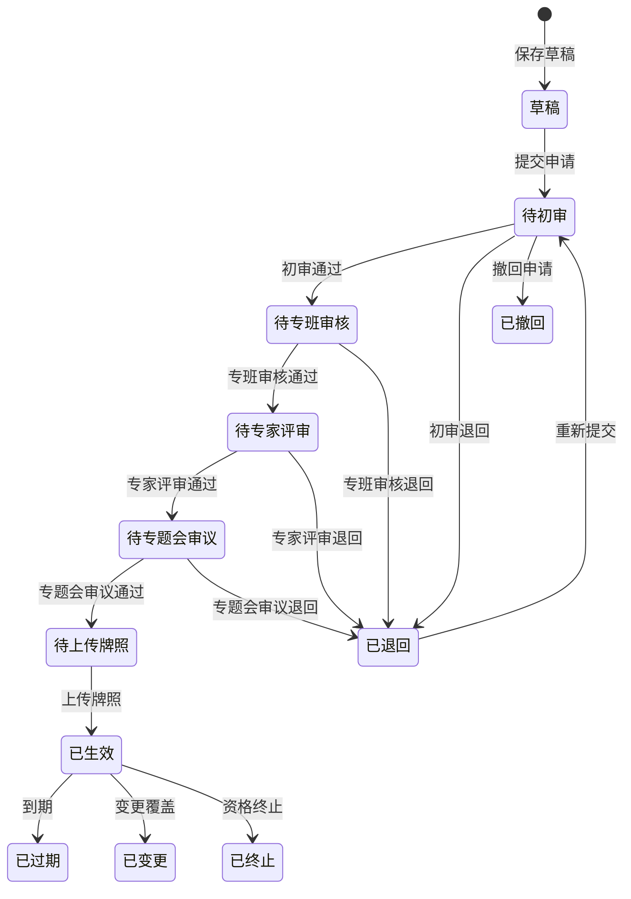

# 版本记录

| 文档版本 | 修改日期      | 修改人 | 修改内容 | 审核人 |
| :--- | :-------- | :-- | :--- | :-- |
| V1.0 | 2026-6-30 | 孙继成 | 首次新增 |     |

# 名词解释

暂无

## 1 背景

 测试示范监管模块是智能网联汽车安全监测平台的核心业务模块，构建覆盖**事前准入、事中监控、事后评价**的全流程数字化监管体系

- 核心特点：多主体协同（政府/第三方/企业）、多类型申请（道路测试/示范应用/商业化试点）、多子类型（初次/延期/变更/新增车辆）、严格串联审批流程
- 关联模块关系：
  - 开放道路资源管理模块：测试路段或区域数据来源、道路状态变更触发资格终止
  - 监测数据分析模块：车辆运行数据、告警数据、事故数据的统计分析
  - 平台管理模块：用户权限、字典配置等基础能力支撑

## 2 主要用户与权限

| 角色               | 该模块中的职责                                       | 客户端   |
| ---------------- | --------------------------------------------- | ----- |
| 政府监管部门（经信/交通/公安） | 专班审批、资格终止、报告报送、监控查看                           | Web 端 |
| 第三方专业管理机构        | 初审申请材料、组织专家评审、受理在线反馈                          | Web 端 |
| 产业运营主体（主机厂/运营企业） | 提交准入申请、登记企业/车辆/人员信息、上报事故、提交报告、查看审批进度、录入临时牌照信息 | Web 端 |
| 市交管部门            | 审核开放道路申请信息                                    | Web 端 |

## 3 流程图

### 3.1 状态机

| 状态编码 | 状态名称   | 说明                            | 是否终态 |
| ---- | ------ | ----------------------------- | ---- |
| S01  | 草稿     | 用户保存申请但未提交                    | 否    |
| S02  | 待初审    | 申请已提交，等待第三方专业管理机构初审           | 否    |
| S03  | 待专班审核  | 初审通过，等待市工作专班审核（初次/延期/变更/新增车辆） | 否    |
| S04  | 待专家评审  | 专班审核通过，等待专家评审（仅初次申请）          | 否    |
| S05  | 待专题会审议 | 专家评审通过，等待专班专题会议审议（仅初次申请）      | 否    |
| S06  | 待上传牌照  | 终审通过，等待用户上传临时牌照               | 否    |
| S07  | 已生效    | 用户已上传临时牌照，申请进入有效期             | 否    |
| S08  | 已过期    | 当前时间超过申请有效期                   | 是    |
| S09  | 已退回    | 审批节点被退回，需修改后重新提交              | 是    |
| S10  | 已撤回    | 用户在审批前主动撤回申请                  | 是    |
| S11  | 已变更    | 原申请被变更申请替换覆盖，不再有效             | 是    |
| S12  | 已终止    | 触发系统自动终止或管理部门手动终止             | 是    |

## 4 产品定义与说明

### 4.1 产品定义

本功能主要搭载在 WEB 端，其中根据用户的不同，能够使用的网络环境不同，可以分为互联网端和车辆网端

### 4.2 功能清单

| 编号  | 页面        | 功能描述                                                               | 优先级 | 客户端       |
| --- | --------- | ------------------------------------------------------------------ | --- | --------- |
| F01 | 企业信息登记    | 测试主体企业基本信息的登记、编辑、查看、删除                                             | P0  | 互联网端、车联网端 |
| F02 | 车辆信息登记    | 测试车辆详细信息的登记、编辑、查看、删除，按分组录入                                         | P0  | 互联网端、车联网端 |
| F03 | 人员信息登记    | 测试驾驶员/安全员信息的登记、编辑、查看、删除，含驾驶资质校验、人员类型区分、交通违法与事故记录、记分周期承诺制、安全员额外培训信息 | P0  | 互联网端、车联网端 |
| F04 | 道路测试准入申请  | 道路测试初次/延期/变更/新增相同配置车辆申请，含申请材料上传、流程预览、详情查看                          | P0  | 互联网端      |
| F05 | 示范应用准入申请  | 示范应用初次/延期/变更/新增相同配置车辆申请                                            | P0  | 互联网端      |
| F06 | 商业化试点准入申请 | 商业化试点初次/延期/变更/新增相同配置车辆申请                                           | P0  | 互联网端      |
| F07 | 业务总览      | 测试主体查看全部申请及报告的统一视图                                                 | P1  | 互联网端      |
| F08 | 审批管理      | 第三方初审、市工作专班审核、专家评审、专题会审议，含审批详情、流程日志                                | P0  | 车联网端      |
| F09 | 报告管理（政府端） | 报告查询、报告提交（向上级部门）、材料归档                                              | P1  | 车联网端      |
| F10 | 资格终止管理    | 市工作专班发起资格终止，含 6 种终止类型                                              | P0  | 车联网端      |
| F11 | 在线反馈管理    | 用户提交问题，第三方专业管理机构受理与回复                                              | P1  | 车联网端      |
| F12 | 审批配置      | 准入类型配置、申请材料目录配置与版本管理                                               | P1  | 车联网端      |
| F13 | 监控一张图     | 车辆实时位置/轨迹/告警/事故/围栏/道路的地图可视化监控                                      | P0  | 车联网端      |
| F14 | 车辆运行监测    | 视频监控、运行数据、自动驾驶状态、传感器、里程、电池、故障监测                                    | P0  | 车联网端      |
| F15 | 异常状态告警    | 车辆运行异常、碰撞、终端异常、临牌预警、围栏越界、时段合规、安全员状态告警                              | P0  | 车联网端      |
| F16 | 事故数据上报    | 测试主体上报事故信息、交通事故报告、事故分析报告                                           | P0  | 互联网端      |
| F17 | 事故审核      | 第三方/市工作专班对事故报告进行多阶段审核                                              | P0  | 车联网端      |
| F18 | 信息发布管理    | 公告公示/办事指南/测试示范报告的编辑、审核、发布、撤回                                       | P1  | 车联网端      |
| F19 | 电子围栏管理    | 围栏新建（两步操作）、属性编辑、图形绘制/编辑（含保存/取消预览）、右侧信息面板查看详情、删除                    | P0  | 是         |
| F20 | 测试评价管理    | 评估参数配置、评估规则配置与版本管理、车辆评估、企业评估                                       | P1  | 车联网端      |
| F21 | 信息公开      | 公告公示、办事指南、测试示范报告的公开查看                                              | P1  | 互联网端      |

## 5 功能需求

### 5.1 F01 企业信息登记

#### 5.1.1 数据列表区

**查询条件：** 公司名称、申请主体类型

**列表显示字段：**

| 序号  | 字段名    | 字段标识          | 宽度建议  | 说明                         |
| --- | ------ | ------------- | ----- | -------------------------- |
| 1   | 复选框    | —             | 40px  | 见附录 A.3                    |
| 2   | 公司名称   | companyName   | 200px | —                          |
| 3   | 统一信用代码 | creditCode    | 180px | —                          |
| 4   | 申请主体类型 | subjectType   | 140px | 枚举值见 3.1.4                 |
| 5   | 联系人    | contactPerson | 100px | —                          |
| 6   | 联系方式   | contactPhone  | 140px | —                          |
| 7   | 登记时间   | createTime    | 160px | 系统自动生成，格式 YYYY-MM-DD HH:mm |
| 8   | 操作     | —             | 150px | 见操作列按钮                     |

**排序规则：** 默认按登记时间倒序排列。

#### 5.1.2 按钮功能说明

| 操作     | 功能说明                     | 可见角色                    |
| ------ | ------------------------ | ----------------------- |
| 查询     | 按条件筛选列表                  | 全部                      |
| 重置     | 清空查询条件                   | 全部                      |
| 新增企业信息 | 打开新增企业弹窗                 | 产业运营主体                  |
| 导出     | 导出当前筛选数据为 Excel（见附录 A.3） | 产业运营主体、政府监管部门、第三方专业管理机构 |
| 详情     | 打开**企业详情弹窗**             | 全部                      |
| 编辑     | 打开**编辑企业弹窗**，表单预填现有数据    | 产业运营主体                  |
| 删除     | 二次确认后逻辑删除（见附录 A.2）       | 产业运营主体                  |

**数据权限**：产业运营主体仅能看到自身新建的企业数据，政府监管部门/第三方专业管理机构能够看到全部企业数据

#### 5.1.3 企业信息表单字段定义

**企业基本信息**

| 字段名          | 字段类型  | 是否必填 | 校验规则           | 默认值  | 说明                                     |
| ------------ | ----- | ---- | -------------- | ---- | -------------------------------------- |
| 公司名称         | 文本输入  | 是    | 不可为空，最长 100 字符 | —    | —                                      |
| 统一信用代码       | 文本输入  | 是    | 不可为空，18 位字符    | —    | —                                      |
| 申请主体类型       | 下拉单选  | 是    | 不可为空           | —    | 枚举值：整车厂、系统运营商、零部件制造商、互联网服务商、科研院所/高校、其他 |
| 注册资本（万元）     | 文本输入  | 否    | 数值             | —    | —                                      |
| 业务范围         | 多行文本  | 否    | 最长 300 字       | —    | 显示字数计数器                                |
| 研发/制造及试验能力说明 | 多行文本  | 否    | 最长 300 字       | —    | 显示字数计数器                                |
| 单位联系地址       | 文本输入  | 否    | —              | —    | —                                      |
| 单位联系电话       | 文本输入  | 否    | 合法电话号码格式       | —    | —                                      |
| 单位联系邮箱       | 文本输入  | 否    | 合法邮箱格式         | —    | —                                      |
| 联系人          | 文本输入  | 是    | 不可为空           | —    | —                                      |
| 联系方式         | 文本输入  | 是    | 不可为空           | —    | —                                      |
| 营业执照         | 单文件上传 | 是    | 不可为空，格式见附录 A.4 | —    | 位于所有字段最后                               |
| 登记时间         | 系统自动  | —    | —              | 当前时间 | 新增完成后自动生成，编辑时不可修改                      |

用户在新建或者编辑表单后，保存时需要对数据进行校验：

   - 校验成功 → 保存数据 + Toast 提示 " 保存成功 " + 关闭弹窗 + 刷新列表
   - 校验失败 → 在对应字段下方显示红色错误提示 + 弹窗不关闭

### 5.2 F02 车辆信息登记

#### 5.2.1 数据列表区

查询条件：VIN 码、所属企业、车辆种类

**列表显示字段：**

| 序号  | 字段名     | 字段标识       | 宽度建议  | 说明                         |
| --- | ------- | ---------- | ----- | -------------------------- |
| 1   | 复选框     | —          | 40px  | 见附录 A.5                    |
| 2   | 车辆识别代号  | vin        | 160px |                            |
| 3   | 生产企业    |            | 180px | —                          |
| 4   | 所属企业    |            | 120px | —                          |
| 5   | 车辆种类    |            | 120px | —                          |
| 6   | 车辆型号    | model      | 120px | —                          |
| 7   | 自动驾驶级别  | adLevel    | 100px | L2/L3/L4/L5                |
| 8   | 临牌号（最新） | plateNo    | 120px | 根据准入申请模块中更新的临牌号自动同步获取      |
| 9   | 登记时间    | createTime | 160px | 系统自动生成，格式 YYYY-MM-DD HH:mm |
| 9   | 操作      | —          | 120px | 见操作列按钮                     |

**排序规则：** 默认按登记时间倒序排列。

#### 5.2.2 按钮功能说明

| 按钮     | 功能说明                     | 可见角色                    |
| ------ | ------------------------ | ----------------------- |
| 查询     | 按条件筛选列表                  | 全部                      |
| 重置     | 清空查询条件                   | 全部                      |
| 新增车辆信息 | 打开新增车辆弹窗                 | 产业运营主体                  |
| 导出     | 导出当前筛选数据为 Excel（见附录 A.3） | 产业运营主体、政府监管部门/第三方专业管理机构 |
| 详情     | 打开**车辆详情弹窗**             | 全部                      |
| 编辑     | 打开**编辑车辆弹窗**，表单预填现有数据    | 产业运营主体                  |
| 删除     | 二次确认后逻辑删除（见附录 A.2）       | 产业运营主体                  |

**数据权限**：产业运营主体仅能看到自身新建的车辆数据，政府监管部门/第三方专业管理机构能够看到全部车辆数据

#### 5.2.3 车辆表单字段定义

**基本信息**

| 字段名                | 字段类型 | 是否必填 | 校验规则           | 默认值  | 说明                            |
| ------------------ | ---- | ---- | -------------- | ---- | ----------------------------- |
| 所属企业               | 下拉单选 | 是    | 不可为空，数据来源：企业登记 | —    | 平台管理字段，对应测试主体                 |
| 生产企业               | 文本输入 | 是    | 不可为空           | —    | 车辆的生产制造商                      |
| 车辆识别代号（VIN，或唯一性编码） | 文本输入 | 是    | 17 位字符，全局唯一    | —    | 需要校验该字段的唯一性，是否已在系统中 存在        |
| 车辆型号               | 文本输入 | 是    | 不可为空           | —    | —                             |
| 车辆种类               | 下拉单选 | 是    | 不可为空           | —    | 枚举值：乘用车、商用车、专用作业车、功能型低速无人车、其他 |
| 生产日期               | 日期选择 | 是    | 不可为空，不得晚于当前日期  | —    | —                             |
| 车辆颜色               | 文本输入 | 是    | 不可为空           | —    | —                             |
| 自动驾驶级别             | 下拉单选 | 是    | 不可为空           | —    | 枚举值：L2、L3、L4、L5               |
| 临牌号（最新）            | 文本输入 | 否    | —              | —    | 系统自动获取最新临牌号，若无，为空             |
| 登记时间               | 系统自动 | —    | —              | 当前时间 | 新增完成后自动生成                     |

**车辆参数**

| 字段名 | 字段类型 | 是否必填 | 校验规则 | 默认值 | 说明 |
| ------ | -------- | -------- | -------- | ------ | ---- |
| 整车整备质量 (kg) | 数字输入 | 是 | 正数 | — | — |
| 轴荷 (kg) | 数字输入 | 是 | 正数 | — | — |
| 最大设计总质量 (kg) | 数字输入 | 是 | 正数 | — | — |
| 额定载客人数 | 数字输入 | 是 | 正整数 | — | — |
| 发动机号 | 文本输入 | 否 | — | — | 燃油/混动车辆填写 |

**总成信息 — 动力系统**

| 字段名     | 字段类型 | 是否必填 | 校验规则 | 默认值 | 说明                   |
| ------- | ---- | ---- | ---- | --- | -------------------- |
| 动力型式    | 下拉单选 | 是    | 不可为空 | —   | 枚举值：纯电动、混合动力、燃料电池、燃油 |
| 动力生产企业  | 文本输入 | 否    | —    | —   | —                    |
| 发动机型号   | 文本输入 | 否    | —    | —   | 燃油/混动车辆填写            |
| 发动机生产企业 | 文本输入 | 否    | —    | —   | 燃油/混动车辆填写            |
| 动力蓄电池型号 | 文本输入 | 否    | —    | —   | 电动/混动车辆填写            |
| 蓄电池生产企业 | 文本输入 | 否    | —    | —   | 电动/混动车辆填写            |
| 动力电机型号  | 文本输入 | 否    | —    | —   | 电动/混动车辆填写            |
| 电机生产企业  | 文本输入 | 否    | —    | —   | 电动/混动车辆填写            |
| 驱动型式    | 文本输入 | 否    | —    | —   | —                    |
| 驱动生产企业  | 文本输入 | 否    | —    | —   | —                    |
| 变速器型式   | 文本输入 | 否    | —    | —   | —                    |
| 变速器生产企业 | 文本输入 | 否    | —    | —   | —                    |

**总成信息 — 转向系统**

| 字段名 | 字段类型 | 是否必填 | 校验规则 | 默认值 | 说明 |
| ------ | -------- | -------- | -------- | ------ | ---- |
| 转向系统型式 | 文本输入 | 否 | — | — | — |
| 转向生产企业 | 文本输入 | 否 | — | — | — |

**总成信息 — 制动系统**

| 字段名 | 字段类型 | 是否必填 | 校验规则 | 默认值 | 说明 |
| ------ | -------- | -------- | -------- | ------ | ---- |
| 制动系统型式 | 文本输入 | 否 | — | — | — |
| 制动生产企业 | 文本输入 | 否 | — | — | — |
| ESC 型号 | 文本输入 | 否 | — | — | — |
| ESC 生产企业 | 文本输入 | 否 | — | — | — |

**总成信息 — 感知系统**

| 字段名      | 字段类型 | 是否必填 | 校验规则 | 默认值 | 说明                     |
| -------- | ---- | ---- | ---- | --- | ---------------------- |
| 环境感知系统型式 | 文本输入 | 是    | 不可为空 | —   | 如：激光雷达 + 毫米波雷达 + 摄像头融合 |
| 感知生产企业   | 文本输入 | 否    | —    | —   | —                      |

**轮胎信息**

| 字段名    | 字段类型 | 是否必填 | 校验规则 | 默认值 | 说明  |
| ------ | ---- | ---- | ---- | --- | --- |
| 轮胎规格   | 文本输入 | 否    | —    | —   | —   |
| 轮胎生产企业 | 文本输入 | 否    | —    | —   | —   |

**其他改装情况说明**

| 字段名      | 字段类型 | 是否必填 | 校验规则 | 默认值 | 说明                         |
| -------- | ---- | ---- | ---- | --- | -------------------------- |
| 其他改装情况说明 | 多行文本 | 否    | —    | —   | 详细说明车辆改装情况以及传感器品牌、安装位置和数量等 |

**自动驾驶功能说明**

| 字段名         | 字段类型 | 是否必填 | 校验规则 | 默认值 | 说明                               |
| ----------- | ---- | ---- | ---- | --- | -------------------------------- |
| 自动驾驶相应级别    | 下拉单选 | 是    | 不可为空 | —   | 枚举值：L2、L3、L4、L5，应符合车辆配置情况和自动驾驶功能 |
| 自主式智能驾驶功能描述 | 多行文本 | 否    | —    | —   | —                                |
| 网联式协同驾驶功能描述 | 多行文本 | 否    | —    | —   | —                                |

用户在新建或者编辑表单后，保存时需要对数据进行校验：

   - 校验成功 → 保存数据 + Toast 提示 " 保存成功 " + 关闭弹窗 + 刷新列表
   - 校验失败 → 在对应字段下方显示红色错误提示 + 弹窗不关闭
### 5.3 F03 人员信息登记

#### 5.3.1 数据列表区

查询条件：姓名、身份证号、所属企业、人员类型、驾照类型

**列表显示字段：**

| 序号  | 字段名            | 字段标识             | 宽度建议  | 说明                 |
| --- | -------------- | ---------------- | ----- | ------------------ |
| 1   | 复选框            | —                | 40px  | 见附录 A.5            |
| 2   | 姓名             | name             | 80px  | —                  |
| 3   | 性别             | gender           | 60px  | —                  |
| 4   | 身份证号           | idNumber         | 160px | 脱敏显示（前 4 后 2 中间星号） |
| 5   | 所属企业           | company          | 160px | —                  |
| 6   | 人员类型           | personType       | 120px | 标签展示，支持多个          |
| 7   | 驾照类型           | licenseType      | 80px  | —                  |
| 8   | 最近一年有无严重交通违法行为 | illegalRecord    | 140px | —                  |
| 9   | 有无酒驾/醉驾/精神药品记录 | drinkDriveRecord | 160px | —                  |
| 10  | 有无交通事故记录       | accidentRecord   | 120px | —                  |
| 11  | 登记时间           | createTime       | 140px | 系统自动生成             |
| 12  | 操作             | —                | 120px | 见操作列按钮             |

**排序规则：** 默认按登记时间倒序排列。

#### 5.3.2 按钮功能说明

| 操作     | 功能说明                     | 可见角色                    |
| ------ | ------------------------ | ----------------------- |
| 详情     | 打开人员详情弹窗                 | 全部                      |
| 编辑     | 打开编辑人员弹窗，表单预填现有数据        | 产业运营主体                  |
| 删除     | 二次确认后逻辑删除（见附录 A.2）       | 产业运营主体                  |
| 查询     | 按条件筛选列表                  | 全部                      |
| 重置     | 清空查询条件                   | 全部                      |
| 新增人员信息 | 打开新增人员弹窗                 | 产业运营主体                  |
| 导出     | 导出当前筛选数据为 Excel（见附录 A.3） | 产业运营主体、政府监管部门、第三方专业管理机构 |

**数据权限**：产业运营主体仅能看到自身新建的人员数据，政府监管部门/第三方专业管理机构能够看到全部人员数据

#### 5.3.3 表单字段定义

**基本信息**

| 字段名   | 字段类型 | 是否必填 | 校验规则       | 默认值  | 说明                         |
| ----- | ---- | ---- | ---------- | ---- | -------------------------- |
| 姓名    | 文本输入 | 是    | 不可为空       | —    | —                          |
| 性别    | 下拉单选 | 是    | 不可为空       | —    | 枚举值：男、女                    |
| 身份证号  | 文本输入 | 是    | 18 位有效身份证号 | —    | —                          |
| 身份证附件 | 文件上传 | 是    |            | —    | 正反面扫描件                     |
| 年龄    | 系统自动 | —    | —          | —    | 根据身份证号自动计算，不可编辑            |
| 所属企业  | 下拉单选 | 是    | 数据来源：企业登记  | —    | 准入申请中选取人员时，工作单位自动取所属企业名称展示 |
| 登记时间  | 系统自动 | —    | —          | 当前时间 | 新增完成后自动生成，不可编辑             |

**驾驶资质信息**

| 字段名      | 字段类型 | 是否必填 | 校验规则     | 默认值 | 说明                                         |
| -------- | ---- | ---- | -------- | --- | ------------------------------------------ |
| 驾照类型     | 下拉单选 | 是    | 不可为空     | —   | 枚举值：A1、A2、A3、B1、B2、C1、C2、C3、C4、C5、D、E      |
| 机动车驾驶证附件 | 文件上传 | 是    |          | —   | —                                          |
| 初次领证日期   | 日期选择 | 是    | 不得晚于当前日期 | —   | 选择后下方实时显示只读提示 " 当前驾龄：X 年 X 月 "；提交时校验驾龄≥3 年 |
| 安全驾驶证明   | 文件上传 | 是    |          | —   | —                                          |

**人员类型信息**

| 字段名 | 字段类型 | 是否必填 | 校验规则 | 默认值 | 说明 |
| ------ | -------- | -------- | -------- | ------ | ---- |
| 人员类型 | 多选下拉 | 是 | 不可为空，至少选择 1 项 | — | 枚举值：驾驶人、安全员、远程操控员、其他 |

**交通违法与事故记录**

| 字段名                  | 字段类型 | 是否必填        | 校验规则 | 默认值 | 说明                                                                   |
| -------------------- | ---- | ----------- | ---- | --- | -------------------------------------------------------------------- |
| 最近 1 年内有无严重交通违法行为记录  | 下拉单选 | 是           | 不可为空 | —   | 枚举值：有、无。选 " 有 " 时阻止提交，提示 " 该人员不符合驾驶人/安全员条件 "                         |
| 严重交通违法行为类型           | 多选下拉 | 选 " 有 " 时必填 | —    | —   | 枚举值：超速 50% 以上、超员、超载、违反交通信号灯通行。仅当 " 最近 1 年内有无严重交通违法行为记录 " 选 " 有 " 时展示 |
| 有无酒驾/醉驾/精神药品记录       | 下拉单选 | 是           | 不可为空 | —   | 枚举值：有、无。选 " 有 " 时阻止提交，提示 " 该人员不符合驾驶人/安全员条件 "                         |
| 连续 3 个记分周期未记满 12 分承诺 | 下拉单选 | 是           | 不可为空 | —   | 枚举值：是、否。选 " 否 " 时阻止提交，提示 " 该人员不符合驾驶人/安全员条件 "                         |
| 记分周期合规承诺书            | 文件上传 | 是           |      | —   | 企业上传加盖公章的承诺书，承诺该人员最近连续 3 个记分周期内未记满 12 分                              |
| 交管记分查询证明             | 文件上传 | 否           |      | —   | 交管部门出具的记分查询结果截图/PDF，作为佐证材料，鼓励但不强制                                    |
| 有无交通事故记录             | 下拉单选 | 是           | 不可为空 | —   | 枚举值：有、无                                                              |
| 有无致人死亡或重伤且负责任的交通事故记录 | 下拉单选 | 是           | 不可为空 | —   | 枚举值：有、无。选 " 有 " 时阻止提交，提示 " 该人员不符合驾驶人/安全员条件 "                         |

**培训与资质信息**

| 字段名              | 字段类型 | 是否必填 | 校验规则 | 默认值 | 说明      |
| ---------------- | ---- | ---- | ---- | --- | ------- |
| 是否熟悉自动驾驶功能测试评价规程 | 下拉单选 | 是    | 不可为空 | —   | 枚举值：是、否 |
| 是否掌握车辆道路测试操作方法   | 下拉单选 | 是    | 不可为空 | —   | 枚举值：是、否 |
| 是否具备紧急状态下应急处置能力  | 下拉单选 | 是    | 不可为空 | —   | 枚举值：是、否 |
| 劳动合同或劳务合同信息      | 文件上传 | 是    |      | —   | —       |
| 培训记录             | 文件上传 | 否    |      | —   | —       |

**自动驾驶安全员/远程操控员额外信息**（仅当人员类型包含 " 安全员 " 或 " 远程操控员 " 时展示）

| 字段名          | 字段类型 | 是否必填 | 校验规则     | 默认值 | 说明                                  |
| ------------ | ---- | ---- | -------- | --- | ----------------------------------- |
| 专业技能培训时长（小时） | 数字输入 | 是    | 正整数，≥40  | —   | 自动驾驶道路测试安全员不少于 40 小时专业技能培训          |
| 远程操控操作时长（小时） | 数字输入 | 是    | 正整数，≥100 | —   | 自动驾驶道路测试安全员不少于 100 小时自动驾驶测试车辆远程控制操作 |
| 专业技能培训证明     | 文件上传 | 是    |          | —   | —                                   |
| 远程操控操作证明     | 文件上传 | 是    |          | —   | —                                   |

用户在新建或者编辑表单后，保存时需要对数据进行校验：

   - 校验成功 → 保存数据 + Toast 提示 " 保存成功 " + 关闭弹窗 + 刷新列表
   - 校验失败 → 在对应字段下方显示红色错误提示 + 弹窗不关闭

### 5.4 F04 道路测试准入申请

#### 5.4.1 数据列表区

查询条件：申请编号、申请类型、申请状态、有效期

**列表显示字段：**

| 序号  | 字段名    | 说明                              |
| --- | ------ | ------------------------------- |
| 1   | 申请编号   | 系统自动生成                          |
| 2   | 申请类型   | 标签展示                            |
| 3   | 道路测试类型 | 枚举值，主驾有人、自动驾驶                   |
| 4   | 原申请编号  | 延期/变更/新增车辆时显示；支持点击，点击后打开对应申请的弹窗 |
| 5   | 车辆数    | —                               |
| 6   | 路段或区域数 | —                               |
| 7   | 申请状态   | 标签展示                            |
| 8   | 测试周期   | 格式：YYYY-MM-DD 至 YYYY-MM-DD      |
| 9   | 申请时间   | 格式：YYYY-MM-DD HH-MM-SS          |
| 10  | 操作     | 见操作列按钮                          |

**排序规则：** 默认按申请时间倒序排列。

#### 5.4.2 按钮功能说明

| 操作       | 功能说明              | 可见条件                                            | 可见角色   |
| -------- | ----------------- | ----------------------------------------------- | ------ |
| 查询       | 按条件筛选列表           | 所有状态                                            | 全部     |
| 重置       | 清空查询条件            | 所有状态                                            | 全部     |
| 新增申请     | 打开**新增申请弹窗**      | 所有状态                                            | 测试主体   |
| 查看       | 打开**申请详情页**       | 所有状态                                            | 全部     |
| 编辑       | 打开**编辑申请弹窗**      | 仅 " 草稿 " 状态                                     | 产业运营主体 |
| 提交       | 提交申请，状态变为 " 待初审 " | 仅 " 草稿 " 状态                                     | 产业运营主体 |
| 重新提交     | 打开编辑弹窗重新提交        | 仅 " 已退回 " 状态                                    | 产业运营主体 |
| 撤回       | 撤回申请，状态变为 " 已撤回 " | 仅 " 待初审/待专班审核/待专家评审 " 且当前审批人未处理                 | 产业运营主体 |
| 报告提交     | 跳转报告提交页           | 仅 " 已生效 " 状态且当前日期在有效期内                          | 产业运营主体 |
| 延期       | 打开**延期申请页**       | 已生效 + 有效期截止日 ≤ 未来 2 个月 + 无进行中的派生申请（三类互斥，见 4.14） | 产业运营主体 |
| 变更       | 打开**变更申请页**       | 已生效 + 当前日期 ≤ 有效期截止日 + 无进行中的派生申请（见 4.14）         | 产业运营主体 |
| 新增相同配置车辆 | 打开**新增车辆申请页**     | 已生效 + 当前日期 ≤ 有效期截止日 + 无进行中的派生申请（见 4.14）         | 产业运营主体 |

#### 5.4.4 新增道路测试申请弹窗

##### 5.4.4.1 申请基本信息

| 字段名     | 字段类型 | 是否必填 | 校验规则        | 默认值  | 说明                                                                                         |
| ------- | ---- | ---- | ----------- | ---- | ------------------------------------------------------------------------------------------ |
| 申请类型    | 单选   | 是    | 不可为空        | 初次申请 | 枚举值：初次申请。选择后动态展示对应流程预览步骤                                                                   |
| 道路测试类型  | 单选   | 是    | 不可为空        | 主驾有人 | 枚举值：主驾有人、自动驾驶。选择 " 自动驾驶 " 时展示额外前置条件提示和补充材料要求                                               |
| 申请主体    | 下拉单选 | 是    |             | —    | 默认填充当前用户所在的企业；数据来源：企业信息登记，需要在当前用户所在**数据权限**范围内                                             |
| 测试周期    | 日期范围 | 是    | 开始日期不早于当前日期 | —    | —                                                                                          |
| 测试路段或区域 | 表格多选 | 是    | 至少选择 1 条    | —    | 弹窗选择，道路数据来源：道路信息建档，区域数据来源：电子围栏管理；列：区域类型、名称、开放状态、操作                                         |
| 测试车辆    | 表格多选 | 是    | 至少选择 1 辆    | —    | 弹窗选择，数据来源：车辆登记，列：VIN 码、生产企业、车辆型号、自动驾驶级别、操作；选择后支持填写临时牌照号及有效期                                |
| 测试人员    | 表格多选 | 是    | 至少选择 1 人    | —    | 弹窗选择，数据来源：人员登记，列：姓名、性别、年龄、证件号码、人员类型、操作                                                     |
| 道路测试项目  | 文本输入 | 是    | 不可为空        | —    | 描述本次道路测试开展的项目内容（如具体功能验证或场景测试方向）                                                            |
| 申请材料清单  | 附件上传 | 是    |             |      | 营业执照在申请页面自动从企业信息登记模块调取展示，无需重复上传；驾驶员（安全员）信息在用户选取特定人员后自动带入其所需信息（身份证、驾驶证、劳动合同等），无需在申请材料中重复提交。 |

##### 5.4.4.2 按钮功能说明

| 操作      | 功能说明                                                                                      |
| ------- | ----------------------------------------------------------------------------------------- |
| 保存草稿    | 点击后将该申请保存为草稿，Toast 提示 " 草稿已保存 "                                                           |
| 取消      | 关闭当前弹窗                                                                                    |
| 提交申请    | 点击后，需要先进行校验：校验成功 → 状态变为 " 待初审 " + Toast 提示 " 申请已提交 "；校验失败（必填字段为空/必传材料未上传）→ 错误提示 + 保留在当前页面 |
| 添加路段或区域 | 打开添加路段或区域弹窗                                                                               |
| 添加车辆    | 打开车辆选择弹窗                                                                                  |
| 添加人员    | 打开人员选择弹窗                                                                                  |

##### 5.4.4.3 添加路段或区域弹窗
- 点击 " 测试路段或区域 " → 弹出路段选择弹窗→ 点击“确认选择”后更新路段表格
- 弹窗支持切换路段或区域，其中路段的信息来自道路建档页面，展示字段为道路名称、道路类型、开放状态；支持切换为区域，信息来源为电子围栏管理页面，展示字段为区域名称、开放状态
- 弹窗中的表格支持分页，支持按照名称搜索路段或区域
##### 5.4.4.4 车辆选择弹窗
- 点击 " 测试车辆 " → 弹出车辆选择弹窗 →点击“确认选择”后更新车辆表格，自动增加临牌号输入列
- 弹窗中的表格支持分页，支持按照 VIN 码搜索车辆
##### 5.4.4.5 人员选择弹窗
- 点击 " 测试人员 " → 弹出人员选择弹窗 → 点击“确认选择”后更新人员表格
- 弹窗中的表格支持分页，支持按照姓名搜索人员
#### 准入申请详情弹窗
准入申请详情弹窗显示信息包括
- 申请基本信息
- 测试路段或区域：点击“查看”，打开**道路或区域详情弹窗**
- 测试车辆：点击“查看”，打开**车辆详情弹窗**
- 测试人员：点击“查看”，打开**人员详情弹窗**
- 申请材料：支持预览和下载
- 审批流程进度：已完成节点显示绿色，未完成置灰，当前节点为蓝色
- 流程日志：流程日志，显示环节名称、处理人、处理时间、处理意见（如有）

# 附录
## 1 A.1 分页组件

| 配置项 | 规则 |
| ------ | ---- |
| 每页条数选项 | 10、20、50、100，默认 10 |
| 显示信息 | 总记录数、当前页码/总页数 |
| 翻页控件 | 首页、上一页、页码、下一页、末页 |
| 切换每页条数 | 下拉选择，切换后从第一页重新加载 |

## 2 A.2 删除确认组件

1. 用户点击 " 删除 " → 弹出二次确认弹窗
2. 确认弹窗内容：" 确定要删除该记录吗？删除后不可恢复。"
3. 点击 " 确定 " → 执行删除操作 + 记录删除操作日志 + 列表刷新
4. 点击 " 取消 " → 关闭确认弹窗，不执行删除

**删除方式：** 逻辑删除（标记删除状态），不物理删除数据。

## 3 A.3 导出组件

| 触发条件 | 行为 |
| -------- | ---- |
| 用户选中了特定数据 | 导出用户选择的数据，不支持跨页导出 |
| 用户未选择特定数据 | 弹出提示：" 是否导出所有数据？"，选 " 是 " 导出当前筛选条件下所有数据 |

**导出格式：** .xlsx

**文件命名规则：** {模块名称}_YYYYMMDD.xlsx

## 4 A.4 附件上传组件

| 规则项     | 图片类          | 文档类          |
| ------- | ------------ | ------------ |
| 支持格式    | jpg/png      | pdf/doc/docx |
| 单文件大小限制 | ≤5MB         | ≤20MB        |
| 多文件上传   | 支持           | 支持           |
| 预览/下载   | 查看态支持点击预览/下载 | 查看态支持点击下载    |

## 5 A.5 复选框组件

- 表头存在全选复选框，勾选后选中当前页所有行
- 支持单行勾选
- 勾选状态用于导出、批量操作等场景
- 全选仅作用于当前页数据，不支持跨页全选

## 6 A.6 二次确认弹窗组件

- 弹窗宽度：400~500px
- 位置：居中弹出
- 遮罩：半透明
- 确定按钮：主按钮（或危险按钮，删除场景）
- 取消按钮：次按钮
- 点击遮罩不关闭弹窗
