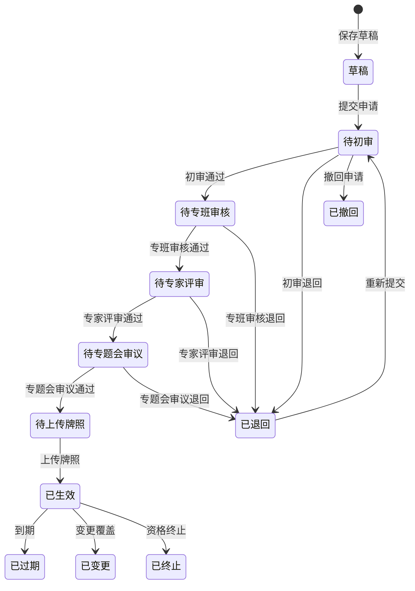

# 版本记录

| 文档版本 | 修改日期      | 修改人 | 修改内容 | 审核人 |
| :--- | :-------- | :-- | :--- | :-- |
| V1.0 | 2026-6-30 | 孙继成 | 首次新增 |     |

# 名词解释

暂无

## 1 背景

 测试示范监管模块是智能网联汽车安全监测平台的核心业务模块，构建覆盖**事前准入、事中监控、事后评价**的全流程数字化监管体系

- 核心特点：多主体协同（政府/第三方/企业）、多类型申请（道路测试/示范应用/商业化试点）、多子类型（初次/延期/变更/新增车辆）、严格串联审批流程
- 关联模块关系：
  - 开放道路资源管理模块：测试路段或区域数据来源、道路状态变更触发资格终止
  - 监测数据分析模块：车辆运行数据、告警数据、事故数据的统计分析
  - 平台管理模块：用户权限、字典配置等基础能力支撑

## 2 主要用户与权限

| 角色               | 该模块中的职责                                       | 客户端    |
| ---------------- | --------------------------------------------- | ------ |
| 政府监管部门（经信/交通/公安） | 专班审批、资格终止、报告报送、监控查看                           | Web 端  |
| 第三方专业管理机构        | 初审申请材料、组织专家评审、受理在线反馈                          | Web 端  |
| 产业运营主体（主机厂/运营企业） | 提交准入申请、登记企业/车辆/人员信息、上报事故、提交报告、查看审批进度、录入临时牌照信息 | Web 端  |
| 市交管部门            | 审核开放道路申请信息                                    | Web 端  |

## 3 流程图

### 3.1 状态机

| 状态编码 | 状态名称   | 说明                            | 是否终态 |
| ---- | ------ | ----------------------------- | ---- |
| S01  | 草稿     | 用户保存申请但未提交                    | 否    |
| S02  | 待初审    | 申请已提交，等待第三方专业管理机构初审           | 否    |
| S03  | 待专班审核  | 初审通过，等待市工作专班审核（初次/延期/变更/新增车辆） | 否    |
| S04  | 待专家评审  | 专班审核通过，等待专家评审（仅初次申请）          | 否    |
| S05  | 待专题会审议 | 专家评审通过，等待专班专题会议审议（仅初次申请）      | 否    |
| S06  | 待上传牌照  | 终审通过，等待用户上传临时牌照               | 否    |
| S07  | 已生效    | 用户已上传临时牌照，申请进入有效期             | 否    |
| S08  | 已过期    | 当前时间超过申请有效期                   | 是    |
| S09  | 已退回    | 审批节点被退回，需修改后重新提交              | 是    |
| S10  | 已撤回    | 用户在审批前主动撤回申请                  | 是    |
| S11  | 已变更    | 原申请被变更申请替换覆盖，不再有效             | 是    |
| S12  | 已终止    | 触发系统自动终止或管理部门手动终止             | 是    |

## 4 产品定义与说明

### 4.1 产品定义

本功能主要搭载在 WEB 端，其中根据用户的不同，能够使用的网络环境不同，可以分为互联网端和车辆网端

### 4.2 功能清单

| 编号  | 页面     | 功能描述                                            | 优先级 | 客户端  |
| --- | ------ | ----------------------------------------------- | --- | ---- |
| F11 | 在线反馈管理 | 用户提交问题，第三方专业管理机构受理与回复                           | P1  | 车联网端 |
| F12 | 审批配置   | 准入类型配置、申请材料目录配置与版本管理                            | P1  | 车联网端 |
| F13 | 监控一张图  | 车辆实时位置/轨迹/告警/事故/围栏/道路的地图可视化监控                   | P0  | 车联网端 |
| F14 | 车辆运行监测 | 视频监控、运行数据、自动驾驶状态、传感器、里程、电池、故障监测                 | P0  | 车联网端 |
| F15 | 异常状态预警 | 车辆运行异常、碰撞、终端异常、临牌预警、围栏越界、时段合规、安全员状态告警           | P0  | 车联网端 |
| F16 | 事故数据上报 | 测试主体上报事故信息、交通事故报告、事故分析报告                        | P0  | 互联网端 |
| F17 | 事故审核   | 第三方/市工作专班对事故报告进行多阶段审核                           | P0  | 车联网端 |
| F18 | 信息发布管理 | 公告公示/办事指南/测试示范报告的编辑、审核、发布、撤回                    | P1  | 车联网端 |
| F19 | 电子围栏管理 | 围栏新建（两步操作）、属性编辑、图形绘制/编辑（含保存/取消预览）、右侧信息面板查看详情、删除 | P0  | 车联网端 |
| F20 | 测试评价管理 | 评估参数配置、评估规则配置与版本管理、车辆评估、企业评估                    | P1  | 车联网端 |
| F21 | 信息公开   | 公告公示、办事指南、测试示范报告的公开查看                           | P1  | 互联网端 |

## 5 功能需求

### 5.1 F13 监控一张图

#### 5.1.1 统计卡片
1. 在线车辆：当前在线的车辆数/接入平台的累计车辆数，计算在线率；展示离线车辆总数
2. 自动驾驶：当前在线车辆中处于自动驾驶模式下的车辆总数，点击卡片能够联动数据筛选，填入自动驾驶筛选项，对地图中的车辆点位进行筛选
3. 预警事件：当前发生的预警事件数；点击卡片会联动右侧异常事件面板中的预警卡片，筛选预警事件
4. 告警事件：当前发生的告警事件数；点击卡片会联动右侧异常事件面板中的告警卡片，筛选告警事件
5. 当日事故：当日发生的事故数量；点击后打开图层面板中的“事故点位”图层
#### 5.1.2 工具栏

**图层控制**

图层面板管理地图对象显隐，包含：

- 底图切换（互斥）
	- 电子地图（默认选中）
	- 卫星影像
- 车辆实时位置（默认开）
- 行驶轨迹（默认关）
- 异常事件标识（默认开）
- 事故点位（默认关）
- 电子围栏（默认关）
- 开放道路（默认开）
- 设施设备（默认关）
- 图例开关（默认开）
- 历史事故（默认关）
**数据筛选**
1. 支持车辆筛选和异常事件筛选：
	- 车辆筛选：车牌号、VIN、企业、申请类型、驾驶模式、在线状态
	- 异常事件筛选：事件类型；与预警卡片、告警卡片联动
		- 预警卡片：对应车辆运行异常预警、车辆碰撞事件预警、车载终端异常预警
		- 告警卡片：对应临牌有效期告警、电子围栏越界告警、测试时段合规性告警、安全员到岗状态告警
2. 点击“应用筛选”，筛选条件对地图中的点位、车辆状态列表、右侧异常事件列表生效
3. 点击“重置”，恢复默认状态。默认状态均为全部车辆、全部状态
#### 5.1.3 地图区
1. 地图默认显示为襄阳市全市电子地图

**车辆实时位置与状态**

1. 用不同的图标区分车辆的运行状态：蓝色=自动驾驶模式、绿色=人工驾驶模式、灰色=离线
2. 对于当前存在异常事件的车辆，在车辆图标上叠加异常光圈：仅预警=蓝色光圈，仅告警=橙色光圈，同时存在预警和告警=橙色光圈优先并显示组合提示
3. 车辆图标右上角显示该车辆的异常事件数量，角标数量为未处理和处理中事件总数
4. 点击车辆图标，车辆图标会居中，并弹出**信息窗**：标题为车辆详情 -“车牌号”，信息窗分为两个 tab 标签。
	- 车辆状态 tab 页：显示字段为：VIN、所属企业、驾驶模式、实时速度、加速度、航向角、档位、自动驾驶等级、在线状态、最后上报时间、当前异常事件（如果无异常事件，可不显示该字段）
	- 异常状态 tab 页：以卡片形式展示当前车辆所有关联的异常事件。按照倒序进行排列
5. 信息窗底部操作按钮：**查看轨迹**、**实时视频**
6. 车辆在地图中默认采用聚合展示效果，放大后显示正常车辆点位。对于当前存在异常事件的车辆保持可见

**查看轨迹弹窗**

1. 触发条件：点击车辆信息页的“查看轨迹”按钮
2. 地图上默认叠加显示当天的轨迹路径
3. 地图下方为轨迹控制面板，包含时间轴、查询和展示区，需具备以下功能
	- 时间轴支持控制播放速度、开始/暂停、快进、快退
	- 时间轴支持拖动进度条
	- 查询和展示区位于时间轴上方，支持显示当前时间范围框、车牌号选择框、进度条对应时间、对应速度、对应驾驶模式等信息

**实时视频弹窗**
1. 触发条件：点击车辆信息页的“实时视频”按钮
2. 实时视频窗口：
  - 浮窗形式，以卡片的形式展示该车辆所有摄像头的缩略图，支持点击特定缩略图并播放
  - 单个摄像头画面提供截图、本地录像、全屏功能
  - 若车辆离线或摄像头不可用，提示 " 视频流不可用 "
3. 历史回放：
  - 在视频窗口内可切换到 " 历史回放 " 标签，选择日期时间范围，查询录像片段
  - 支持进度条拖拽、倍速播放
  - 支持导出录像片段（需权限）
#### 5.1.4 异常事件列表

1. 数据源为车辆的异常事件，包括预警和告警的事件
2. 卡片分为全部、预警、告警、待处理，卡片支持点击，点击后能够对下方事件列表和地图点位进行筛选
3. 卡片信息：
	- 异常事件类型 - 发生时间
	- 车牌号 - 公司名称
	- 测试区域
	- 事件编号：选中卡片后显示，默认不显示
	- 触发规则：选中卡片后显示，默认不显示
	- 处理状态：选中卡片后显示，默认不显示
4. 选中卡片后，地图会触发选中车辆图标行为

#### 5.1.5 车辆状态列表

1. 底部车辆状态列表抽屉提供车辆列表视图，列表显示字段为车牌号、VIN、企业、申请类型、驾驶模式、速度、在线状态、异常事件数量、最后上报时间、操作
2. 选中列表特定行或者点击“定位”→ 地图会触发选中车辆图标行为
3. 列表的查询结果与地图关联，地图中仅显示符合条件的车辆图标

 **数据刷新频率：** 位置信息 ≥ 10Hz，异常事件和状态变化准实时推送

### 5.2 交通违法行为记录
本页面的数据源来自于其他平台的数据接口，本平台仅以列表形式展示道路交通安全违法行为记录

查询条件：违法记录编号、违法时间、临牌号、运营企业名称、车辆种类、违法行为代码、文书开具时间

#### 5.2.1 数据列表区

| 序号  | 字段名    | 说明                        |
| --- | ------ | ------------------------- |
| 0   | 复选框    |                           |
| 1   | 违法记录编号 | —                         |
| 2   | 违法发生时间 | YYYY-MM-DD HH-MM-SS       |
| 3   | 临时车牌号  |                           |
| 4   | 运营企业名称 |                           |
| 5   | 车辆种类   | 乘用车、商用车、专业作业车、功能型低速无人车、其他 |
| 6   | 违法行为代码 |                           |
| 7   | 违法取证类型 | 电子抓拍 / 现场交警查处 / 视频举报      |
| 8   | 执勤交警警号 |                           |
| 9   | 文书开具日期 |                           |
| 操作  |        |                           |
底部为分页区
#### 5.2.2 按钮功能说明

| 操作  | 触发行为                     | 可见角色 |
| --- | ------------------------ | ---- |
| 查询  | 按条件筛选列表                  | 全部   |
| 重置  | 清空查询条件                   | 全部   |
| 导出  | 按当前筛选条件导出 Excel（见附录 A.3） | 管理员  |
| 详情  | 打开记录详情弹窗                 | 全部   |

#### 5.2.3 表单字段定义

- 违法案件编号
- 运营企业名称
- 统一社会信用代码
- 车辆类型
- 车辆自动驾驶等级
- 临牌号
- 是否配备随车安全员
- 违法发生时间
- 违法发生地址
- 违法行为代码
- 违法行为文字描述
- 违法适用法律依据
- 违法时车辆状态
- 违法取证类型
- 文书开具单位
- 执勤交警警号
- 交警姓名
- 文书开具日期
- 处罚责任主体
- 罚款金额（元）
- 驾驶证记分分值
- 缴款期限（通知书载明 15 日截止日期）
- 文书附件：照片、pdf 等
